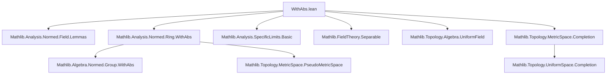
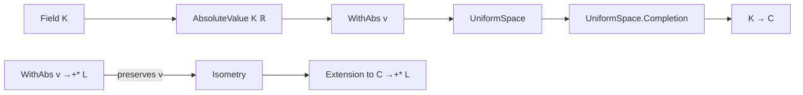

### Technical Brief: `WithAbs.lean` — Extending `WithAbs` to Fields

---

#### **1. Key Definitions & Theorems**

| Name | Type / Signature | Purpose |
|------|------------------|---------|
| `WithAbs v` | `AbsoluteValue R S → Type*` | Type synonym for `R` indexed by an absolute value `v`, enabling distinct structures per absolute value. |
| `instField` | `Field (WithAbs v)` | Shows that `WithAbs v` inherits the field structure from `R`. |
| `normedField` | `NormedField (WithAbs v)` | When `S = ℝ`, `WithAbs v` becomes a normed field via `v.toNormedField`. |
| `tendsto_one_div_one_add_pow_nhds_one` | `{a : R} → v a < 1 → Tendsto ... (𝓝 1)` | Proves convergence of a specific sequence in `WithAbs v` to `1`, under the condition `v(a) < 1`. |
| `isometry_of_comp` *(deprecated)* | `∀ x, ‖f x‖ = v x → Isometry f` | If a ring homomorphism `f` preserves the absolute value, then `f` is an isometry. |
| `pseudoMetricSpace_induced_of_comp` *(deprecated)* | `PseudoMetricSpace.induced f ... = ...` | Shows the pseudometric on `WithAbs v` matches that induced by `f`. |
| `uniformSpace_comap_eq_of_comp` *(deprecated)* | `UniformSpace.comap f ... = ...` | Equates uniform structures induced by `f` and the absolute value. |
| `isUniformInducing_of_comp` *(deprecated)* | `IsUniformInducing f` | `f` is uniformly inducing if it preserves the absolute value. |
| `Completion` | `UniformSpace.Completion (WithAbs v)` | Completion of the field `K` at absolute value `v`. |
| `extensionEmbedding_of_comp` *(deprecated)* | `v.Completion →+* L` | Extension of `f : WithAbs v →+* L` to the completion, assuming `f` preserves the absolute value. |
| `isometry_extensionEmbedding_of_comp` *(deprecated)* | `Isometry (extensionEmbedding_of_comp h)` | The extended map is an isometry. |
| `locallyCompactSpace` | `LocallyCompactSpace L → LocallyCompactSpace v.Completion` | If the target normed field `L` is locally compact, so is the completion. |

> **Note**: Many theorems are marked `@[deprecated]`, with guidance to use newer lemmas from `AddMonoidHomClass` and `Isometry` modules.

---

#### **2. Naming Conventions**

- **Prefixes**:
  - `inst*`: Typeclass instances (`instField`, `instNormedField`).
  - `is*`: Properties (`isometry_of_comp`, `isUniformInducing_of_comp`, `isClosedEmbedding_*`).
  - `pseudoMetricSpace_*`, `uniformSpace_*`: Structural properties.
  - `extension*`: Extensions of maps to completions.
- **Suffixes**:
  - `_of_comp`: Conditions assuming factorization through an embedding `f`.
  - `_coe`: Coercion compatibility (`extensionEmbedding_of_comp_coe`).
  - `_dist_eq`: Distance preservation.
- **Module-level**:
  - `WithAbs.*`: Core definitions and instances.
  - `AbsoluteValue.Completion.*`: Completion-specific constructions.

---

#### **3. Tactic Stack**

Frequent tactics used in proofs:

| Tactic | Usage |
|--------|-------|
| `simpa` | Simplify using assumptions and rewrite rules (e.g., `tendsto_one_div_one_add_pow_nhds_one`). |
| `ext` | Extensionality for equality of structures (e.g., pseudometric/uniform spaces). |
| `exact` / `assumption` | Immediate proof steps (e.g., `‹FiniteDimensional R R'›`). |
| `rw`, `simp_rw` | Rewriting using definitions (implied in `simpa` usage). |
| `apply` | Applying lemmas (e.g., `tendsto_inv_iff₀`, `one_ne_zero`). |
| `convert` / `change` | Adjusting goals to match known lemmas (used implicitly via `simpa`). |

No heavy automation like `aesop` or `linarith` is used — proofs are mostly structural and rely on existing lemmas.

---

#### **4. Proof Logic**

- **Structure**: Most proofs follow a *decomposition pattern*:
  1. **Reduce** to known results via `simpa` or `rw`.
  2. **Apply** a high-level lemma (e.g., `tendsto_inv_iff₀`, `isometry_of_norm`).
  3. **Verify** preconditions (e.g., `one_ne_zero`, `ha : v a < 1`).
- **Induction**: Not used here — this is analysis/structure theory, not arithmetic.
- **Case analysis**: Minimal; mostly relies on typeclass inference and equality reasoning.
- **Uniform/ metric reasoning**: Central — many proofs equate uniform/metric structures via `Isometry` and `UniformSpace.comap`.

---

#### **5. Imports**

| Module | Role |
|--------|------|
| `Mathlib.Analysis.Normed.Field.Lemmas` | Basic lemmas on normed fields. |
| `Mathlib.Analysis.Normed.Ring.WithAbs` | Core `WithAbs` mechanism for rings. |
| `Mathlib.Analysis.SpecificLimits.Basic` | Convergence lemmas (e.g., `tendsto_div_one_add_pow_nhds_one`). |
| `Mathlib.FieldTheory.Separable` | For separable algebra instances. |
| `Mathlib.Topology.Algebra.UniformField` | Uniform field structure. |
| `Mathlib.Topology.MetricSpace.Completion` | Completion of uniform/pseudometric spaces. |

> **Scope**: This module bridges `WithAbs` (a syntactic tool for absolute values) with field-theoretic and topological constructions — especially completions.

---

#### **6. Mermaid Diagrams**

##### **Dependency Graph (Module-Level)**



##### **Overview of Theoretical Flow**

```mermaid
flowchart LR
  subgraph Setup
    V[AbsoluteValue R S]
    W[WithAbs v]
  end

  subgraph Structure
    F[Field (WithAbs v)]
    NF[NormedField (WithAbs v)]
    FD[FiniteDimensional]
    Sep[IsSeparable Algebra]
  end

  subgraph Topology
    PM[PseudoMetricSpace]
    US[UniformSpace]
    C[Completion]
  end

  subgraph Maps
    f[f : WithAbs v →+* L]
    I[Isometry f]
    E[extensionEmbedding_of_comp]
  end

  V --> W
  W --> F
  W --> NF
  W --> FD
  W --> Sep
  NF --> PM
  NF --> US
  US --> C
  f --> I
  I --> E
```

##### **Completion Construction Pipeline**



---

#### **7. Summary**

This file extends the `WithAbs` mechanism — originally for rings — to **fields**, enabling:
- A uniform way to treat multiple absolute values on the same field.
- Construction of **completions at a given absolute value**.
- Transfer of normed-field structure and uniform/metric properties via isometries.

It serves as a foundational module for local field theory, especially in contexts like $p$-adic completions or adeles.

> **Deprecation Note**: The file is in transition — many lemmas are deprecated in favor of more general `AddMonoidHomClass` and `Isometry` lemmas, indicating a refactoring toward abstraction and reuse.
