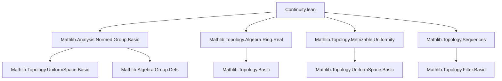

### Technical Brief: Continuity of the Norm on (Semi)Normed Groups

---

#### **1. Key Definitions & Theorems**

| Name | Type / Signature | Purpose |
|------|------------------|---------|
| `tendsto_iff_norm_div_tendsto_zero` | `Tendsto f a (𝓝 b) ↔ Tendsto (fun e => ‖f e / b‖) a (𝓝 0)` | Relates convergence to a point `b` with convergence of normalized difference to `0`. |
| `tendsto_one_iff_norm_tendsto_zero` | `Tendsto f a (𝓝 1) ↔ Tendsto (‖f ·‖) a (𝓝 0)` | Special case for convergence to identity element `1`. |
| `comap_norm_nhds_one` | `comap norm (𝓝 0) = 𝓝 (1 : E)` | Describes neighborhood filter of identity via preimage under `norm`. |
| `squeeze_one_norm'` | `(∀ᶠ n, ‖f n‖ ≤ a n) → Tendsto a t₀ (𝓝 0) → Tendsto f t₀ (𝓝 1)` | Sandwich theorem for convergence to identity using norm bounds. |
| `squeeze_one_norm` | `(∀ n, ‖f n‖ ≤ a n) → Tendsto a t₀ (𝓝 0) → Tendsto f t₀ (𝓝 1)` | Absolute version of `squeeze_one_norm'`. |
| `tendsto_norm_div_self` | `Tendsto (fun a => ‖a / x‖) (𝓝 x) (𝓝 0)` | Norm of `a/x` tends to `0` as `a → x`. |
| `tendsto_norm'` | `Tendsto (fun a => ‖a‖) (𝓝 x) (𝓝 ‖x‖)` | Continuity of norm at a point (in filter sense). |
| `tendsto_norm_one` | `Tendsto (fun a : E => ‖a‖) (𝓝 1) (𝓝 0)` | Norm tends to `0` near identity. |
| `continuous_norm'` | `Continuous fun a => ‖a‖` | Global continuity of norm. |
| `continuous_nnnorm'` | `Continuous fun a => ‖a‖₊` | Continuity of nonnegative norm variant. |
| `Inseparable.norm_eq_norm'` | `Inseparable u v → ‖u‖ = ‖v‖` | Norms equal on inseparable points (via continuous norm). |
| `mem_closure_one_iff_norm` | `x ∈ closure ({1}) ↔ ‖x‖ = 0` | Characterizes closure of identity via zero norm. |
| `Filter.Tendsto.norm'` | `Tendsto f l (𝓝 a) → Tendsto (‖f ·‖) l (𝓝 ‖a‖)` | Norm preserves convergence. |
| `Continuous.norm'` | `Continuous f → Continuous (‖f ·‖)` | Norm preserves continuity. |
| `ContinuousAt.norm'`, `ContinuousWithinAt.norm'`, `ContinuousOn.norm'` | Various continuity variants | Norm preserves local/relative continuity. |
| `eventually_ne_of_tendsto_norm_atTop'` | `Tendsto (‖f ·‖) l atTop → ∀ᶠ y, f y ≠ x` | If norm blows up, eventually away from any fixed point. |
| `SeminormedCommGroup.mem_closure_iff` | `a ∈ closure s ↔ ∀ ε > 0, ∃ b ∈ s, ‖a / b‖ < ε` | Metric characterization of closure in abelian seminormed groups. |
| `tendstoUniformlyOn_one` | Uniform convergence to constant `1` ↔ sup norm < ε eventually | Uniform convergence criterion via norm. |
| `uniformCauchySeqOnFilter_iff_tendstoUniformlyOnFilter_one` | Cauchy condition ↔ uniform convergence of quotients to `1` | Links uniform Cauchy condition to norm behavior of differences. |
| `controlled_prod_of_mem_closure` | For `a ∈ closure(s)`, constructs product sequence converging to `a` with controlled norms | Key structural lemma for abelian closure generation. |
| `tendsto_norm_nhdsNE_one` | `Tendsto norm (𝓝[≠] 1) (𝓝[>] 0)` | Norm tends to positive zero away from identity. |
| `comap_norm_nhdsGT_zero'` | `comap norm (𝓝[>] 0) = 𝓝[≠] 1` | Neighborhood filter away from identity via norm > 0. |

---

#### **2. Naming Conventions**

- **Prefixes**:
  - `tendsto_...`: Filter-based convergence statements.
  - `continuous_...`: Global continuity.
  - `continuousAt_...`, `ContinuousWithinAt_...`, `ContinuousOn_...`: Local/relative continuity.
  - `squeeze_...`: Sandwich theorem variants.
  - `eventually_...`: Eventual properties.
  - `mem_closure_...`: Membership in closure.
  - `controlled_...`: Constructive closure lemmas (especially abelian).
  - `norm_...`, `nnnorm_...`, `enorm_...`: Variants of norm (real, nonneg-extended, extended).
  - `Inseparable_...`: Properties preserved under inseparability.

- **Suffixes**:
  - `'`: Prime variants often phrased in terms of *eventually* (e.g., `squeeze_one_norm'`).
  - No `'`: Absolute or non-eventual phrasing (e.g., `squeeze_one_norm`).
  - `'_` suffix in `to_additive` attributes: indicates additive counterpart exists.

- **`to_additive` attribute**: Used to automatically generate additive versions (e.g., `tendsto_norm_zero` from `tendsto_norm_one`).

---

#### **3. Tactic Stack**

- **Core tactics**:
  - `simp`, `simp only`, `simp_rw`: Extensive use for rewriting definitions (`dist_eq_norm_div`, `norm_div`, etc.).
  - `rw`: Manual rewriting where `simp` insufficient.
  - `exact`, `assumption`, `intro`, `apply`: Basic proof structure.
  - `convert`: For equational reasoning with convertible targets.
  - `have`, `set`, `obtain`, `choose`: Local assumptions and constructions.
  - `filter_upwards`, `eventually_and`, `eventually_forall`: Filter/eventual reasoning.
  - `cauchySeq.subseq_mem`, `tendsto_atTop'.mp`: Advanced filter lemmas.
  - `Finset.eq_prod_range_div'`: Product telescoping identity.

- **Domain-specific tactics**:
  - `metric_tactic` (via `dist_mem_uniformity`, `ball_mem_nhds`).
  - `nhdsWithin`, `comap`, `principal` reasoning via `simp` + `set_ext`.

---

#### **4. Proof Logic**

- **Structure**:
  - Most proofs follow a *rewrite → simplify → apply known lemma* pattern.
  - Leverage `dist_eq_norm_div` to translate metric statements into norm ones.
  - Use `tendsto_iff_dist_tendsto_zero` to reduce convergence questions to norm → 0.
  - For sandwich theorems: reduce to additive case (`squeeze_zero'`) via `norm_nonneg`.
  - For uniform/Cauchy statements: reduce to uniformity basis via `dist_mem_uniformity`.
  - For abelian closure lemmas: construct sequences/products using `mem_closure_iff_seq_limit`, then refine via `cauchySeq.subseq_mem`.

- **Induction/Construction**:
  - `controlled_prod_of_mem_closure` uses:
    - Sequence approximation of closure (`mem_closure_iff_seq_limit`)
    - Subsequence extraction (`cauchySeq.subseq_mem`)
    - Telescoping product definition (`Finset.eq_prod_range_div'`)
    - Inductive norm control via `b_pos`.

- **Continuity arguments**:
  - Use `continuous_norm'` + composition (`comp`) to lift continuity.
  - For pointed neighborhoods (`𝓝[≠]`, `𝓝[>]`), combine with `inf` and `tendsto_principal_principal`.

---

#### **5. Imports & Dependencies**

| Module | Purpose |
|--------|---------|
| `Mathlib.Analysis.Normed.Group.Basic` | Core definitions: `SeminormedGroup`, `NormedGroup`, `ENormedMonoid`, `ContinuousENorm`. |
| `Mathlib.Topology.Algebra.Ring.Real` | Real numbers as topological ring, neighborhoods, etc. |
| `Mathlib.Topology.Metrizable.Uniformity` | Uniformity bases, uniform convergence, Cauchy filters. |
| `Mathlib.Topology.Sequences` | Sequential continuity, closure via sequences. |

**Key abstractions used**:
- `dist`, `norm`, `div`, `mul`, `inv`
- `𝓝`, `𝓝[≠]`, `𝓝[≥]`, `𝓝[>]`, `atTop`, `uniformity`
- `Filter.Tendsto`, `Continuous`, `UniformCauchySeqOn`, `TendstoUniformlyOn`
- `Inseparable`, `closure`, `comap`

---

#### **6. Mermaid Diagrams**

##### **Dependency Graph (Module-Level)**



##### **Overview of Theory Flow**


##### **Proof Strategy Skeleton**

```mermaid
flowchart LR
  A[Goal: Tendsto f l (𝓝 a)] --> B[Rewrite via dist_eq_norm_div]
  B --> C[Apply tendsto_iff_dist_tendsto_zero]
  C --> D[Reduce to Tendsto (‖f· / a‖) l (𝓝 0)]
  D --> E[Use squeeze theorem / continuity / uniform bounds]
  E --> F[Conclude]
```

---

#### **7. Summary**

This file formalizes foundational continuity and convergence properties of the norm in (semi)normed groups, emphasizing:
- Equivalence between metric convergence and norm-based convergence.
- Preservation of continuity, uniform convergence, and Cauchy properties under the norm.
- Structural lemmas for abelian groups (e.g., closure generation via controlled products).
- Careful handling of pointed neighborhoods (`≠`, `>`, `≥`) and their interaction with the norm.

The formalization is highly systematic, leveraging `to_additive` for additive analogues and `simp`-friendly rewrites (`dist_eq_norm_div`, `norm_div`, etc.) to unify multiplicative and additive reasoning.
