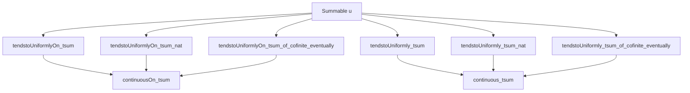
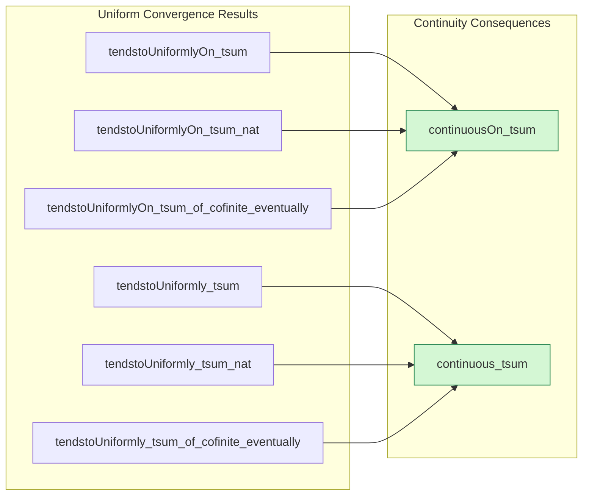

**Technical Brief: `FunctionSeries.lean` — Continuity of Series of Functions**

---

### **1. Key Definitions & Theorems**

| Name | Type / Signature | Purpose |
|------|------------------|---------|
| `tendstoUniformlyOn_tsum` | `{f : α → β → F} → Summable u → (∀ n x, x ∈ s → ‖f n x‖ ≤ u n) → TendstoUniformlyOn (fun t ↦ ∑ₙ ∈ t, f n) (∑'ₙ, f n) atTop s` | Shows that the infinite sum of functions converges *uniformly on a set* `s` if the sup-norm bounds are summable. |
| `tendstoUniformlyOn_tsum_nat` | Special case of `tendstoUniformlyOn_tsum` for index set `ℕ`, using `Finset.range N`. | Enables uniform convergence statements for series indexed by natural numbers. |
| `tendstoUniformlyOn_tsum_of_cofinite_eventually` | Allows the bound `‖f n x‖ ≤ u n` to hold *eventually* (i.e., outside a finite set), still yielding uniform convergence on `s`. | Handles series where finitely many terms may violate the bound. |
| `tendstoUniformlyOn_tsum_nat_eventually` | Natural-number version of the above, using `atTop` instead of `cofinite`. | Practical for sequences indexed by `ℕ`. |
| `tendstoUniformly_tsum` | Global version (no restriction to a set `s`) of uniform convergence. | Used when convergence is required on the entire space. |
| `tendstoUniformly_tsum_nat` | Natural-number version of global uniform convergence. | Standard for series over `ℕ`. |
| `tendstoUniformly_tsum_of_cofinite_eventually` | Global version with eventual bounds. | Generalizes uniform convergence to “almost everywhere” bounded terms. |
| `continuousOn_tsum` | If each `f i` is continuous on `s`, and sup-norm bounds are summable, then `∑'ₙ f n` is continuous on `s`. | Main continuity result: uniform limit of continuous functions (partial sums) is continuous. |
| `continuous_tsum` | Global version: if each `f i` is continuous, and sup-norm bounds are summable, then `∑'ₙ f n` is continuous. | Most commonly used continuity theorem. |

> **Notation**:  
> - `∑' n, f n x` denotes the *infinite sum* (i.e., $ \sum'_{n} f_n(x) $).  
> - `tendstoUniformlyOn` is defined via `dist` and `norm`, using the metric structure of `F`.

---

### **2. Naming Conventions**

- **Prefixes**:
  - `tendstoUniformlyOn_`: uniform convergence *on a set*.
  - `tendstoUniformly_`: uniform convergence *globally*.
  - `continuousOn_`: continuity *on a subset*.
  - `continuous_`: global continuity.
- **Suffixes**:
  - `_tsum`: infinite sum (as opposed to finite sum).
  - `_nat`: index set is `ℕ`.
  - `_of_cofinite_eventually`: bounds hold eventually (cofinite filter).
- **Helper patterns**:
  - `hu` for `Summable u` (the bounding sequence).
  - `hfu` for the uniform bound `‖f n x‖ ≤ u n`.

---

### **3. Tactic Stack**

Frequently used tactics in proofs:
- `refine`, `apply`, `rw`, `simp_rw`, `aesop`, `simp`, `filter_upwards`, `obtain`, `have`, `exact`, `trans`, `linarith`, `norm_num`, `ring`, `norm_cast`, `apply lt_of_le_of_lt`, `apply le_of_lt`, `apply tendsto_of_frequently`, `eventually_iff_exists_mem`, `Finset.sum_add_tsum_subtype_compl`, `norm_tsum_le_tsum_norm`, `subtype_sum`, `tsum_le_tsum`.

**Dominant proof strategy**:  
- Reduce to known convergence lemmas (`tendsto_tsum_compl_atTop_zero`, `norm_tsum_le_tsum_norm`).  
- Use `Summable` closure properties (`of_nonneg_of_le`, `subtype`, `add_compl`, `of_finite`).  
- Apply continuity lemmas for finite sums (`continuousOn_finset_sum`), then lift via uniform convergence.

---

### **4. Proof Logic**

**General proof pattern** (e.g., for `tendstoUniformlyOn_tsum`):

1. **Goal**: Show uniform convergence on `s`.  
   → Use `tendstoUniformlyOn_iff`, reduce to bounding `‖∑'ₙ f n x - ∑ₙ ∈ t f n x‖ < ε`.

2. **Decompose tail**:  
   Use identity:  
   $$
   \left\| \sum'_{n} f_n(x) - \sum_{n \in t} f_n(x) \right\| = \left\| \sum'_{n \notin t} f_n(x) \right\| \le \sum_{n \notin t} \|f_n(x)\|
   $$

3. **Bound tail using `u`**:  
   Since `‖f n x‖ ≤ u n`, then  
   $$
   \sum_{n \notin t} \|f_n(x)\| \le \sum_{n \notin t} u_n
   $$

4. **Use summability of `u`**:  
   `tendsto_tsum_compl_atTop_zero u` gives that the tail of `∑ u n` → 0, so for large `t`, this is `< ε`.

5. **Conclude** via `lt_of_le_of_lt`.

**Continuity proofs** (`continuousOn_tsum`, `continuous_tsum`):
- Use that uniform limit of continuous functions is continuous.
- Partial sums `x ↦ ∑ₙ ∈ t f n x` are continuous (finite sum of continuous functions).
- Apply `continuousOn_tsum` lemma from `tendstoUniformlyOn_tsum`.

---

### **5. Imports & Dependencies**

**Core imports**:
```lean
Mathlib.Analysis.Normed.Group.InfiniteSum
Mathlib.Topology.Instances.ENNReal.Lemmas
```

**Key underlying theories**:
- `NormedAddCommGroup`, `CompleteSpace`: ensures infinite sums behave well (Cauchy → convergent).
- `ENNReal.Lemmas`: used for extended nonnegative reals in summability arguments (e.g., monotone convergence, comparison tests).
- `Filter`, `Metric`, `TopologicalSpace`: for uniform convergence, continuity, and neighborhood filters.
- `Set`, `Function`: for set-restricted statements and function spaces.

**No reliance on calculus-specific tools** (e.g., differentiability), as this is purely about *continuity* of series.

---

### **6. Mermaid Diagrams**

#### **Dependency Graph (Theorems)**



#### **Overview of File Structure**



---

### **7. Summary**

This module formalizes the classical result:  
> *If a series of functions has uniformly summable sup-norm bounds and each term is continuous, then the infinite series defines a continuous function.*

It provides:
- Multiple variants (on sets, globally, for general/indexed-by-ℕ families).
- Handling of *eventual* bounds (via cofinite/atTop filters).
- A clean separation between convergence (`tendstoUniformlyOn_*`) and regularity (`continuous*`).

**TODO**: As noted in the docstring, future work includes refactoring to use `SummableUniformlyOn`, which would unify the “on a set” and “eventually” variants under a single abstraction.

--- 

Let me know if you'd like a formalization of `SummableUniformlyOn` or a migration plan for the TODO.
