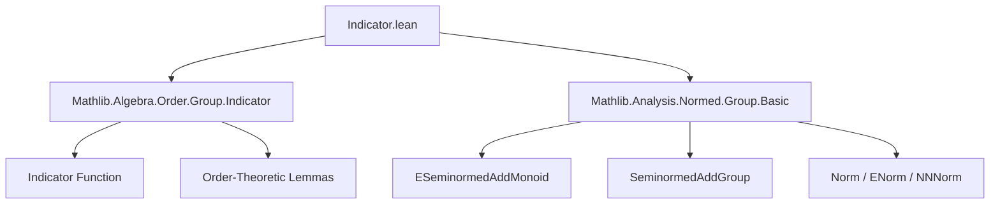
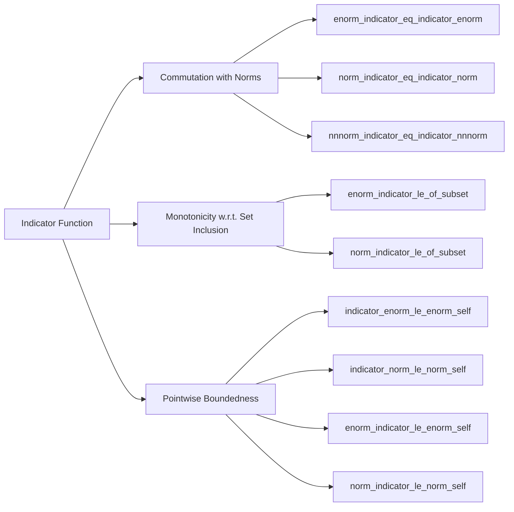

**Technical Brief: `Indicator.lean` Module**

---

### 1. **Key Definitions & Theorems**

| Name | Type / Signature | Purpose |
|------|------------------|---------|
| `indicator` | `Set α → (α → ε) → α → ε` | Returns `f a` if `a ∈ s`, else `0`. Standard *indicator function* (also called *characteristic multiplication*). |
| `enorm` | `ε → ℝ≥0∞` | Extended norm on an `ESeminormedAddMonoid`. |
| `norm` | `E → ℝ≥0` | Norm on a `SeminormedAddGroup`. |
| `nnnorm` | `E → ℝ≥0` | Non-negative norm (coercion of `norm` to `ℝ≥0`). |

#### Key Lemmas (Theorems)

| Name | Type | Purpose |
|------|------|---------|
| `enorm_indicator_eq_indicator_enorm` | `‖indicator s f a‖ₑ = indicator s (fun a ↦ ‖f a‖ₑ) a` | `enorm` commutes with `indicator`. |
| `enorm_indicator_le_of_subset` | `s ⊆ t ⇒ ‖indicator s f a‖ₑ ≤ ‖indicator t f a‖ₑ` | Monotonicity of `enorm` of indicator w.r.t. set inclusion. |
| `indicator_enorm_le_enorm_self` | `indicator s (fun a ↦ ‖f a‖ₑ) a ≤ ‖f a‖ₑ` | Indicator of extended norm is bounded by full norm. |
| `enorm_indicator_le_enorm_self` | `‖indicator s f a‖ₑ ≤ ‖f a‖ₑ` | Indicator’s extended norm ≤ original extended norm. |
| `norm_indicator_eq_indicator_norm` | `‖indicator s f a‖ = indicator s (fun a ↦ ‖f a‖) a` | Same as `enorm_indicator_eq_indicator_enorm`, but for `norm`. |
| `nnnorm_indicator_eq_indicator_nnnorm` | `‖indicator s f a‖₊ = indicator s (fun a ↦ ‖f a‖₊) a` | Same for non-negative norm. |
| `norm_indicator_le_of_subset` | `s ⊆ t ⇒ ‖indicator s f a‖ ≤ ‖indicator t f a‖` | Monotonicity for `norm`. |
| `indicator_norm_le_norm_self` | `indicator s (fun a ↦ ‖f a‖) a ≤ ‖f a‖` | Indicator of norm ≤ full norm. |
| `norm_indicator_le_norm_self` | `‖indicator s f a‖ ≤ ‖f a‖` | Indicator norm ≤ original norm. |

---

### 2. **Naming Conventions**

- **Prefixes**:
  - `enorm_...`: Extended norm variants.
  - `norm_...`: Standard norm variants.
  - `nnnorm_...`: Non-negative norm variants.
- **Suffixes**:
  - `_eq_indicator_...`: Commutation lemmas (`indicator` and norm commute).
  - `_le_of_subset`: Monotonicity under set inclusion.
  - `_le_self`: Indicator is pointwise bounded by original function’s norm.
- **Pattern**: `norm_indicator_le_norm_self` = `norm ∘ indicator ≤ indicator ∘ norm ≤ norm`.

---

### 3. **Tactic Stack**

- `simp only [...]`: Simplify using specific lemmas (e.g., `enorm_indicator_eq_indicator_enorm`).
- `grw [...]`: Rewrite using `Set.indicator` monotonicity (`grw` = `rw` + `set_like` support).
- `rw [...]`: Rewrite using equality lemmas.
- `apply ...`: Apply a previously proven inequality lemma.
- `flip congr_fun a ...`: Prove pointwise equality by flipping quantifier and applying `congr_fun`.
- `indicator_comp_of_zero ...`: Used to show `indicator s (f ∘ c) = indicator s f ∘ c` when `c` maps to `0`.

---

### 4. **Proof Logic**

- **Structure**: Two main sections:
  1. `ESeminormedAddMonoid`: Generalized setting (extended seminorms, no subtraction).
  2. `SeminormedAddGroup`: Standard normed group setting (with subtraction, norm-valued in `ℝ≥0`).
- **Typical proof pattern**:
  1. Show equality via `indicator_comp_of_zero` + `congr_fun`.
  2. Derive inequalities via:
     - `indicator_le_self'` (a general lemma about indicator functions),
     - monotonicity of `indicator` under set inclusion (`grw [h]`),
     - transitivity via `rw` + `apply`.
- **No induction** used — all proofs are pointwise and algebraic.

---

### 5. **Imports**

| Import | Role |
|--------|------|
| `Mathlib.Algebra.Order.Group.Indicator` | Core `indicator` definitions and basic properties (e.g., `indicator_comp_of_zero`, `indicator_le_self'`). |
| `Mathlib.Analysis.Normed.Group.Basic` | Definitions of `norm`, `enorm`, `nnnorm`, and typeclasses like `SeminormedAddGroup`, `ESeminormedAddMonoid`. |

---

### 6. **Mermaid Diagrams**

#### **Dependency Graph**

#### **Overview of File Content**

---

### 7. **Domain & Theory Scope**

- **Domain**: Ordered algebraic structures with extended seminorms and norms.
- **Theory**: Interplay between *set-theoretic* constructions (`indicator`) and *analytic* ones (`norm`, `enorm`).
- **Use Cases**:
  - Simplifying expressions involving `norm (indicator s f a)`.
  - Proving convergence or continuity results where truncation via `indicator` is used.
  - Formalizing measure-theoretic arguments where functions are localized to sets.

--- 

Let me know if you'd like a formalized dependency graph in `leanpkg` format or a summary of related lemmas in `Mathlib`.
