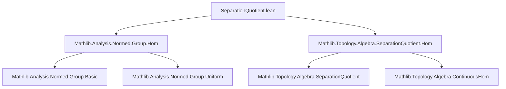
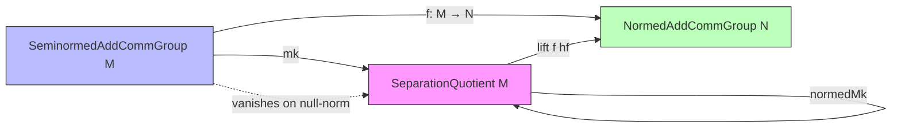
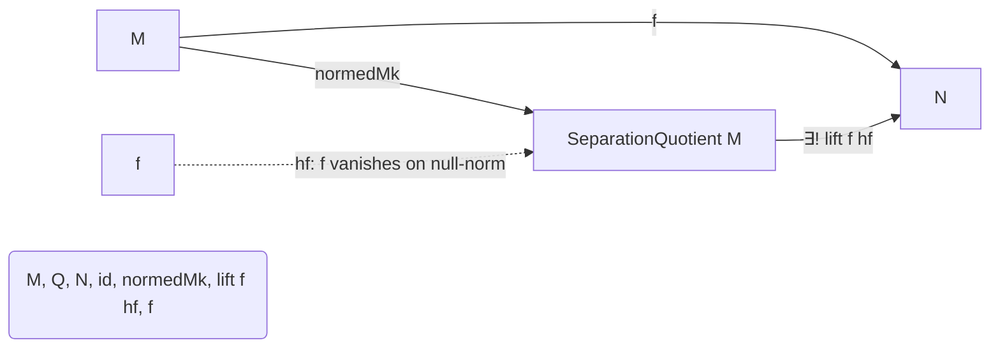

**Technical Brief: `SeparationQuotient.lean`**

---

### 1. **Key Definitions & Theorems**

| Name | Type / Signature | Purpose |
|------|------------------|---------|
| `normedMk` | `NormedAddGroupHom M (SeparationQuotient M)` | Canonical projection from a seminormed group $M$ to its separation quotient; induced by the additive monoid hom `mkAddMonoidHom`. |
| `liftNormedAddGroupHom` | `(f : NormedAddGroupHom M N) → (∀ x, ‖x‖ = 0 → f x = 0) → NormedAddGroupHom (SeparationQuotient M) N` | Universal property: any bounded group hom $f$ vanishing on the inseparable set descends uniquely to a bounded hom on the quotient. |
| `liftNormedAddGroupHomEquiv` | `{f : NormedAddGroupHom M N // ∀ x, ‖x‖ = 0 → f x = 0} ≃ NormedAddGroupHom (SeparationQuotient M) N` | Equivalence of hom-sets: bounded maps vanishing on inseparable elements ↔ bounded maps on the separation quotient. |
| `norm_normedMk_le` | `‖normedMk‖ ≤ 1` | Projection has operator norm ≤ 1. |
| `norm_normedMk_eq_one` | `[NontrivialTopology M] → ‖normedMk‖ = 1` | Projection has operator norm exactly 1 if $M$ is nontrivial (i.e., not all norms zero). |
| `norm_liftNormedAddGroupHom_le` | `‖liftNormedAddGroupHom f hf‖ ≤ ‖f‖` | Lifted map has norm no larger than original. |
| `norm_liftNormedAddGroupHom_apply_le` | `‖lift f hf x‖ ≤ ‖f‖ * ‖x‖` | Pointwise bound for lifted map. |
| `liftNormedAddGroupHom_normNoninc` | `f.NormNoninc → lift f hf.NormNoninc` | Norm-nonincreasing property descends to the quotient. |
| `normedMk_eq_zero_iff` | `normedMk = 0 ↔ ∀ x, ‖x‖ = 0` | Projection is zero iff $M$ is trivial in the seminorm sense. |
| `apply_eq_apply_of_inseparable` | `(∀ x, ‖x‖ = 0 → f x = 0) → Inseparable x y → f x = f y` | Ensures well-definedness of lift: $f$ is constant on inseparable pairs. |

---

### 2. **Naming Conventions**

- **Prefixes**:
  - `normedMk`: standard projection (analogous to `mk` in quotient constructions).
  - `liftNormedAddGroupHom`: universal lift (analogous to `lift` in categorical quotients).
  - `norm_...`: operator norm properties (e.g., `norm_normedMk_le`, `norm_liftNormedAddGroupHom_le`).
  - `apply_eq_apply_of_inseparable`: logical condition for well-definedness.

- **Suffixes**:
  - `_le`, `_eq_one`, `_iff`: indicate inequality/equality/bi-implication results.
  - `_Equiv`: indicates an equivalence of types (not just a map).

- **Structure**:
  - All definitions live in the `SeparationQuotient` namespace.
  - `normedMk` and `liftNormedAddGroupHom` are `noncomputable def`s with `@[simps]`, indicating they are definitional up to simplifier rules.

---

### 3. **Tactic Stack**

Frequent tactics used in proofs:

| Tactic | Usage |
|--------|-------|
| `simp` / `simp only` | Simplify goals using definitions (`normedMk`, `lift...`, `norm_eq_zero`, etc.). |
| `rw` / `rfl` | Rewrite using lemmas or reflexivity (e.g., `mk_eq_zero_iff`, `surjective_mk`). |
| `obtain ⟨x, rfl⟩ := surjective_mk x` | Eliminate quotient elements via surjectivity of `mk`. |
| `exact`, `apply`, `refine` | Construct proofs stepwise, especially for boundedness (`bound'`). |
| `norm_num`, ` positivity` | Handle numeric inequalities and positivity assumptions. |
| `ext` | Extensionality for functions/homomorphisms. |
| `le_trans` | Chain inequalities (e.g., `norm_liftNormedAddGroupHom_norm_le`). |
| `opNorm_le_bound`, `opNorm_eq_of_bounds` | Operator norm lemmas from `NormedAddGroupHom`. |
| `mul_le_of_le_one_left` | Manipulate inequalities involving multiplication by norms. |

---

### 4. **Proof Logic**

- **Well-definedness**: Prove $f$ is constant on inseparable pairs (`apply_eq_apply_of_inseparable`) using continuity and vanishing on null-norm elements.
- **Lift construction**: Use `liftContinuousAddMonoidHom` (from topology) to get a continuous additive monoid hom, then verify it's a *bounded* group hom (via `bound'`).
- **Norm bounds**: Use `surjective_mk` to reduce to elements of $M$, then apply `le_opNorm`.
- **Equivalence proof**:
  - `toFun`: apply `liftNormedAddGroupHom`.
  - `invFun`: compose with `normedMk`.
  - `right_inv`: use surjectivity of `mk`.
  - `left_inv`: use `norm_mk` and `norm_eq_zero`.
- **Operator norm = 1**: Use `opNorm_eq_of_bounds` with existence of a nonzero element (`exists_norm_ne_zero`) and `norm_normedMk_le`.

---

### 5. **Imports**

| Import | Role |
|--------|------|
| `Mathlib.Analysis.Normed.Group.Hom` | Defines `NormedAddGroupHom`, operator norm, basic properties. |
| `Mathlib.Topology.Algebra.SeparationQuotient.Hom` | Defines `SeparationQuotient`, `mk`, continuity, and homomorphism lifting machinery. |

These imports indicate this module sits at the intersection of:
- **Normed additive group theory** (analysis),
- **Uniform/Topological algebra** (separation, continuity),
- **Category-theoretic universal properties** (lifts, equivalences).

---

### 6. **Mermaid Diagrams**

#### **Dependency Graph (Module-Level)**

#### **Conceptual Overview (Theory Flow)**

#### **Universal Property Diagram**

---

### 7. **Domain-Specific AI Agent Notes**

- **Key domain**: Functional analysis / topological algebra.
- **Core abstraction**: Separation quotient as a reflector from seminormed groups to normed groups.
- **Pattern**: Universal property + norm control.
- **AI use case**: Automate lifting proofs, verify norm bounds, or generate equivalence proofs in similar quotient constructions.

--- 

Let me know if you'd like a formalized summary in Lean or a tactic automation sketch.
