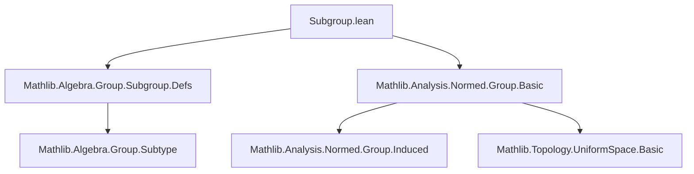

### Technical Brief: `Subgroup.lean` — Subgroups of Normed (Semi)groups

---

#### **1. Key Definitions & Theorems**

| Name | Type / Signature | Purpose |
|------|------------------|---------|
| `seminormedGroup` | `[SeminormedGroup E] → {s : Subgroup E} → SeminormedGroup s` | Induces a seminormed group structure on a subgroup via the induced norm from the ambient group. |
| `coe_norm` | `∀ x : s, ‖x‖ = ‖(x : E)‖` | States that the norm of an element in the subgroup equals its norm in the ambient group. Used as a `simp` lemma. |
| `norm_coe` | `∀ x : s, ‖(x : E)‖ = ‖x‖` | Reversed version of `coe_norm`, intended for use with `norm_cast`. |
| `seminormedCommGroup` | `[SeminormedCommGroup E] → {s : Subgroup E} → SeminormedCommGroup s` | Extends the above to commutative seminormed groups. |
| `normedGroup` | `[NormedGroup E] → {s : Subgroup E} → NormedGroup s` | Induces a normed group structure on a subgroup (requires injectivity of coercion to ensure Hausdorffness). |
| `normedCommGroup` | `[NormedCommGroup E] → {s : Subgroup E} → NormedCommGroup s` | Commutative version of `normedGroup`. |
| `SubgroupClass.seminormedGroup` | `[SeminormedGroup E] → [SetLike S E] → [SubgroupClass S E] → s : S → SeminormedGroup s` | Generalizes the construction to *subgroup classes* (e.g., `AddSubgroup`, `Subgroup`, etc.). |
| `SubgroupClass.coe_norm` | `∀ x : s, ‖x‖ = ‖(x : E)‖` | Analogous to `Subgroup.coe_norm`, but for subgroup classes. |

> **Note**: All instances are built using `induced` constructions from `SeminormedGroup`, `NormedGroup`, etc., pulling back the structure along the subgroup inclusion map (`subtype` or `SubgroupClass.subtype`). Injectivity of coercion is required for `NormedGroup` (to ensure the induced uniformity is Hausdorff).

---

#### **2. Naming Conventions**

- **Prefixes**:
  - `coe_`: Relates to coercion from the subtype (`x : s` ↦ `x : E`).
  - `norm_`: Pertains to norm behavior under coercion.
- **Suffixes**:
  - `_norm`: Norm-related lemmas.
  - `seminormedGroup`, `normedGroup`, `seminormedCommGroup`, `normedCommGroup`: Instance names for algebraic + topological structures.
- **`[to_additive]`**: Indicates additive analogues are automatically generated (e.g., for `AddSubgroup`).

---

#### **3. Tactic Stack**

- **`rfl`**: Used in all norm lemmas (`coe_norm`, `norm_coe`, etc.) — equality is definitional.
- **`induced`**: Not a tactic, but a constructor used in instance declarations to define structures via pullback along a map.
- **Implicit use of `simp`, `norm_cast`, `aesop`**: Though not explicit in this file, these tactics are expected to be used downstream (e.g., `norm_cast` for `norm_coe`, `simp` for `coe_norm`).

---

#### **4. Proof Logic**

- **Structure**: All proofs are *definitionally trivial* — the norm on the subgroup is defined as the *induced norm* from the ambient space.
- **Instance construction logic**:
  1. Use `SeminormedGroup.induced _ _ f` (or `NormedGroup.induced _ _ f inj`) to pull back the structure along the inclusion `f : s ↪ E`.
  2. For `NormedGroup`, require `Subtype.coe_injective` (or `SubgroupClass.subtype_injective`) to ensure the induced uniformity is Hausdorff.
- **Lemmas**: Proved by `rfl`, since the norm on the subtype is *definitionally* the restriction of the ambient norm.

---

#### **5. Imports & Dependencies**

- **Core imports**:
  - `Mathlib.Algebra.Group.Subgroup.Defs`: Defines `Subgroup`, subtype structure, etc.
  - `Mathlib.Analysis.Normed.Group.Basic`: Defines `SeminormedGroup`, `NormedGroup`, and their induced structure machinery.
- **Open namespaces**:
  - `Filter`, `Function`, `Metric`, `Bornology`, `ENNReal`, `NNReal`, `Uniformity`, `Pointwise`, `Topology`
  - These support uniform/Topological/Measure-theoretic aspects of normed groups.

---

#### **6. Mermaid Diagrams**

##### **Dependency Graph (Module-Level)**



##### **Theoretical Overview (Structure Induction)**

```mermaid
flowchart LR
  E[NormedGroup E] -->|inclusion i| s[Subgroup s ≤ E]
  i -->|induced structure| s_semi[SeminormedGroup s]
  i -->|+ injectivity| s_norm[NormedGroup s]
  s -->|coercion| E
  s -->|norm| ℝ≥0
  E -->|norm| ℝ≥0
  s_norm -.->|norm_coe/coe_norm| s_semi
```

##### **Subgroup Class Generalization**

```mermaid
flowchart LR
  E[NormedGroup E] -->|subtype f| S[SubgroupClass S E]
  f -->|induced| s[S]
  S -->|SetLike| E
  S -->|SubgroupClass| Subgroup E
  S -->|norm| ℝ≥0
  E -->|norm| ℝ≥0
```

---

#### **7. Summary**

This file establishes that **any subgroup (or more generally, any subgroup class) of a normed (semi)group inherits a canonical normed (semi)group structure**, with the norm defined as the restriction of the ambient norm. All key properties (e.g., norm preservation under coercion) follow *definitionally*, making the formalization concise and robust for downstream analysis (e.g., completeness, closedness, quotient norms).

The use of `induced` structures and `to_additive` ensures uniform treatment of additive and multiplicative settings, and the `priority := 75` annotations prevent ambiguity in typeclass resolution when multiple subgroup classes coexist.

--- 

Let me know if you'd like a formalized dependency graph in `leanpkg` format or a comparison with the additive (`AddSubgroup`) version.
