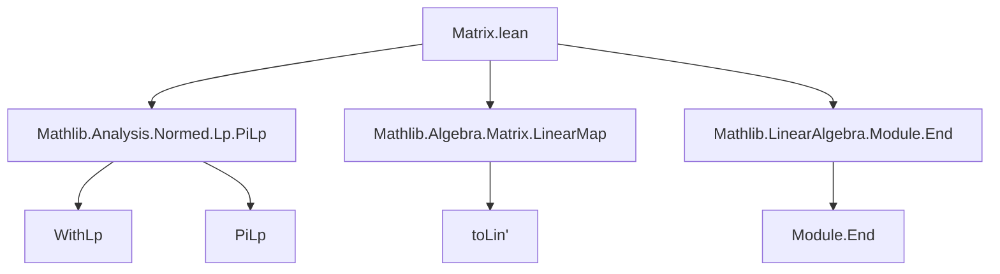

### Technical Brief: `Matrix.lean`

---

#### **1. Key Definitions & Theorems**

| Name | Type | Purpose |
|------|------|---------|
| `toLpLin` | `Matrix m n R ≃ₗ[R] WithLp p (n → R) →ₗ[R] WithLp q (m → R)` | Linear isomorphism from matrices to linear maps between `WithLp`-spaces (i.e., `Lp`-type vector spaces of functions). Generalizes `Matrix.toLin'` to `PiLp`/`WithLp` settings. |
| `toLpLin_toLp` | `∀ A x, toLpLin p q A (toLp _ x) = toLp _ (Matrix.toLin' A x)` | Commutativity of `toLpLin` with `toLp` embedding: applying the linear map corresponds to matrix-vector multiplication followed by embedding. |
| `ofLp_toLpLin` | `∀ A x, ofLp (toLpLin p q A x) = Matrix.toLin' A (ofLp x)` | Dual of above: projecting out of `WithLp` before or after applying `toLpLin` yields same result. |
| `toLpLin_apply` | `∀ M v, toLpLin p q M v = toLp _ (M *ᵥ ofLp v)` | Explicit action of `toLpLin`: applies matrix to vector (via `ofLp`) and re-embeds. |
| `toLpLin_eq_toLin` | `toLpLin p q = Matrix.toLin (PiLp.basisFun p R n) (PiLp.basisFun q R m)` | Identifies `toLpLin` with the standard basis-induced linear map construction. |
| `toLpLin_one` | `toLpLin p p (1 : Matrix n n R) = LinearMap.id` | Identity matrix maps to identity linear map. |
| `toLpLin_mul` | `toLpLin p r (A * B) = toLpLin q r A ∘ₗ toLpLin p q B` | Compatibility with matrix multiplication (composition of linear maps). |
| `toLpLin_mul_same` | Special case of `toLpLin_mul` where domain/codomain norms match (`p = q = r`). |
| `toLpLin_symm_id` | `(toLpLin p p).symm .id = (1 : Matrix n n R)` | Inverse of `toLpLin` sends identity map to identity matrix. |
| `toLpLin_symm_comp` | `(toLpLin p r).symm (A ∘ₗ B) = (toLpLin q r).symm A * (toLpLin p q).symm B` | Inverse respects composition: composition of linear maps corresponds to matrix multiplication. |
| `toLpLinAlgEquiv` | `Matrix n n R ≃ₐ[R] Module.End R (WithLp p (n → R))` | Algebra isomorphism between square matrices and module endomorphisms on `WithLp`-spaces. |
| `toLpLin_pow` | `toLpLin p p (A ^ k) = toLpLin p p A ^ k` | Compatibility with powers (via algebra homomorphism). |
| `toLpLin_symm_pow` | `(toLpLin p p).symm (A ^ k) = (toLpLin p p).symm A ^ k` | Inverse also preserves powers. |

---

#### **2. Naming Conventions**

- **Prefixes**:
  - `toLpLin`: indicates conversion *to* a linear map from a matrix, using `WithLp`.
  - `toLp`, `ofLp`: standard embeddings/projections between function spaces and `WithLp` spaces.
  - `mul`, `one`, `pow`, `id`, `symm`: standard algebraic operations on maps/matrices.

- **Suffixes**:
  - `_same`: for lemmas where all `p`, `q`, `r` are equal (simpler for `simp`).
  - `_apply`: explicit action on elements.
  - `_toLp`, `_ofLp`: relate to `toLp`/`ofLp` projections.

- **Variables**:
  - `p q r : ℝ≥0∞`: exponents for `WithLp` norms (including ∞).
  - `m n o`: finite types indexing rows/columns.

---

#### **3. Tactic Stack**

- **Core tactics**:
  - `ext`: extensionality (for proving linear maps equal).
  - `simp`: heavily used, especially with `@[simp]` lemmas.
  - `rfl`: for definitional equalities (e.g., `toLpLin_apply`).
  - `rw`, `simp_rw`: rewriting using `toLpLin_mul`, `toLpLin_symm_comp`, etc.
  - `map_pow`: used to lift exponent laws through algebra homomorphisms.
  - `injective` + `simp`: to prove equalities in the inverse direction (e.g., `toLpLin_symm_comp`, `toLpLin_symm_id`).

- **Pattern**:
  - Prove equality of linear maps by `ext` + `simp`.
  - Use `toLpLin_mul`/`toLpLin_symm_comp` to reduce to matrix multiplication.
  - Leverage `@[simps!]` for `toLpLinAlgEquiv` to auto-generate projections.

---

#### **4. Proof Logic**

- **Structure**:
  - Define `toLpLin` as a composition of:
    - `toLin'`: standard matrix-to-linear-map.
    - `WithLp.linearEquiv`: equivalence between function spaces and `WithLp` spaces.
    - `arrowCongr`: congruence for function spaces.
  - Prove key properties (`mul`, `one`, `pow`) by reducing to known facts about `toLin'` and `WithLp` equivalences.
  - Use `ext` + `simp` to show two linear maps agree on all inputs.
  - For inverse properties, apply injectivity of `toLpLin` and simplify using forward lemmas.

- **Induction**: Not used directly; proofs rely on algebraic structure and definitional equalities.

- **Key insight**: The `WithLp` framework allows treating `Lp`-type vectors as normed spaces while retaining the underlying function-space structure, enabling clean transport of matrix algebra.

---

#### **5. Imports**

- `Mathlib.Analysis.Normed.Lp.PiLp`: Provides `PiLp`, `WithLp`, `toLp`, `ofLp`, and their linear equivalences.
- `Matrix`: Standard matrix library (used via `Matrix.toLin'`, `Matrix.toLinAlgEquiv'`, etc.).
- `ENNReal`: Extended non-negative reals (`ℝ≥0∞`) for `p, q, r`.

---

#### **8. Mermaid Diagrams**

##### **Dependency Graph (Module-Level)**



##### **Overview of Theory Flow**

```mermaid
flowchart LR
  subgraph "Function Spaces"
    F1[n → R] -->|toLp| Wp[WithLp p (n → R)]
    F2[m → R] -->|toLp| Wq[WithLp q (m → R)]
  end

  subgraph "Linear Maps"
    Wp -->|toLpLin p q A| Wq
  end

  subgraph "Matrix Algebra"
    M[Matrix m n R] -->|toLpLin| LinMap[WithLp p (n → R) →ₗ WithLp q (m → R)]
    M -->|toLin'| LinMap'
  end

  Wp <-->|ofLp / toLp| F1
  Wq <-->|ofLp / toLp| F2

  M <-->|*| M
  LinMap <-->|∘ₗ| LinMap

  style Wp fill:#f9f,stroke:#333
  style Wq fill:#f9f,stroke:#333
  style M fill:#bbf,stroke:#333
```

##### **Algebra Isomorphism Diagram**

```mermaid
flowchart LR
  SquareMat[Matrix n n R] -- toLpLinAlgEquiv --> End[Module.End R (WithLp p (n → R))]

  SquareMat -- mul --> SquareMat
  End -- ∘ₗ --> End

  SquareMat -.->|id| 1M[1 : Matrix n n R]
  End -.->|id| Id[LinearMap.id]

  1M -- toLpLinAlgEquiv --> Id

  style SquareMat fill:#bbf,stroke:#333
  style End fill:#f9f,stroke:#333
```

--- 

This file bridges concrete matrix algebra with abstract functional-analytic structures (`WithLp`/`PiLp`), enabling reuse of matrix theory in analysis and numerical contexts.
