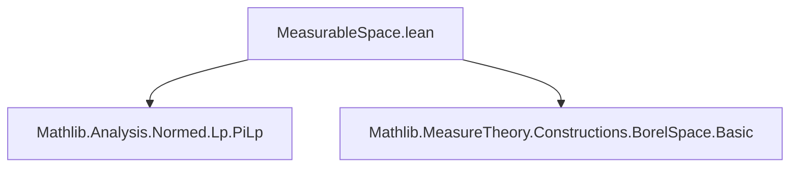

**Technical Brief: MeasurableSpace.lean**

---

### 1. Key Definitions & Theorems

| Name | Type / Signature | Purpose |
|------|------------------|---------|
| `WithLp.measurableSpace` | `MeasurableSpace (WithLp p X)` | Defines the measurable space structure on `WithLp p X` via pullback (`comap`) along `ofLp`. |
| `WithLp.measurable_ofLp` | `Measurable (@ofLp p X)` | States that the canonical inclusion `ofLp : X → WithLp p X` is measurable. |
| `WithLp.measurable_toLp` | `Measurable (@toLp p X)` | States that the inverse map `toLp : WithLp p X → X` is measurable. |
| `WithLp.borelSpace` | `BorelSpace (WithLp p (X × Y))` | Shows that `WithLp p (X × Y)` inherits a Borel space structure compatible with the product topology and measurable structure. |
| `PiLp.borelSpace` | `BorelSpace (PiLp p X)` | Establishes that the `p`-integrable product space `PiLp p X` (for countable index family `X`) is a Borel space. |
| `MeasurableEquiv.toLp` | `X ≃ᵐ WithLp p X` | Constructs a measurable equivalence between `X` and `WithLp p X`. |
| `MeasurableEquiv.toLp_apply`, `toLp_symm_apply` | `⇑(toLp p X) x = toLp p x`, etc. | Simplification lemmas showing the underlying functions of the measurable equivalence match the concrete `toLp`/`ofLp`. |

---

### 2. Naming Conventions

- **Prefixes**:
  - `measurable_`: for properties of functions being measurable (e.g., `measurable_ofLp`, `measurable_toLp`).
  - `borelSpace`: for instances proving Borel space structures.
  - `toLp`, `ofLp`: standard maps between `X` and `WithLp p X`.
- **Suffixes**:
  - `_apply`, `_symm_apply`: for simplification lemmas about application of equivalences.
  - `_equiv`, `_measurableEquiv`: for equivalence-related constructions.
- **Module-level**:
  - `WithLp`, `PiLp`, `MeasurableEquiv`: namespaces for grouped definitions.

---

### 3. Tactic Stack

Frequent tactics used in proofs:
- `rw`: rewriting using equalities (especially `borel_comap`, `measurableSpace`, `instProdTopologicalSpace`).
- `simpa [Set.preimage_preimage]`: simplifying preimage expressions.
- `by` + `obtain ⟨t, ht, rfl⟩ := hs`: destructing existential-uniqueness or equality hypotheses.
- `instProdTopologicalSpace`, `borel_comap`, `WithLp.measurableSpace`: used in `rw` sequences to unfold definitions.

No heavy automation (e.g., `aesop`, `tauto`) is used—proofs rely on unfolding definitions and applying known lemmas.

---

### 4. Proof Logic

- **Structure**: All proofs are short and rely on *definition unfolding* and *known lemmas* from Measure Theory and Topology libraries.
- **Typical flow**:
  1. Unfold definitions (e.g., `borelSpace`, `measurableSpace`) using `rw`.
  2. Apply lemmas like `borel_comap`, `MeasurableSpace.comap_measurable`, `BorelSpace.measurable_eq`.
  3. Simplify using `simpa` or ` rfl` when definitions match exactly.
- **No induction or case analysis** is needed—proofs are purely equational/definitional.

---

### 5. Imports

| Import | Role |
|--------|------|
| `Mathlib.Analysis.Normed.Lp.PiLp` | Provides `PiLp`, `WithLp`, and their topological/analytic structure. |
| `Mathlib.MeasureTheory.Constructions.BorelSpace.Basic` | Provides `BorelSpace`, `borel_comap`, `measurable_eq`, etc. |

These imports define the ambient context: `WithLp` and `PiLp` as normed spaces, and Borel spaces as measurable spaces generated by open sets.

---

### 6. Mermaid Diagrams

#### Dependency Graph (Module-Level)



#### Overview of Theory Flow

```mermaid
flowchart LR
  X[Measurable Space X] -->|ofLp| WithLpX["WithLp p X"]
  WithLpX -->|toLp| X
  WithLpX -.->|measurableSpace| X
  X × Y[Product Space] -->|WithLp p| WithLpXY
  WithLpXY -->|borelSpace| MeasurableSpace
  ΠX[Π i, X i] -->|PiLp p| PiLpX["PiLp p X"]
  PiLpX -->|borelSpace| MeasurableSpace
  X -->|MeasurableEquiv.toLp| WithLpX
```

#### Key Equivalences & Structures

```mermaid
flowchart LR
  X["X"] <-->|≃ᵐ| WithLp["WithLp p X"]
  WithLp <-->|≃| X["X"]  %% underlying equivalence
  WithLpXY["WithLp p (X × Y)"] <-->|≃ᵐ| X × Y
  PiLp["PiLp p X"] <-->|≃ᵐ| ΠX["Π i, X i"]
```

All equivalences are measurable (denoted `≃ᵐ`), and the measurable structures are defined via `comap` along the underlying equivalence functions.

---

### 7. Summary

This file formalizes that the `WithLp` and `PiLp` constructions preserve the measurable and Borel space structure of their underlying spaces, via canonical measurable equivalences. It leverages existing infrastructure for `comap` measurable spaces and Borel spaces, and is typical of Lean’s “structure inheritance” style: reuse existing instances via `comap` and `equiv`.
