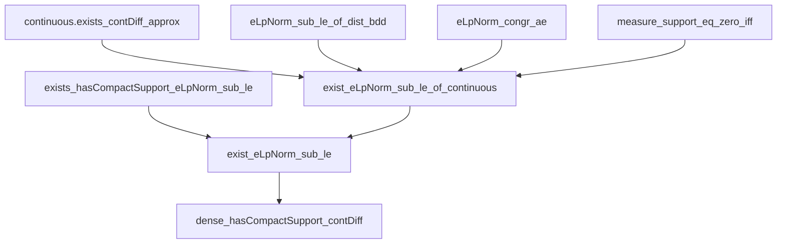
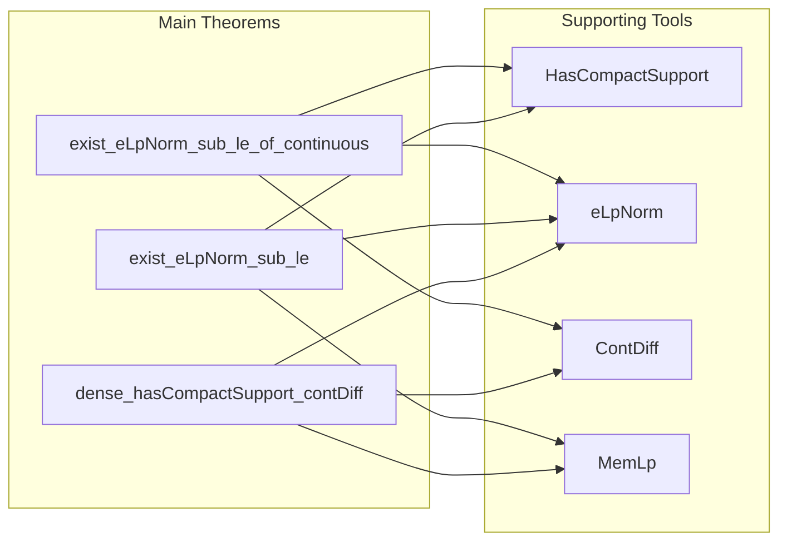

**Technical Brief: `SmoothApprox.lean`**

---

### 1. **Key Definitions & Theorems**

| Name | Type / Signature | Purpose |
|------|------------------|---------|
| `HasCompactSupport` | `class` | Encapsulates functions with compact support (via `tsupport`). |
| `exist_eLpNorm_sub_le_of_continuous` | `{p : ℝ≥0∞} → p ≠ ⊤ → 0 < ε → {f : E → F} → HasCompactSupport f → Continuous f → ∃ g, HasCompactSupport g ∧ ContDiff ℝ ∞ g ∧ eLpNorm (f - g) p μ ≤ ENNReal.ofReal ε` | Approximates continuous compactly supported functions by smooth compactly supported ones in `eLpNorm` for `p < ∞`. |
| `exist_eLpNorm_sub_le` | `{p : ℝ≥0∞} → p ≠ ⊤ → 1 ≤ p → {f : E → F} → MemLp f p μ → 0 < ε → ∃ g, HasCompactSupport g ∧ ContDiff ℝ ∞ g ∧ eLpNorm (f - g) p μ ≤ ENNReal.ofReal ε` | Main approximation result: any `Lp` function (`p < ∞`, `p ≥ 1`) can be approximated in `eLpNorm` by smooth compactly supported functions. |
| `dense_hasCompactSupport_contDiff` | `{p : ℝ≥0∞} → p ≠ ⊤ → Fact (1 ≤ p) → Dense {f : Lp F p μ | ∃ g, f =ᵐ[μ] g ∧ HasCompactSupport g ∧ ContDiff ℝ ∞ g}` | Density of smooth compactly supported functions in `Lp` space (for `1 ≤ p < ∞`). |

---

### 2. **Naming Conventions**

- **Prefixes**:
  - `exist_`: Existential approximation theorems.
  - `eLpNorm_`: Related to the extended `Lp`-norm (`eLpNorm`).
  - `contDiff_`: Pertaining to smoothness (`ContDiff`).
  - `hasCompactSupport_`: Pertaining to compact support (`HasCompactSupport`).
- **Suffixes**:
  - `_of_continuous`: Applies to continuous functions.
  - `_sub_le`: Bounds on `eLpNorm (f - g)`.
- **Variables**:
  - `ε`, `ε'`: Approximation error parameters.
  - `p`: Exponent in `Lp`-norm, constrained by `p ≠ ⊤` and `1 ≤ p`.
  - `μ`: Reference measure, assumed finite on compacts.

---

### 3. **Tactic Stack**

Frequently used tactics:
- `by_cases`: Branching on equality modulo almost everywhere (`f =ᵐ[μ] 0`).
- `have / obtain`: Intermediate lemma extraction.
- `rw / grw`: Rewriting using definitions and extended lemmas (`grw` = `rw` + `gcongr`).
- `simp / simpa`: Simplification with target simplification.
- ` positivity`: Proving positivity of expressions.
- `convert`: Equality up to definitional equality or congruence.
- `apply eLpNorm_congr_ae`: Use a.e. equality to equate `eLpNorm`s.
- `set_option backward.privateInPublic true`: Allows internal definitions in public theorems.

---

### 4. **Proof Logic**

- **Structure**:
  1. **Trivial case handling**: If `f =ᵐ[μ] 0`, use `g = 0`.
  2. **Nontrivial case**: Use positivity of measure of support and scaling of error (`ε'`).
  3. **Approximation**: Apply `continuous.exists_contDiff_approx` to get `g` close pointwise.
  4. **Norm bound**: Use `eLpNorm_sub_le_of_dist_bdd` to lift pointwise bound to `eLpNorm`.
  5. **General `Lp` case**: Use ε/2 argument:
     - Approximate `f` by a compactly supported `g` (via `hf.exists_hasCompactSupport_eLpNorm_sub_le`).
     - Approximate `g` by smooth `g'` (via previous theorem).
     - Triangle inequality in `eLpNorm` yields final bound.
  6. **Density**: Use closure characterization via neighborhoods; construct approximants using `exist_eLpNorm_sub_le`.

- **Induction**: Not used.
- **Key logical pattern**: *ε/2 argument* + *pointwise-to-norm lifting* via measure finiteness on compacts.

---

### 5. **Imports & Dependencies**

- **Core imports**:
  - `Mathlib.Geometry.Manifold.SmoothApprox`: Provides `exists_contDiff_approx` (smooth approximation of continuous functions).
  - `Mathlib.MeasureTheory.Function.ContinuousMapDense`: Related density results for continuous functions.
- **Assumptions**:
  - `E` finite-dimensional real vector space, Borel, with `NormedSpace ℝ E`.
  - `μ` finite on compact sets (`IsFiniteMeasureOnCompacts μ`).
  - `p ∈ ℝ≥0∞`, `p ≠ ⊤`, `1 ≤ p`.
- **Key auxiliary lemmas used**:
  - `eLpNorm_sub_le_of_dist_bdd`
  - `measure_support_eq_zero_iff`
  - `contDiff_const`
  - `MemLp.memLp_of_hasCompactSupport`
  - `Lp.dist_def`, `Lp.coeFn_toLp`

---

### 6. **Mermaid Diagrams**

#### **Dependency Graph (Theorems & Lemmas)**

#### **Overview of File Structure**

---

### 7. **Summary**

This file formalizes the classical functional-analytic fact that smooth compactly supported functions are dense in `Lp(E, μ)` for `1 ≤ p < ∞`, where `E` is a finite-dimensional real vector space with Borel σ-algebra and `μ` is finite on compacts. The proof leverages:
- Smooth approximation of continuous functions (via `exists_contDiff_approx`),
- Approximation of `Lp` functions by compactly supported ones,
- A standard ε/2 argument to combine both.

The formalization is typical of modern `Mathlib` style: modular, tactic-heavy, and leveraging measure-theoretic and differential-geometric infrastructure.

--- 

Let me know if you'd like a dependency graph of the entire `Mathlib` module or a formalization roadmap for related density theorems.
