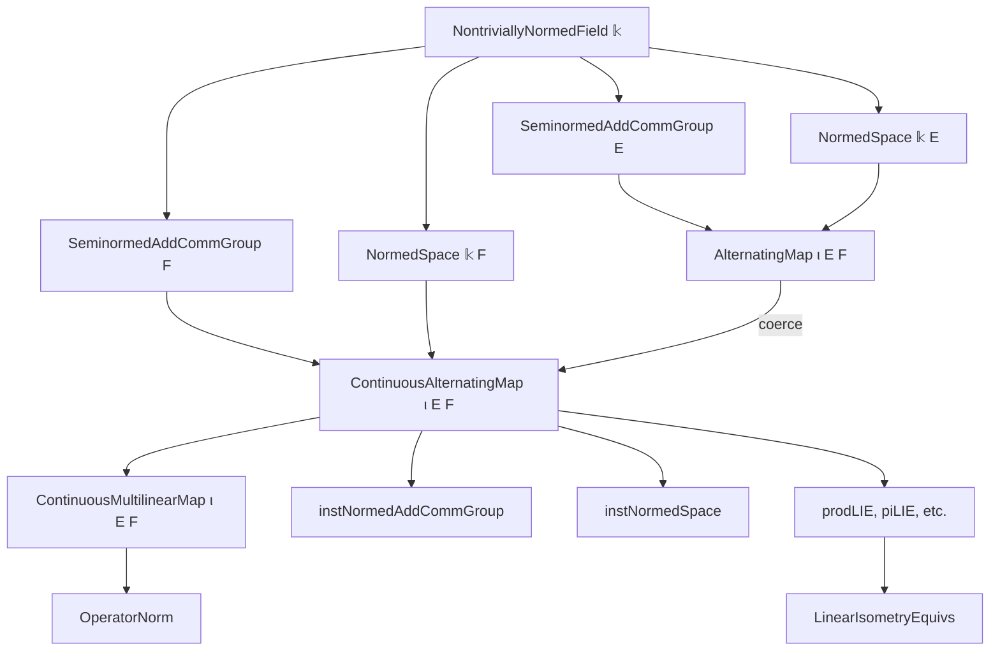
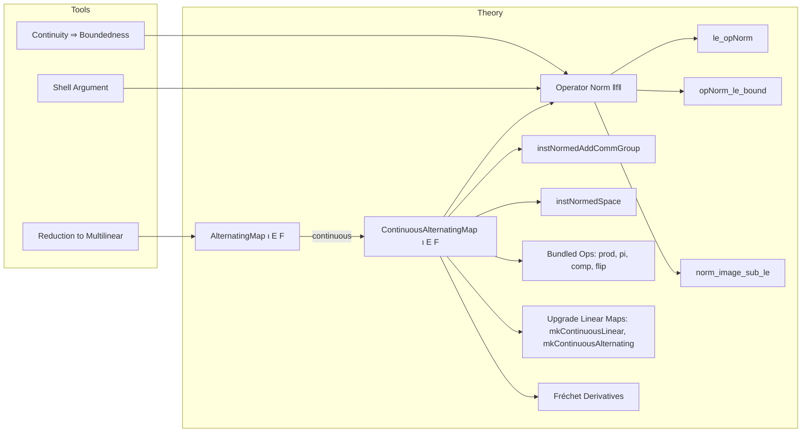

**Technical Brief: `Basic.lean` — Operator Norm on Continuous Alternating Maps**

---

### 1. KEY DEFINITIONS & THEOREMS

| Name | Type / Signature | Purpose |
|------|------------------|---------|
| `E [⋀^ι]→L[𝕜] F` | Type | Space of **continuous alternating maps** from `ι → E` to `F`, where `ι` is finite, `E`, `F` are normed spaces over a nontrivially normed field `𝕜`. |
| `norm f` | `‖f‖` | **Operator norm** of `f : E [⋀^ι]→L[𝕜] F`, defined as `sInf {c ≥ 0 | ∀ m, ‖f m‖ ≤ c * ∏ i, ‖m i‖}`. |
| `le_opNorm f m` | `‖f m‖ ≤ ‖f‖ * ∏ i, ‖m i‖` | Fundamental inequality bounding the image of `f`. |
| `opNorm_le_bound f M hM` | `‖f‖ ≤ M` under `∀ m, ‖f m‖ ≤ M * ∏ i, ‖m i‖` | Characterization of the operator norm as the least such bound. |
| `mkContinuous f C H` | `E [⋀^ι]→ₗ[𝕜] F → ℝ → (∀ m, ‖f m‖ ≤ C * ∏ i, ‖m i‖) → E [⋀^ι]→L[𝕜] F` | Constructor lifting an alternating map to a continuous one using a bound. |
| `norm_image_sub_le f m₁ m₂` | `‖f m₁ - f m₂‖ ≤ ‖f‖ * card ι * (max ‖m₁‖ ‖m₂‖)^(card ι - 1) * ‖m₁ - m₂‖` | Lipschitz-type bound on differences of `f`. |
| `instNormedAddCommGroup` | `SeminormedAddCommGroup` / `NormedAddCommGroup` | Equips `E [⋀^ι]→L[𝕜] F` with a (semi)normed additive commutative group structure. |
| `instNormedSpace` | `NormedSpace 𝕜' (E [⋀^ι]→L[𝕜] F)` | Extends scalar restriction to a normed space structure under compatibility assumptions. |
| `prodLIE`, `piLIE`, `compContinuousAlternatingMapCLM`, `flipAlternating`, `continuousAlternatingMapCongr`, etc. | `≃ₗᵢ[𝕜]` or `→L[𝕜]` | Bundled linear isometries / continuous linear maps for product, pi, composition, and congruence constructions. |
| `mkContinuousLinear`, `mkContinuousAlternating` | `F →ₗ[𝕜] E [⋀^ι]→ₗ[𝕜] G → F →L[𝕜] E [⋀^ι]→L[𝕜] G` | Upgrade linear maps into alternating maps to continuous linear maps between spaces of continuous alternating maps. |

---

### 2. NAMING CONVENTIONS

- **Prefixes**:
  - `norm_`, `opNorm_`, `nnnorm_`, `enorm_`: norms (real, operator, nonnegative real, extended real).
  - `mkContinuous_`, `mkContinuousLinear_`, `mkContinuousAlternating_`: constructors for bundled continuous maps.
  - `compContinuous_`, `flip_`, `prod_`, `pi_`: operations (composition, flipping arguments, product, pi).
  - `congr_` (e.g., `continuousAlternatingMapCongr`): equivalence constructions induced by domain/codomain equivalences.
  - `ofSubsingleton_`, `constOfIsEmpty_`: special cases for small index types.

- **Suffixes**:
  - `_LI`, `_LIE`: `LinearIsometry`, `LinearIsometryEquiv`.
  - `_CLM`: `ContinuousLinearMap`.
  - `_le`, `_le_iff`: inequalities and characterizations.
  - `_of_`: e.g., `bound_of_shell_of_continuous`, `continuous_of_bound`.

- **Notable patterns**:
  - `f.1` is used to project to the underlying multilinear map.
  - `f.toContinuousMultilinearMap` is the coercion to `ContinuousMultilinearMap`.
  - `f.toAlternatingMapLinear` is the underlying alternating map (linear in arguments).

---

### 3. TACTIC STACK

- **Core automation**:
  - `simp`, `ext`, `congr`, `gcongr`, `grw`
  - `rw`, `apply`, `refine`, `convert`
  - `linarith`, `nlinarith`, `ring`, `norm_num`
  - `aesop`, `interval_cases`, `cases`

- **Advanced/structural**:
  - `induction` (on `ι` or natural numbers)
  - `rcases`, `obtain`, `rintro`, `intro`
  - `have`, `suffices`, `by_cases`
  - `convert` + `with i` for symmetry arguments in alternating maps
  - `ext` + `simp` for functional extensionality

- **Topology/analysis-specific**:
  - `separation_iff`, `norm_eq_zero`, `isLeast_opNorm`, `isLeast_opNNNorm`
  - `bounds_nonempty`, `bounds_bddBelow`, `isLeast_opNorm`, `isLeast_opNNNorm`

---

### 4. PROOF LOGIC

The proofs follow a **modular strategy**:

1. **Reduction to multilinear case**:
   - Most lemmas are lifted from `ContinuousMultilinearMap` via coercion `toContinuousMultilinearMap`.
   - E.g., `le_opNorm`, `norm_image_sub_le`, `continuous_of_bound`, `exists_bound_of_continuous`.

2. **Bounding arguments**:
   - Use shell arguments (`bound_of_shell_of_continuous`, `bound_of_shell_of_norm_map_coord_zero`) to reduce global bounds to local ones.
   - Continuity + alternating property implies vanishing on degenerate inputs (`norm_map_coord_zero`).

3. **Normed space structure**:
   - Define norm via infimum of admissible constants.
   - Prove separation (for `NormedAddCommGroup`) using injectivity of coercion to multilinear maps.

4. **Bundled constructions**:
   - Use `LinearMap.mkContinuous`, `LinearMap.mkContinuous₂`, `ContinuousLinearMap.mkContinuous`, etc.
   - Verify continuity via `norm_map'` or `norm_compContinuousAlternatingMap_le`.

5. **Differentiation & calculus**:
   - `fderivCompContinuousLinearMap` is computed explicitly using sum over updates.
   - Derivative bounds use `norm_image_sub_le` and product estimates.

6. **Special cases**:
   - `Subsingleton ι`, `IsEmpty ι` handled separately (often trivializing alternating conditions).
   - Use `norm_ofSubsingleton_id` to compute norms of identity-like maps.

---

### 5. IMPORTS & DEPENDENCIES

**Primary imports**:
```lean
Mathlib.Topology.Algebra.Module.Alternating.Topology
Mathlib.Analysis.Normed.Module.Multilinear.Basic
```

**Key underlying theories**:
- `Mathlib.Analysis.Normed.Module.Multilinear.Basic`: multilinear maps, operator norm, continuity criteria.
- `Mathlib.Topology.Algebra.Module.Alternating.Topology`: topology on alternating maps, continuity.
- `Mathlib.Analysis.Normed.Space.Basic`, `Mathlib.Topology.MetricSpace.Basic`, `Mathlib.Algebra.Module.Alternating.Basic`: foundational structures.

**Typeclass assumptions**:
- `NontriviallyNormedField 𝕜`
- `SeminormedAddCommGroup E`, `NormedSpace 𝕜 E`
- `SeminormedAddCommGroup F`, `NormedSpace 𝕜 F`
- `Fintype ι` (finite index)
- `TopologicalSpace F`, `AddCommGroup F`, `IsTopologicalAddGroup F`, `Module 𝕜 F` for continuity of evaluation.

---

### 6. MERMAID DIAGRAMS

#### Dependency Graph (High-Level)



#### Overview of `Basic.lean`



---

### 7. SUMMARY

This file establishes the **operator norm structure** on the space of **continuous alternating maps** between seminormed/normed spaces over a nontrivially normed field. It leverages the existing theory of continuous multilinear maps, adapting key lemmas (boundedness, continuity, Lipschitz estimates, product/pi constructions) to the alternating setting. The proofs are largely mechanical once the multilinear theory is in place, but require careful handling of alternating properties (e.g., vanishing on degenerate inputs, symmetry under swaps). The file culminates in a robust toolkit for working with continuous alternating maps as a **normed space**, including linear isometries, derivative formulas, and upgrade lemmas for linear maps into alternating maps.

--- 

Let me know if you'd like a formalized dependency graph (e.g., `leanpkg` or `lake`-style), or a summary of the `ContinuousAlternatingMap` API for downstream use.
