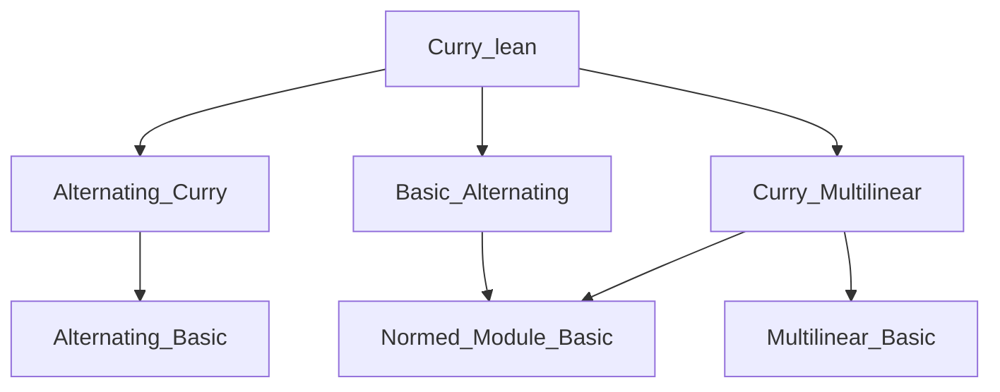

### Technical Brief: `Curry.lean` — Currying Continuous Alternating Forms

---

#### **1. Key Definitions & Theorems**

| Name | Type / Signature | Purpose |
|------|------------------|---------|
| `curryLeft` | `E [⋀^Fin (n + 1)]→L[𝕜] F → E →L[𝕜] E [⋀^Fin n]→L[𝕜] F` | Interprets a continuous alternating map in `n+1` variables as a continuous linear map into continuous alternating maps in `n` variables. |
| `curryLeftLI` | `(E [⋀^Fin (n + 1)]→L[𝕜] F) →ₗᵢ[𝕜] (E →L[𝕜] E [⋀^Fin n]→L[𝕜] F)` | The same currying operation, but viewed as a **linear isometry** (i.e., preserves norm and linearity). |
| `curryLeft_apply_apply` | `curryLeft f x v = f (Matrix.vecCons x v)` | Describes the action of `curryLeft f` on inputs: evaluates `f` on the vector with `x` prepended to `v`. |
| `norm_curryLeft` | `‖f.curryLeft‖ = ‖f‖` | Shows `curryLeft` is norm-preserving (hence an isometry). |
| `curryLeft_same` | `(f.curryLeft x).curryLeft x = 0` if `f` is alternating | Captures the alternating property: currying twice with the same argument yields zero. |
| `curryLeft_add`, `curryLeft_smul`, `curryLeft_zero` | Linearity properties | Confirm `curryLeft` is linear (and hence `curryLeftLI` is a linear isometry). |
| `curryLeft_compContinuousAlternatingMap` | Compatibility with post-composition | Shows `curryLeft` commutes with post-composition by continuous alternating maps. |
| `curryLeft_compContinuousLinearMap` | Compatibility with pre-composition | Shows how `curryLeft` interacts with pre-composition by continuous linear maps. |
| `toContinuousMultilinearMap_curryLeft`, `toAlternatingMap_curryLeft` | `rfl` | Relates `curryLeft` on continuous alternating maps to the underlying multilinear/alternating currying. |

---

#### **2. Naming Conventions**

- **Prefix `curryLeft`**: Used for the main currying operation (left-currying, i.e., separating the first argument).
- **Suffix `LI`**: Stands for *Linear Isometry* (e.g., `curryLeftLI`).
- **`to_` prefix**: For coercion or projection to underlying structures (e.g., `toAlternatingMap`, `toContinuousMultilinearMap`).
- **`compContinuousAlternatingMap`, `compContinuousLinearMap`**: Standard composition operations in this library.

---

#### **3. Tactic Stack**

- `rfl`: Used extensively for definitional equalities (e.g., `rfl` proofs for `curryLeft_apply_apply`, `to_` lemmas).
- `ext`: Used to prove equality of alternating maps by extensionality (`fun v ↦ ...`).
- `simp`: Used in `curryLeft_same` to simplify `Matrix.vecCons` and apply alternating property.
- `congr_arg`, `funext`, `cases i using Fin.cases`: Used in `curryLeft_compContinuousLinearMap` to handle index-wise equality.
- `by simp`: Common in `simp`-based simplifications.

---

#### **4. Proof Logic**

- **Definitional structure**: `curryLeft` is defined via `AlternatingMap.mkContinuousLinear`, lifting the multilinear currying (`curryLeft`) and verifying continuity via a norm bound.
- **Equality proofs**: Mostly rely on definitional equality (`rfl`) or extensionality (`ext`), leveraging the fact that alternating maps are determined by their values on vectors.
- **Norm preservation**: Uses `norm_map_cons_le` from multilinear maps to show continuity and norm equality.
- **Alternating property**: `curryLeft_same` uses the alternating property of `f` and `Fin.zero_ne_one` to show that repeating the same argument yields zero.
- **Functoriality**: Composition lemmas are proven by extensionality and simplification, often using `congr_arg` and `funext`.

---

#### **5. Imports & Dependencies**

- `Mathlib.LinearAlgebra.Alternating.Curry`: Provides `AlternatingMap.curryLeft`.
- `Mathlib.Analysis.Normed.Module.Alternating.Basic`: Defines `ContinuousAlternatingMap` and basic properties.
- `Mathlib.Analysis.Normed.Module.Multilinear.Curry`: Provides `ContinuousMultilinearMap.curryLeft`, used as the underlying construction.

These imports indicate this file sits at the intersection of:
- **Multilinear algebra** (alternating maps, wedge powers),
- **Normed space theory** (continuity, boundedness),
- **Category-theoretic structure** (linearity, composition, functoriality).

---

#### **6. Mermaid Diagrams**

##### **Dependency Graph (Module Level)**



##### **Conceptual Overview (Theory Flow)**

```mermaid
graph LR
  A[Continuous Multilinear Maps] -->|curryLeft| B[Continuous Linear → Continuous Multilinear]
  C[Alternating Maps] -->|inclusion| A
  D[Continuous Alternating Maps] -->|curryLeft| E[Continuous Linear → Continuous Alternating]
  E -->|norm preservation| F[Linear Isometry]
  D -->|alternating| G[Zero on repeated args]
  G -->|curryLeft_same| H[(f.curryLeft x).curryLeft x = 0]
```

##### **CurryLeft as a Natural Transformation**

```mermaid
graph LR
  Hom(⋀^{n+1} E, F) -->|curryLeft| Hom(E, Hom(⋀^n E, F))
  |                             |
  | post ∘ g                    | post ∘ g
  v                             v
  Hom(⋀^{n+1} E, G) -->|curryLeft| Hom(E, Hom(⋀^n E, G))
```

This expresses naturality of `curryLeft` in the codomain.

---

#### **7. Mathematical Interpretation**

The central construction is the isomorphism (in the category of normed spaces):

$$
\mathrm{ContAlt}^{n+1}(E, F) \cong \mathrm{ContLin}(E, \mathrm{ContAlt}^n(E, F))
$$

This mirrors the algebraic isomorphism:

$$
\mathrm{Alt}^{n+1}(M, N) \cong \mathrm{Hom}_R(M, \mathrm{Alt}^n(M, N))
$$

and reflects the universal property of the exterior power:

$$
\mathrm{Hom}\left(\bigwedge^{n+1} E, F\right) \cong \mathrm{Hom}\left(E, \mathrm{Hom}\left(\bigwedge^n E, F\right)\right)
$$

The continuity and norm preservation ensure this holds in the category of **Banach spaces** (or more generally, complete normed spaces over a nontrivially normed field).

---

Let me know if you'd like a formalization-level dependency graph (e.g., using `leanproject graph`) or a comparison with the multilinear `curryLeft`.
