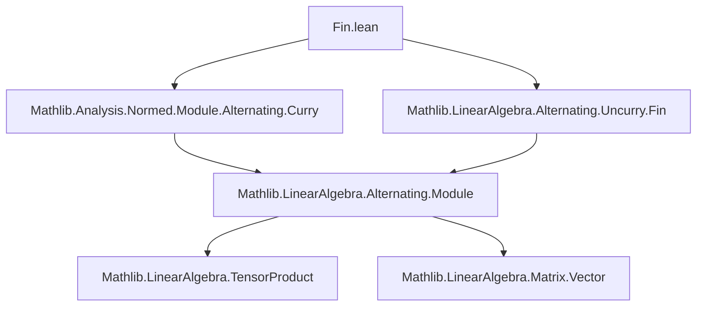

### Technical Brief: `Fin.lean` — Uncurrying Continuous Alternating Maps

---

#### **1. Key Definitions & Theorems**

| Name | Type / Signature | Purpose |
|------|------------------|---------|
| `map_insertNth` | `f (p.insertNth x v) = (-1)^p • f (Matrix.vecCons x v)` | Relates insertion at position `p` to prepending, up to sign. |
| `neg_one_pow_smul_map_insertNth` | `(-1)^p • f (p.insertNth x v) = f (Matrix.vecCons x v)` | Inverse of `map_insertNth`. |
| `neg_one_pow_smul_map_removeNth_add_eq_zero_of_eq` | `(-1)^i • f (i.removeNth v) + (-1)^j • f (j.removeNth v) = 0` | Key cancellation lemma for alternating sums when two entries coincide. |
| `alternatizeUncurryFinCLM.aux` | `(E →L[𝕜] E [⋀^Fin n]→L[𝕜] F) →ₗ[𝕜] E [⋀^Fin (n + 1)]→ₗ[𝕜] F` | Linear (not yet continuous) version of alternatization. |
| `alternatizeUncurryFinCLM` | `(E →L[𝕜] E [⋀^Fin n]→L[𝕜] F) →L[𝕜] E [⋀^Fin (n + 1)]→L[𝕜] F` | Continuous linear map version of alternatization. |
| `alternatizeUncurryFin` | `E →L[𝕜] E [⋀^Fin n]→L[𝕜] F → E [⋀^Fin (n + 1)]→L[𝕜] F` | Main construction: uncurries and alternatizes. |
| `alternatizeUncurryFin_apply` | `alternatizeUncurryFin f v = ∑ i, (-1)^i • f (v i) (i.removeNth v)` | Explicit formula for the construction. |
| `alternatizeUncurryFin_curryLeft` | `alternatizeUncurryFin (curryLeft f) = (n + 1) • f` | Round-trip identity: uncurrying then alternatizing recovers original up to scalar. |
| `alternatizeUncurryFin_alternatizeUncurryFinCLM_comp_of_symmetric` | `hf : symmetric ⇒ alternatizeUncurryFin (alternatizeUncurryFinCLM ∘L f) = 0` | Twice uncurried symmetric bilinear map yields zero — key for $d^2 = 0$. |
| `fderivCompContinuousLinearMap_eq_alternatizeUncurryFin` | `f.fderivCompContinuousLinearMap g = alternatizeUncurryFinCLM ∘L ((comp ∘ f.curryLeft).postcomp)` | Expresses derivative of composition in terms of alternatization. |
| `alternatizeUncurryFin_fderivCompContinuousLinearMap_eq_zero` | Under symmetry, `alternatizeUncurryFin (fderivComp ∘ h) = 0` | Application to exterior calculus: $d^2 = 0$. |

---

#### **2. Naming Conventions**

- **Prefixes**:
  - `alternatizeUncurryFin*`: main construction family.
  - `map_*`: properties of alternating maps.
  - `neg_one_pow_*`: sign-related lemmas.
  - `aux`: internal auxiliary definitions.
- **Suffixes**:
  - `CLM`: Continuous Linear Map version.
  - `LM`: Linear Map version (used internally).
  - `apply`: evaluation at a tuple.
  - `comp`: composition with other maps.
  - `ofSymmetric`, `ofEq`, `ofIsUnit`: conditional properties.

---

#### **3. Tactic Stack**

Frequent tactics used in proofs:

| Tactic | Role |
|--------|------|
| `simp` | Simplify using definitions, especially `alternatizeUncurryFin_apply`, `curryLeft`, `removeNth`, `insertNth`. |
| `ext` | Extensionality for functions/maps (e.g., alternating maps). |
| `rw` | Rewrite using lemmas like `map_insertNth`, `neg_one_pow_smul_map_insertNth`. |
| `cases` + `Fin.succAboveCases` | Handle `Fin` indices via case analysis. |
| `simp_rw` | Combine `simp` + `rw` for complex rewrites. |
| `norm_num`, `norm_cast`, `norm_add`, `norm_mul` | Norm estimates in continuity proofs. |
| `apply`, `exact`, `refine` | Goal-directed proof construction. |
| ` positivity` | Used in norm bounds (e.g., for `mkContinuousLinear_norm_le`). |

---

#### **4. Proof Logic**

- **Structure**: Most proofs follow a pattern:
  1. **Extensionality**: Prove equality of maps by evaluating on arbitrary `v : Fin k → E`.
  2. **Index-wise simplification**: Use `alternatizeUncurryFin_apply` to expand sums.
  3. **Sign bookkeeping**: Leverage `neg_one_pow_*` lemmas to handle permutations.
  4. **Cancellation**: Use `neg_one_pow_smul_map_removeNth_add_eq_zero_of_eq` to kill pairs of terms when inputs repeat.
  5. **Symmetry exploitation**: For symmetric inputs, pair terms $(i,j)$ and $(j,i)$ to show cancellation.

- **Induction**: Not explicitly used here; instead, finite summation and pairing arguments dominate.

- **Norm estimates**: Use `norm_sum_le_of_le`, `norm_isUnit_zsmul`, and operator norm bounds.

---

#### **5. Imports**

| Module | Purpose |
|--------|---------|
| `Mathlib.Analysis.Normed.Module.Alternating.Curry` | Curry/uncurry theory for alternating maps. |
| `Mathlib.LinearAlgebra.Alternating.Uncurry.Fin` | Finite-index uncurrying lemmas (e.g., `alternatizeUncurryFinLM`). |

---

#### **8. Mermaid Diagrams**

##### **Dependency Graph (Module-Level)**



##### **Overview of Theory Flow**

```mermaid
graph LR
  A[Continuous Multilinear Maps] --> B[Currying]
  B --> C[Alternating Maps]
  C --> D[Uncurrying + Alternatization]
  D --> E[Round-trip Identity: (n+1)•f]
  D --> F[Symmetric Input ⇒ Zero]
  F --> G[Application: d² = 0]
```

##### **Data Flow of `alternatizeUncurryFin`**

```mermaid
graph LR
  f[E →L[𝕜] E [⋀^n]→L[𝕜] F] -->|input| CLM[alternatizeUncurryFinCLM]
  CLM -->|output| g[E [⋀^(n+1)]→L[𝕜] F]
  g -->|apply| v[Fin (n+1) → E]
  v -->|sum| ∑[∑_i (-1)^i • f(v i) (removeNth i v)]
```

---

#### **Summary**

This module formalizes a key step in the theory of exterior calculus: the *alternatization* of uncurried maps. It provides a constructive way to turn a continuous linear map into the first argument of an alternating map into a full alternating map of one higher arity. The absence of division by $n+1$ ensures applicability over arbitrary normed fields (including positive characteristic). The central theorem `alternatizeUncurryFin_alternatizeUncurryFinCLM_comp_of_symmetric` is the algebraic core behind the nilpotency of the exterior derivative ($d^2 = 0$), a foundational result in differential geometry.
