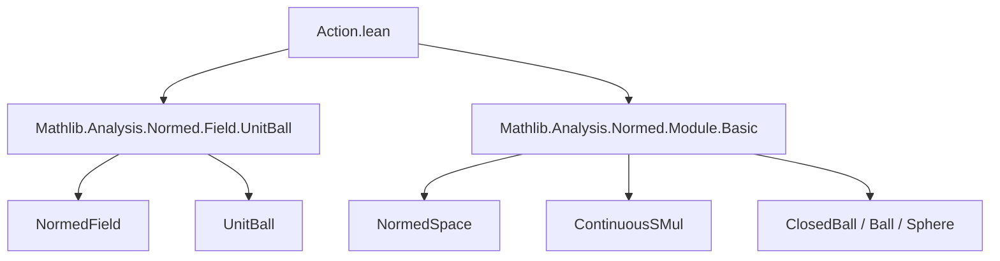
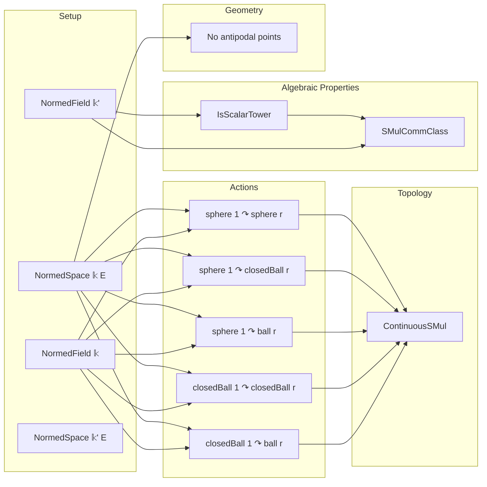

### Technical Brief: `Action.lean` — Multiplicative Actions on Balls and Spheres in Normed Spaces

---

#### **1. Key Definitions & Theorems**

| Name | Type / Purpose |
|------|----------------|
| `mulActionClosedBallBall` | `MulAction (closedBall (0 : 𝕜) 1) (ball (0 : E) r)` — scalar multiplication by closed unit ball in field preserves open ball centered at 0. |
| `mulActionClosedBallClosedBall` | `MulAction (closedBall (0 : 𝕜) 1) (closedBall (0 : E) r)` — scalar multiplication by closed unit ball preserves closed ball. |
| `mulActionSphereBall` | `MulAction (sphere (0 : 𝕜) 1) (ball (0 : E) r)` — unit sphere acts on open ball (via inclusion into closed ball). |
| `mulActionSphereClosedBall` | `MulAction (sphere (0 : 𝕜) 1) (closedBall (0 : E) r)` — unit sphere acts on closed ball. |
| `mulActionSphereSphere` | `MulAction (sphere (0 : 𝕜) 1) (sphere (0 : E) r)` — unit sphere acts on sphere (norm-preserving action). |
| `continuousSMul_*` (8 total) | `ContinuousSMul` instances for all above actions — ensures continuity of scalar multiplication. |
| `isScalarTower_*` (9 total) | `IsScalarTower` instances for combinations of closed balls, spheres, and balls over nested normed algebras. |
| `instSMulCommClass_*` (8 total) | `SMulCommClass` instances ensuring scalar multiplications from two fields commute on modules. |
| `ne_neg_of_mem_sphere` | `r ≠ 0 → x ∈ sphere (0 : E) r → x ≠ -x` — no antipodal points on nonzero-radius sphere. |
| `ne_neg_of_mem_unit_sphere` | `x ∈ sphere (0 : E) 1 → x ≠ -x` — corollary for unit sphere (uses `one_ne_zero`). |

---

#### **2. Naming Conventions**

- **Prefixes**:
  - `mulAction*`: defines multiplicative action structure.
  - `continuousSMul*`: ensures continuity of the action.
  - `isScalarTower*`: encodes associativity of scalar multiplication across nested algebras.
  - `instSMulCommClass*`: encodes commutativity of scalar multiplications from two algebras.

- **Suffixes**:
  - `closedBall_closedBall_closedBall`: domain, codomain, target — all closed balls.
  - `sphere_sphere_ball`: domain = sphere, codomain = sphere, target = ball.
  - `ball_ball_ball`, `closedBall_ball_ball`: mix of open/closed sets.

- **Structure**:
  - `X_Y_Z` where `X` = action domain (e.g., `closedBall (0 : 𝕜) 1`), `Y` = codomain (e.g., `closedBall (0 : E) r`), `Z` = target (often same as `Y`).

---

#### **3. Tactic Stack**

Frequent tactics used in proofs:

| Tactic | Role |
|--------|------|
| `simpa` | Simplifies goals using lemmas like `norm_smul`, `one_mul`, `mem_*_zero_iff`. |
| `rw` | Rewrites using `norm_smul`, `one_mul`, `mem_*_zero_iff`, etc. |
| `conv_lhs => rw [...]` | Local rewriting in left-hand side of equation. |
| `fun_prop` | Proves continuity of functions built from continuous operations (used in `continuousSMul_*`). |
| `mul_lt_mul'`, `mul_le_mul` | Used to bound norms under scalar multiplication. |
| `Subtype.ext` | Proves equality of subtype elements (e.g., pairs `(c • x, h)`) by equality of their coercions. |
| `self_eq_neg.mp` | From hypothesis `x = -x`, deduces `x = 0`. |
| `of_isTorsionFree` | Used to deduce additive torsion-freeness from `CharZero`. |

---

#### **4. Proof Logic**

- **Structure of proofs**:
  - For each `MulAction` instance:
    1. Define `smul` as scalar multiplication on underlying elements.
    2. Prove result stays in set using norm inequalities (`mem_*_zero_iff` lemmas).
    3. Use `Subtype.ext` to lift `one_smul` and `mul_smul` from ambient space.
  - For `ContinuousSMul`:
    - Use `Continuous.subtype_mk` + `fun_prop` to show continuity of the action map.
  - For `IsScalarTower` / `SMulCommClass`:
    - Use `smul_assoc` / `smul_comm` in ambient space, then `Subtype.ext`.
  - For `ne_neg_of_mem_sphere`:
    - Assume `x = -x`, deduce `2 • x = 0`, then use torsion-freeness (`CharZero`) and nonzero radius to conclude `x = 0`, contradicting `x ∈ sphere r` with `r ≠ 0`.

- **Induction / Cases**: Not used — proofs are direct algebraic manipulations.

---

#### **5. Imports**

| Import | Purpose |
|--------|---------|
| `Mathlib.Analysis.Normed.Field.UnitBall` | Defines unit ball/sphere in normed fields, basic properties. |
| `Mathlib.Analysis.Normed.Module.Basic` | Normed vector spaces, scalar multiplication, continuity, balls/spheres. |

---

#### **6. Mermaid Diagrams**

##### **Dependency Graph (Module-Level)**

##### **Overview of Theory Flow**

---

#### **7. Summary**

This file formalizes **multiplicative groupoid actions** of unit balls and spheres (in a normed field `𝕜`) on balls and spheres (in a normed space `E`). It establishes:

- **Algebraic structure**: `MulAction` for all combinations.
- **Topological compatibility**: `ContinuousSMul`.
- **Compatibility with scalar tower / commutativity**: `IsScalarTower`, `SMulCommClass`.
- **Geometric rigidity**: No nonzero vector equals its negation on a sphere (if `CharZero`).

The formalization is highly uniform: all instances follow a pattern of defining the action, verifying closure via norm estimates, and lifting properties via `Subtype.ext`. The `CharZero` assumption ensures torsion-freeness, enabling the final geometric lemma.

--- 

Let me know if you'd like a formalized dependency graph (e.g., for `leanpkg`), or a visualization of the `smul` definitions.
