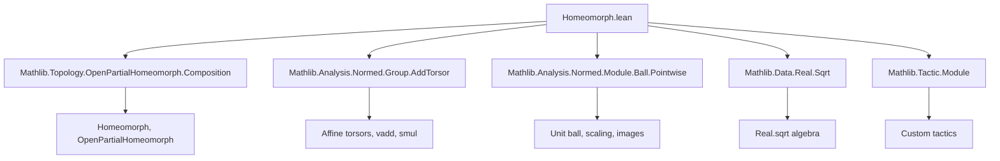

**Technical Brief: Homeomorph.lean (Lean 4 Formalization)**  
*Domain: Topology of Normed Vector Spaces — Homeomorphisms to the Unit Ball*

---

### 1. KEY DEFINITIONS & THEOREMS

| Name | Type | Purpose |
|------|------|---------|
| `OpenPartialHomeomorph.univUnitBall` | `OpenPartialHomeomorph E E` | Constructs a *global* open partial homeomorphism from the whole space $E$ to the open unit ball $\mathrm{ball}(0,1)$ via the map $x \mapsto \frac{x}{\sqrt{1 + \|x\|^2}}$. |
| `Homeomorph.unitBall` | `E ≃ₜ ball 0 1` | A *homeomorphism* (not just partial) between $E$ and the open unit ball, obtained by restricting `univUnitBall` to its source/target. |
| `OpenPartialHomeomorph.unitBallBall` | `OpenPartialHomeomorph E P` | For $r > 0$, an affine homeomorphism between the unit ball in $E$ and $\mathrm{ball}(c, r) \subseteq P$, where $P$ is a normed affine torsor over $E$. |
| `OpenPartialHomeomorph.univBall` | `OpenPartialHomeomorph E P` | A unified construction: if $r > 0$, it's the composition `univUnitBall ∘ unitBallBall`; otherwise, it's just translation by $c$. |
| `univBall_apply_zero` | `univBall c r 0 = c` | Normalization: the map sends the origin to the center $c$. |
| `univBall_symm_apply_center` | `(univBall c r).symm c = 0` | Inverse property at the center. |
| `continuous_univBall` | `Continuous (univBall c r)` | Global continuity of the map. |
| `continuousOn_univBall_symm` | `ContinuousOn (univBall c r).symm (ball c r)` | Continuity of the inverse on its natural domain. |

---

### 2. NAMING CONVENTIONS

- **Prefixes**:
  - `univ_`: indicates source = `univ` (entire space).
  - `unitBall_`: pertains to the unit ball $\mathrm{ball}(0,1)$.
  - `smulOfNeZero`, `vaddConst`: standard `IsometryEquiv`/`Homeomorph` constructors.
- **Suffixes**:
  - `_apply`: function application (e.g., `univUnitBall_apply`).
  - `_symm_apply`: inverse function application.
  - `_source`, `_target`: accessor lemmas for domain/codomain.
- **Pattern**: `OpenPartialHomeomorph.[name]`, `Homeomorph.[name]`, `continuousOn_[name]`, etc.

---

### 3. TACTIC STACK

Frequent tactics used in proofs:

| Tactic | Role |
|--------|------|
| `match_scalars` | Simplifies scalar multiplication expressions (custom tactic for normed spaces). |
| `field_simp` | Cancels nonzero denominators (e.g., $\sqrt{1 + \|x\|^2} \ne 0$). |
| `simp [norm_smul, Real.sq_sqrt, abs_norm]` | Rewrites norms of scaled vectors and square roots. |
| `nlinarith` | Handles inequalities involving norms and positivity (e.g., $0 < 1 - \|y\|^2$). |
| `fun_prop` | Proves continuity of function compositions (via `Continuous`/`ContinuousOn` closure properties). |
| `split_ifs` | Handles `if h : 0 < r then ... else ...` cases. |
| `rw [image_smul, smul_unitBall]` | Rewrites images of sets under scalar multiplication. |
| `simp only [...] using ...` | Applies a lemma via substitution and exactness. |

---

### 4. PROOF LOGIC

**General proof strategy**:

1. **Define maps explicitly** (e.g., $x \mapsto x / \sqrt{1 + \|x\|^2}$).
2. **Verify well-definedness**:
   - Show image lies in target (e.g., $\|x\| / \sqrt{1 + \|x\|^2} < 1$).
   - Show inverse maps land in source (e.g., $\|y\| < 1 \Rightarrow \|y\| / \sqrt{1 - \|y\|^2} \in \mathbb{R}_{\ge 0}$).
3. **Prove inverse properties**:
   - Use `field_simp` + `simp` + algebraic simplifications (e.g., cancel scalars, apply `Real.sq_sqrt`).
4. **Continuity**:
   - Decompose into basic continuous operations (`norm`, `sqrt`, `inv`, `smul`, `id`).
   - Use `fun_prop` and `ContinuousOn.*` lemmas.
5. **Case analysis** (for `univBall`):
   - If $r > 0$, compose with affine map.
   - Else, use translation.

Induction is *not* used — proofs are direct and computational.

---

### 5. IMPORTS & DEPENDENCIES

| Module | Role |
|--------|------|
| `Mathlib.Topology.OpenPartialHomeomorph.Composition` | Provides composition & basic theory of `OpenPartialHomeomorph`. |
| `Mathlib.Analysis.Normed.Group.AddTorsor` | Defines torsor structure for affine spaces over normed groups. |
| `Mathlib.Analysis.Normed.Module.Ball.Pointwise` | Set operations on balls (e.g., `smul_unitBall`). |
| `Mathlib.Data.Real.Sqrt` | Properties of `Real.sqrt`, including monotonicity and algebraic laws. |
| `Mathlib.Tactic.Module` | Tactics like `match_scalars`, `fun_prop`, etc. |

**Core theory**: Lean’s `Mathlib` analysis and topology library — especially normed spaces, continuity, and homeomorphisms.

---

### 6. MERMAID DIAGRAMS

#### Dependency Graph (High-Level)



#### Overview of File Structure

```mermaid
flowchart LR
  subgraph Definitions
    U[OpenPartialHomeomorph.univUnitBall]
    H[Homeomorph.unitBall]
    B[OpenPartialHomeomorph.unitBallBall]
    V[OpenPartialHomeomorph.univBall]
  end

  subgraph Properties
    Z1[Apply zero = zero]
    Z2[Symm zero = zero]
    C1[Continuous]
    C2[ContinuousOn inverse]
    T[Target = ball c r (if r > 0)]
  end

  U --> H
  U --> Z1
  U --> Z2
  U --> C1
  U --> C2

  B --> V
  V --> T
  V --> Z1
  V --> C1
  V --> C2
```

---

### 7. THEORY CONTEXT

- **Goal**: Show *any* real (semi)normed vector space $E$ is homeomorphic to its unit ball — a foundational result used to model manifolds, diffeomorphisms, and local coordinates.
- **Why `OpenPartialHomeomorph`?** It allows a *globally defined* inverse (as a partial map), crucial for proving smoothness (`ContDiff`) later (see comments referencing `Homeomorph.contDiff_unitBall`).
- **Affine generalization**: Extends to balls centered at arbitrary points $c$ in a torsor $P$, enabling coordinate charts on manifolds.

---

### 8. NOTES

- The map $x \mapsto x / \sqrt{1 + \|x\|^2}$ is a *standard* homeomorphism from $\mathbb{R}^n$ to the open unit ball (generalizes to infinite dimensions).
- The `univBall` construction unifies scaling + translation + radial retraction into one reusable tool.
- The file avoids `classical` or `choice` — all definitions are *computable* (though `noncomputable section` is used for `Homeomorph.unitBall` due to `≃ₜ` being noncomputable in general).

--- 

Let me know if you'd like a formalized dependency graph (e.g., `.lean`-level imports) or a proof sketch for a specific theorem.
