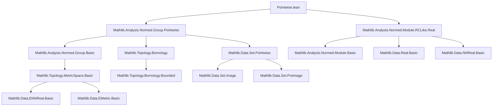
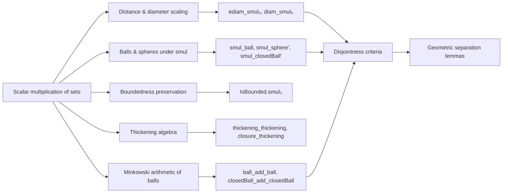

**Technical Brief: `Pointwise.lean` — Properties of Scalar Multiplication of Sets in Normed Spaces**

---

### **1. Key Definitions & Theorems**

| Name | Type / Signature | Purpose |
|------|------------------|---------|
| `ediam_smul_le` | `ediam (c • s) ≤ ‖c‖₊ • ediam s` | Upper bound on extended diameter under scalar multiplication (for seminormed spaces). |
| `ediam_smul₀` | `ediam (c • s) = ‖c‖₊ • ediam s` | Exact equality of extended diameter under nonzero scalar multiplication (in normed division rings). |
| `diam_smul₀` | `diam (c • x) = ‖c‖ * diam x` | Diameter scaling under scalar multiplication (real-valued). |
| `infEDist_smul₀` | `infEDist (c • x) (c • s) = ‖c‖₊ • infEDist x s` | Scaling of extended distance from a point to a set under scalar multiplication (nonzero scalar). |
| `infDist_smul₀` | `Metric.infDist (c • x) (c • s) = ‖c‖ * Metric.infDist x s` | Real-valued distance scaling. |
| `smul_ball` | `c • ball x r = ball (c • x) (‖c‖ * r)` | Scalar multiplication maps balls to balls (nonzero scalar). |
| `smul_unitBall` | `c • ball 0 1 = ball 0 ‖c‖` | Image of unit ball under scalar multiplication. |
| `smul_sphere'`, `smul_closedBall'` | `c • sphere x r = sphere (c • x) (‖c‖ * r)`<br>`c • closedBall x r = closedBall (c • x) (‖c‖ * r)` | Scalar multiplication preserves spheres and closed balls (nonzero scalar). |
| `set_smul_sphere_zero` | `s • sphere 0 r = (‖·‖) ⁻¹' ((‖·‖ * r) '' s)` | Description of scalar multiplication of sphere at 0 as preimage of radial scaling. |
| `Bornology.IsBounded.smul₀` | `IsBounded s → IsBounded (c • s)` | Scalar multiplication preserves boundedness. |
| `eventually_singleton_add_smul_subset` | `∀ᶠ r in 𝓝 0, {x} + r • s ⊆ u` | Small scalar multiples of bounded sets shrink into neighborhoods. |
| `smul_unitBall_of_pos`, `smul_unitClosedBall_of_nonneg` | `r • ball 0 1 = ball 0 r` (for `r > 0`) | Scaling unit ball by positive real gives ball of radius `r`. |
| `Ioo_smul_sphere_zero` | `Ioo a b • sphere 0 r = ball 0 (b * r) \ closedBall 0 (a * r)` | Scalar multiplication of sphere at 0 by interval yields annulus. |
| `exists_dist_eq`, `exists_dist_le_le`, `exists_dist_lt_lt`, etc. | Various existence lemmas for points splitting a segment | Construct points with prescribed distances (used in ball disjointness criteria). |
| `disjoint_ball_ball_iff`, `disjoint_closedBall_closedBall_iff`, etc. | Characterizations of disjointness of balls via radius sum vs. distance | Key geometric lemmas for separation properties. |
| `infEDist_thickening`, `thickening_thickening`, `closure_thickening`, etc. | Properties of thickening (Minkowski sum with open/closed balls) | Algebraic and topological behavior of thickening under scalar multiplication and closure. |
| `ball_add_ball`, `ball_sub_closedBall`, `closedBall_add_closedBall`, etc. | Sum/difference of balls = ball of sum/difference of centers + sum of radii | Minkowski arithmetic of balls. |
| `affinity_unitBall`, `affinity_unitClosedBall` | `x + r • ball 0 1 = ball x r` (for `r > 0`) | Affine image of unit ball = arbitrary ball. |

---

### **2. Naming Conventions**

- **Prefixes**:
  - `smul_`: scalar multiplication of sets (`c • s`)
  - `infEDist_`, `infDist_`: extended/real-valued distance to a set
  - `thickening_`, `cthickening_`: Minkowski sums with open/closed balls
  - `disjoint_`: disjointness criteria for balls
  - `exists_dist_`: existence of points with distance constraints
  - `affinity_`: affine images of unit ball

- **Suffixes**:
  - `_le`, `_lt`, `_eq`: inequality/equality direction in conclusion
  - `_iff`: equivalence (↔) statement
  - `_zero`: center at 0
  - `_of_pos`, `_of_nonneg`: assumptions on scalar (e.g., `r > 0`, `r ≥ 0`)
  - `_subset`: subset inclusion
  - `mem_`, `set_`: set-theoretic characterizations

- **Notable patterns**:
  - `smul_ball`, `smul_sphere'`, `smul_closedBall'`: prime indicates nonzero scalar version
  - `smul₀`: nonzero scalar version (e.g., `smul_ball` requires `c ≠ 0`, `smul_ball₀` would be redundant — `smul_ball` already assumes `hc : c ≠ 0`)
  - `ediam` vs `diam`: extended vs real diameter

---

### **3. Tactic Stack**

Frequently used tactics in proofs:

| Tactic | Role |
|--------|------|
| `rw` / `simp_rw` | Rewriting definitions (e.g., `mem_smul_set`, `dist_eq_norm`, `diam`, `ediam`) |
| `ext` | Extensionality for set equality |
| `conv_lhs => rw [...]` | Local rewriting in left-hand side of equation |
| `rcases` / `obtain` / `cases'` | Case analysis on `c = 0`, `r ≥ 0`, `s = ∅`, etc. |
| `exact`, `refine`, `apply` | Goal-directed proof construction |
| `gcongr` | Congruence for inequalities with monotone functions |
| `field`, `linarith`, `ring` | Arithmetic simplification (especially for real numbers) |
| `simp only [...]` | Simplify with precise lemmas (e.g., `mem_sphere`, `dist_smul₀`) |
| `antisymm` | Prove equality by double inequality (common for `ediam`, `thickening`) |
| `iUnion₂_congr`, `iUnion_congr` | Congruence for indexed unions |
| `filter_upwards` | Filter-based eventual containment proofs |
| `nontriviality` (implicit via `[Nontrivial E]`) | Ensures space has at least two points (for sphere nonemptiness) |

---

### **4. Proof Logic**

**General proof strategy**:

1. **Reduction to nonzero scalars**:
   - Split on `c = 0` or `c ≠ 0` (e.g., `rcases eq_or_ne c 0`).
   - Handle zero case trivially (`zero_smul_set`, `singleton_zero`).
   - For nonzero case, use invertibility (`c⁻¹`, `inv_smul_smul₀`).

2. **Metric/Distance-based reasoning**:
   - Translate set operations (e.g., `mem_smul_set`, `mem_ball`, `mem_sphere`) into norm/distance conditions.
   - Use lemmas like `dist_smul₀`, `norm_smul`, `edist_smul₀`.

3. **Diameter & boundedness**:
   - Use Lipschitz property of scalar multiplication (`lipschitzWith_smul`).
   - Apply `ediam_image_le` and invert via `ediam_smul₀` using `inv_smul_smul₀`.

4. **Thickening & closure**:
   - Prove inclusions via `thickening_subset_iff`, `mem_thickening_iff`.
   - Use `infEDist_thickening` to reduce to arithmetic on `infEDist`.
   - Apply `antisymm` for equality (e.g., `thickening_thickening`).

5. **Ball disjointness**:
   - Reduce to existence of a point in intersection via `disjoint_iff_not_mem`.
   - Use `exists_dist_lt_lt`, `exists_dist_le_le`, etc., to construct such a point if `δ + ε < dist x y`.

6. **Real scalar case**:
   - Use `Real.norm_of_nonneg`, `Real.norm_of_pos` to simplify `‖c‖`.
   - Leverage `div_pos`, `div_le_one`, `mul_le_of_le_one_left` for real inequalities.

---

### **5. Imports & Dependencies**

**Primary imports**:
```lean
Mathlib.Analysis.Normed.Group.Pointwise
Mathlib.Analysis.Normed.Module.RCLike.Real
```

**Key underlying theories**:
- `SeminormedAddCommGroup`, `NormedDivisionRing`, `NormedSpace`
- `SMulZeroClass`, `IsBoundedSMul`, `NormSMulClass`
- `Metric`, `Set`, `Pointwise`, `Topology`, `ENNReal`, `EMetric`
- `Bornology`, `Filter`, `ProperSpace` (for `closedBall_add_closedBall`)

**Core dependencies**:
- `Mathlib.Analysis.Normed.Group.Basic`
- `Mathlib.Analysis.Normed.Module.Basic`
- `Mathlib.MeasureTheory.MeasurableSpace.Prod`
- `Mathlib.Topology.MetricSpace.Basic` (via `Metric`)
- `Mathlib.Topology.Bornology` (for `IsBounded`, `thickening`)
- `Mathlib.Data.ENNReal.Basic`, `ENNReal.Arithmetic`

---

### **6. Mermaid Diagrams**

#### **Dependency Graph (Module-Level)**



#### **Overview of Theoretical Flow**



---

### **7. Notes & Observations**

- **Real vs general field**: Many results (e.g., `smul_unitBall_of_pos`, `Ioo_smul_sphere_zero`) are stated for `NormedSpace ℝ`, but comments note they hold for `ℚ`-normed spaces too.
- **Nonzero scalar assumption**: Critical for invertibility; handled via `hc : c ≠ 0` or `hc : 0 < r`.
- **Boundedness**: Uses `Bornology.IsBounded`, leveraging `IsBoundedSMul` and Lipschitz maps.
- **Thickening vs closure**: `closure (thickening δ s) = cthickening δ s` for `δ > 0`, but not for `δ = 0` (interior may differ).
- **Deprecation**: `infEdist_*` aliases point to `infEDist_*` (2026-01-08), indicating migration to uppercase `EDist`.

--- 

**End of Technical Brief**
