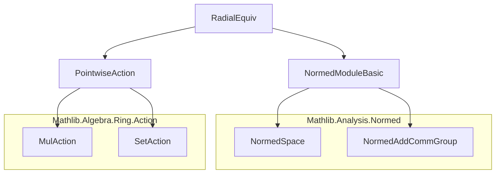

**Technical Brief: `RadialEquiv.lean`**

---

### 1. **Key Definitions & Theorems**

| Name | Type | Purpose |
|------|------|---------|
| `homeomorphSphereProd E r hr` | `({0}ᶜ : Set E) ≃ₜ (sphere (0 : E) r × Ioi (0 : ℝ))` | Constructs a **homeomorphism** between nonzero vectors in a normed space `E` and pairs of (point on sphere of radius `r`, positive real scaling factor). Generalizes polar coordinates. |
| `homeomorphUnitSphereProd E` | `({0}ᶜ : Set E) ≃ₜ (sphere (0 : E) 1 × Ioi (0 : ℝ))` | Special case of `homeomorphSphereProd` for unit sphere (`r = 1`). |
| `IsOpen.smul_sphere` | `r ≠ 0 → IsOpen U → 0 ∉ U → IsOpen V → IsOpen (U • V)` | Proves that the pointwise scalar product of an open set `U ⊆ ℝ \ {0}` and an open subset `V` of a sphere (of nonzero radius) is open in `E`. Key for continuity arguments. |

**Forward/Inverse Maps (for `homeomorphSphereProd`)**  
- `toFun ⟨x, hx⟩ = (r • ‖x‖⁻¹ • x, ‖x‖ / r)`  
- `invFun (x, d) = d • x`  

**Forward/Inverse Maps (for `homeomorphUnitSphereProd`)**  
- `toFun ⟨x, hx⟩ = (‖x‖⁻¹ • x, ‖x‖)`  
- `invFun (x, d) = d • x`  

---

### 2. **Naming Conventions**

- **Prefixes**:
  - `homeomorph*`: Denotes homeomorphisms (`≃ₜ`).
  - `smul_*`: Scalar multiplication–related lemmas.
- **Suffixes**:
  - `_prod`: Product structure (sphere × ray).
  - `_unit`: Unit sphere specialization.
- **Variables**:
  - `E`: Normed space over `ℝ`.
  - `r`, `hr`: Radius and positivity proof.
  - `U`, `V`: Open subsets of `ℝ` and sphere respectively.

---

### 3. **Tactic Stack**

Frequently used tactics in proofs:
- `simp`, `simp only`, `simp (disch := positivity)` — simplification with custom discharges.
- `field_simp`, `ring` — algebraic simplification in fields.
- `ext` — extensionality for subtype equality.
- `fun_prop` — for proving continuity of function compositions.
- `filter_upwards` — for filtering neighborhood bases.
- `wlog` — without loss of generality (for sign cases).
- `lift ... to Ioi` — lifting to positive reals via order.
- `rw [mem_*]`, `apply Set.smul_mem_smul` — membership and set-theoretic reasoning.

---

### 4. **Proof Logic**

- **Homeomorphism proofs**:
  - `left_inv`, `right_inv`: Prove inverse properties using field simplifications and norm identities.
  - `continuous_toFun`: Proven via `fun_prop`, leveraging continuity of basic operations (`norm`, `smul`, `inv`).
- **Openness proof (`IsOpen.smul_sphere`)**:
  - Uses neighborhood-based definition (`isOpen_iff_mem_nhds`).
  - Splits into sign cases (`wlog` on `x > 0`).
  - Lifts to `Ioi (0 : ℝ)` to use positivity.
  - Pulls back openness via `homeomorphSphereProd.symm` and maps forward via continuity of scalar multiplication.
  - Relies on `IsOpen.nhdsWithin_eq`, `map_nhds_subtype_val`, and set-theoretic identities.

---

### 5. **Imports & Dependencies**

| Import | Role |
|--------|------|
| `Mathlib.Analysis.Normed.Module.Basic` | Provides normed space structure, continuity of scalar mult, norm properties. |
| `Mathlib.Algebra.Ring.Action.Pointwise.Set` | Defines pointwise scalar multiplication on sets (`U • V`). |

**Core theories used**:
- Normed additive commutative groups and real normed spaces.
- Metric topology: spheres, neighborhoods, openness.
- Filter theory: continuity, image under maps, neighborhood bases.
- Subtype topology: complement of `{0}`, `Ioi`.

---

### 6. **Mermaid Diagrams**

#### **Dependency Graph (File-Level)**



#### **Overview of Theory Flow**

```mermaid
flowchart LR
  A[Normed Space E] --> B[Nonzero vectors {0}ᶜ]
  B --> C[Homeomorph to sphere × Ioi]
  C --> D[Forward map: normalize & scale]
  C --> E[Inverse: scale by radius]
  D --> F[Generalized polar coords]
  E --> F
  G[IsOpen.smul_sphere] --> H[Openness of scalar products]
  H --> I[Continuity of homeomorphisms]
  I --> C
```

---

### 7. **Summary**

This file formalizes a **radial decomposition** of nonzero vectors in any real normed space: every nonzero vector uniquely decomposes as a unit direction (on a sphere) times a positive radial component. The construction is a **canonical homeomorphism**, generalizing polar coordinates beyond Euclidean space. It also proves a key topological lemma (`IsOpen.smul_sphere`) needed to ensure continuity and openness of the coordinate charts involved.

This underpins constructions in analysis and geometry where spherical coordinates or radial retraction are used (e.g., compactification, blow-ups, or spherical symmetry arguments).
