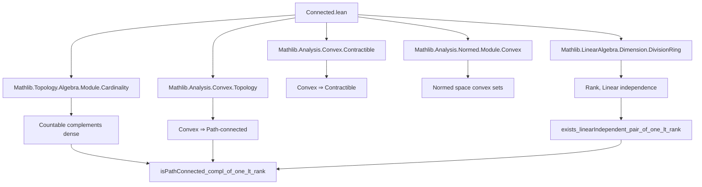
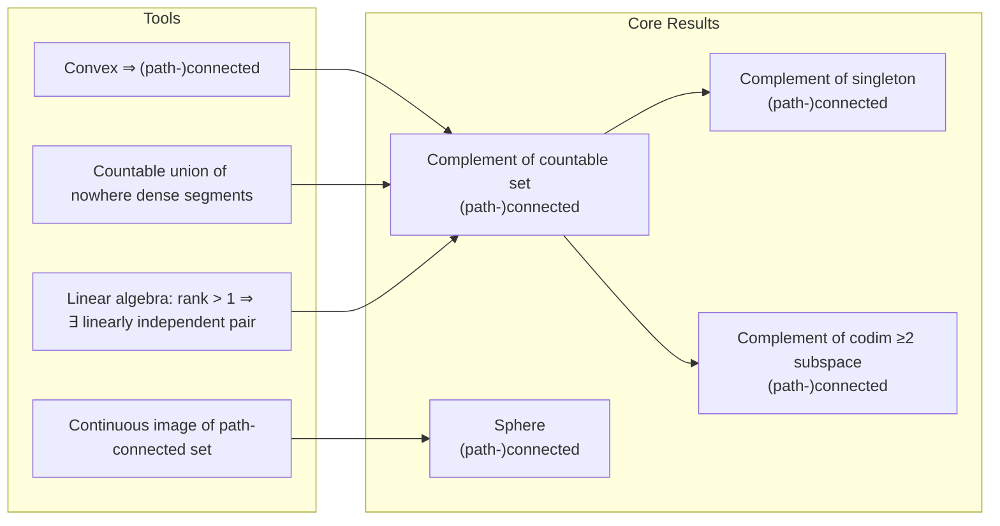

**Technical Brief: Connected.lean — Connectedness and Path-Connectedness in Real Vector Spaces**

---

### **1. Key Definitions & Theorems**

| Name | Type / Signature | Purpose |
|------|------------------|---------|
| `isPathConnected_compl_of_one_lt_rank` | `(h : 1 < Module.rank ℝ E) → s.Countable → IsPathConnected sᶜ` | Complement of any countable set is path-connected in dim > 1 |
| `isConnected_compl_of_one_lt_rank` | `(h : 1 < Module.rank ℝ E) → s.Countable → IsConnected sᶜ` | Complement of countable set is connected (weaker) |
| `isPathConnected_compl_singleton_of_one_lt_rank` | `(h : 1 < Module.rank ℝ E) → x : E → IsPathConnected ({x}ᶜ)` | Complement of a singleton is path-connected |
| `isConnected_compl_singleton_of_one_lt_rank` | `(h : 1 < Module.rank ℝ E) → x : E → IsConnected ({x}ᶜ)` | Complement of singleton is connected |
| `isPathConnected_sphere` | `(h : 1 < Module.rank ℝ E) → x : E → r : ℝ → 0 ≤ r → IsPathConnected (sphere x r)` | Sphere of nonnegative radius is path-connected in dim > 1 |
| `isConnected_sphere` | `(h : 1 < Module.rank ℝ E) → x : E → r : ℝ → 0 ≤ r → IsConnected (sphere x r)` | Sphere is connected |
| `isPreconnected_sphere` | `(h : 1 < Module.rank ℝ E) → x : E → r : ℝ → IsPreconnected (sphere x r)` | Sphere is preconnected (even for negative radius, empty case) |
| `isPathConnected_compl_of_one_lt_codim` | `(hcodim : 1 < Module.rank ℝ (F ⧸ E)) → IsPathConnected (Eᶜ)` | Complement of a subspace of codim > 1 is path-connected |
| `isConnected_compl_of_one_lt_codim` | `(hcodim : 1 < Module.rank ℝ (F ⧸ E)) → IsConnected (Eᶜ)` | Complement of codim > 1 subspace is connected |
| `contractibleSpace_ball`, `contractibleSpace_closedBall`, etc. | Various | Balls and closed balls are contractible (hence path-connected) |
| `isPathConnected_ball`, `isPathConnected_closedBall`, etc. | Various | Balls are path-connected (via convexity) |

---

### **2. Naming Conventions**

- **Prefixes**:
  - `isPathConnected_`, `isConnected_`, `isPreconnected_`: predicate properties of sets.
  - `contractibleSpace_`: property of a *type* (not just a subset).
  - `compl_`: refers to complements of sets.
  - `sphere_`, `ball_`, `eball_`, `closedBall_`, `closedEBall_`: geometric objects.

- **Suffixes**:
  - `_of_one_lt_rank`: condition `1 < Module.rank ℝ E`.
  - `_of_one_lt_codim`: condition `1 < Module.rank ℝ (F ⧸ E)`.
  - `_singleton`: special case where the removed set is `{x}`.
  - `_compl`: complement of a set/submodule.

- **Other patterns**:
  - `f '' s` for image of `f` on `s`.
  - `segment_inter_eq_endpoint_of_linearIndependent_of_ne`: segment intersection lemma.

---

### **3. Tactic Stack**

Frequent tactics used in proofs:

| Tactic | Role |
|--------|------|
| `rcases` / `obtain` / `cases` | Decompose existential/universal hypotheses or disjunctions (`eq_or_ne`, `le_or_gt`, `hr.eq_or_lt`) |
| `simp only [...]` | Simplify with precise lemmas (e.g., `Ia`, `Ib`, definitions of `c`, `x`, `z`) |
| `module` | Solve linear algebra identities in modules over `ℝ` |
| `convert` + `exact` | Match goals up to definitional equality (e.g., segment endpoints) |
| `apply ...` / `refine ...` | Construct proofs via lemmas (e.g., `JoinedIn.of_segment_subset`, `image'`) |
| `rw [subset_compl_iff_disjoint_right, disjoint_iff_inter_eq_empty]` | Rewrite set-theoretic inclusions |
| `countable_setOf_nonempty_of_disjoint` | Prove countability of bad parameters (key in main theorem) |
| `dense_compl` | Use density of complement of countable set in ℝ |
| `continuousWithinAt`, `ContinuousOn`, `ContinuousAt` | Prove continuity on subsets (e.g., for image preservation of path-connectedness) |
| `aesop`, `ring`, `linarith` | Implicitly used in `module`, `norm_smul`, `inv_mul_cancel₀`, etc. |

---

### **4. Proof Logic**

**Main proof strategy** (for `isPathConnected_compl_of_one_lt_rank`):

1. **Nontriviality**: From `1 < Module.rank ℝ E`, deduce `Nontrivial E`.
2. **Pick basepoint**: Use density of `sᶜ` to pick `a ∉ s`.
3. **Goal**: For any `b ∉ s`, construct a path in `sᶜ` from `a` to `b`.
4. **Symmetric midpoint trick**:
   - Define `c = (a + b)/2`, `x = (b - a)/2`, so `a = c - x`, `b = c + x`.
   - Since `x ≠ 0`, use `exists_linearIndependent_pair_of_one_lt_rank` to get `y` linearly independent from `x`.
5. **Parameterize paths via `t ↦ c + t • y`**:
   - For each `t`, consider segments `[a, c + t • y]` and `[b, c + t • y]`.
   - Show only countably many `t` make these segments intersect `s` (using disjointness + countability of `s`).
6. **Choose good `t`**: Pick `t` outside the bad countable set → both segments avoid `s`.
7. **Concatenate**: Path `a → c + t • y → b` lies in `sᶜ`.

**Sphere proof**:
- For `r > 0`, write sphere as continuous image of `{0}ᶜ` via `y ↦ x + (r / ‖y‖) • y`.
- Use path-connectedness of `{0}ᶜ` and continuity to conclude.

**Codimension proof**:
- Use decomposition `F = E ⊕ E'` (via `exists_isCompl`).
- Reduce to complement of `{0}` in `E'`, i.e., `E' \ {0}`, which is path-connected since `dim E' > 1`.

---

### **5. Imports & Dependencies**

**Core libraries used**:

| Module | Purpose |
|--------|---------|
| `Mathlib.Analysis.Convex.Contractible` | Contractibility of convex sets |
| `Mathlib.Analysis.Convex.Topology` | Topological properties of convex sets (e.g., balls are convex) |
| `Mathlib.Analysis.Normed.Module.Convex` | Convexity in normed spaces |
| `Mathlib.LinearAlgebra.Dimension.DivisionRing` | Rank, dimension, linear independence over division rings (here `ℝ`) |
| `Mathlib.Topology.Algebra.Module.Cardinality` | Cardinality arguments in topological vector spaces (e.g., density of countable complements) |

**Key auxiliary theories**:
- `Set.Countable`, `Set.Nonempty`, `Set.disjoint`, `Set.segment`
- `Metric.ball`, `Metric.sphere`, `Metric.closedBall`
- `Module.rank`, `Submodule.quotient`, `quotientEquivOfIsCompl`
- `IsPathConnected`, `IsConnected`, `IsPreconnected`, `ContractibleSpace`

---

### **6. Mermaid Diagrams**

#### **Dependency Graph (High-Level)**

#### **Overview of Theory Flow**

---

### **7. Summary**

This file establishes foundational results about (path-)connectedness in real vector spaces of dimension > 1. It leverages:
- **Convexity** (balls, segments) for easy path-connectedness,
- **Linear algebraic flexibility** (existence of linearly independent pairs) to avoid countable obstacles,
- **Topological density** of countable complements to pick generic paths,
- **Continuity** to transfer path-connectedness via images.

The results are central for further work in analysis and topology (e.g., in studying manifolds, measure theory, or functional analysis), where avoiding countable or low-codimension subsets is common.

--- 

Let me know if you'd like a formal dependency graph (e.g., Lean `leanproject graph` output) or a tactic-level trace of a specific proof.
