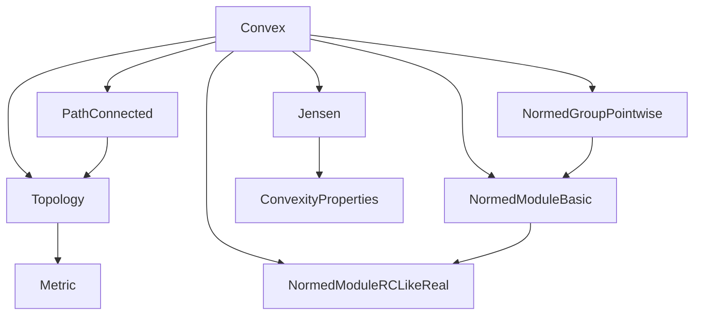
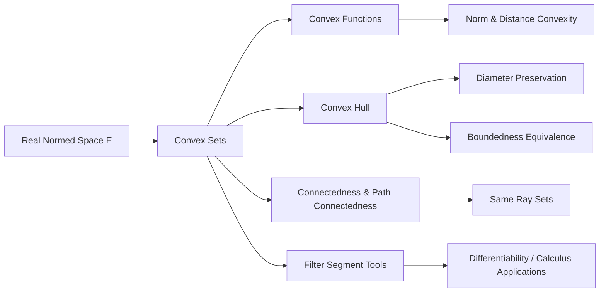

### Technical Brief: `Convex.lean` (Mathlib)

---

#### **1. Key Definitions & Theorems**

| Name | Type / Signature | Purpose |
|------|------------------|---------|
| `convexOn_norm` | `Convex ℝ s → ConvexOn ℝ s norm` | Norm is convex on any convex set in a real normed space. |
| `convexOn_univ_norm` | `ConvexOn ℝ univ norm` | Norm is convex on the entire space. |
| `convexOn_dist` | `z : E → Convex ℝ s → ConvexOn ℝ s (dist z')` | Distance to a fixed point is convex on any convex set. |
| `convexOn_univ_dist` | `z : E → ConvexOn ℝ univ (dist z')` | Distance to a fixed point is convex on the whole space. |
| `convex_ball`, `convex_closedBall` | `a : E → r : ℝ → Convex ℝ (ball a r)`, etc. | Open/closed balls are convex. |
| `convex_eball`, `convex_closedEBall` | `a : E → r : ENNReal → Convex ℝ (eball a r)`, etc. | Extended (possibly infinite-radius) balls are convex. |
| `convexHull_sphere_eq_closedBall` | `convexHull ℝ (sphere x r) = closedBall x r` (under `0 ≤ r`, nontriviality) | Convex hull of a sphere equals the closed ball. |
| `convexHull_exists_dist_ge` | `x ∈ convexHull ℝ s → ∃ x' ∈ s, dist x y ≤ dist x' y` | For any point in the convex hull, there's a point in the original set at least as far from any given point. |
| `convexHull_exists_dist_ge2` | `x ∈ convexHull s, y ∈ convexHull t ⇒ ∃ x' ∈ s, y' ∈ t, dist x y ≤ dist x' y'` | Extends previous result to two convex hulls. |
| `convexHull_ediam` | `ediam (convexHull s) = ediam s` | (Extended) metric diameter is preserved under convex hull. |
| `convexHull_diam` | `Metric.diam (convexHull s) = Metric.diam s` | Metric diameter is preserved under convex hull. |
| `isBounded_convexHull` | `Bornology.IsBounded (convexHull s) ↔ Bornology.IsBounded s` | Boundedness is preserved under convex hull. |
| `NormedSpace.instPathConnectedSpace` | `PathConnectedSpace E` | Any real normed space is path-connected. |
| `isConnected_setOf_sameRay` | `IsConnected { y | SameRay ℝ x y }` | Set of vectors in the same ray as `x` is connected. |
| `isConnected_setOf_sameRay_and_ne_zero` | `x ≠ 0 → IsConnected { y | SameRay ℝ x y ∧ y ≠ 0 }` | Nonzero vectors in same ray as nonzero `x` form a connected set. |
| `norm_sub_le_of_mem_segment` | `y ∈ segment x z → ‖y - x‖ ≤ ‖z - x‖` | Points on a segment are no farther from the start than the endpoint. |
| `Filter.Eventually.segment_of_prod_nhds` | Convergence + segment inclusion ⇒ uniform segment containment in neighborhoods. | Technical tool for differentiability/segment-based arguments in filters. |

---

#### **2. Naming Conventions**

- **Prefixes**:
  - `convexOn_`: convexity of a function on a set.
  - `convex_`: convexity of a set (e.g., `convex_ball`, `convex_closedBall`).
  - `convexHull_`: properties of convex hulls (`convexHull_ediam`, `convexHull_sphere_eq_closedBall`).
  - `isConnected_`, `isBounded_`: topological/bornological properties.
  - `segment_`, `sameRay_`: geometric constructions.

- **Suffixes**:
  - `_univ`: global version (on all space).
  - `_ediam`, `_diam`: extended vs. standard diameter.
  - `_ball`, `_closedBall`, `_eball`, `_closedEBall`: ball variants.
  - `_nhds`, `_nhdsWithin`: filter-theoretic versions.

- **Functional style**:
  - `comp_affineMap`, `translate`, `vadd`, `smul`, `midpoint`, `segment`: geometric operations.

---

#### **3. Tactic Stack**

Frequent tactics used in proofs:

| Tactic | Usage |
|--------|-------|
| `simp` / `simp only` | Simplify goals using definitional equalities and lemmas. |
| `rw` / `rwa` | Rewrite using equalities, sometimes with assumptions. |
| `calc` | Chain inequalities step-by-step (e.g., triangle inequality). |
| `exact`, `apply`, `refine` | Construct proofs via lemmas. |
| `cases` | Case analysis on `ENNReal`, `le_total`, etc. |
| `grw` (from `Mathlib.Tactic.GCongr`) | Rewrite under `≤`, `≥` contexts (e.g., `gcongr`, `grw`). |
| `filter_upwards` | Prove filter convergence statements. |
| `aesop` / `grind` | Automated reasoning for simple algebraic or order goals. |
| `subset_antisymm` | Prove set equality via double inclusion. |
| `mem_convexHull_iff.mpr` | Use characterization of membership in convex hull. |
| `fun_prop` | Prove functors preserve properties (e.g., continuity, connectedness). |

---

#### **4. Proof Logic**

- **Inductive/constructive style**:
  - Convexity proofs often reduce to verifying the defining inequality:
    $$
    f(a x + b y) \le a f(x) + b f(y)
    $$
    for $a, b \ge 0$, $a + b = 1$.
  - For `convexOn_norm`, use triangle inequality and homogeneity of norm.
  - For `convexOn_dist`, reduce to `convexOn_norm` via translation and affine maps.

- **Diameter preservation**:
  - Use `convexHull_exists_dist_ge2` to bound `ediam(convexHull s)` from above by `ediam s`.
  - Combine with monotonicity (`ediam_mono`) for equality.

- **Boundedness equivalence**:
  - Follows directly from `convexHull_ediam` and definition of boundedness via finite diameter.

- **Filter arguments**:
  - Use `segment_of_prod_nhds` to lift pointwise segment containment to neighborhoods.
  - Combine with `Tendsto` and `eventually_prod_nhds_iff`.

- **Connectedness**:
  - Use image of connected sets (`Ici`, `Ioi`) under continuous maps (scalar multiplication).
  - `SameRay` characterized via existence of nonnegative/positive scalars.

---

#### **5. Imports & Dependencies**

**Core imports** (define scope and theory):

```lean
Mathlib.Analysis.Convex.Jensen
Mathlib.Analysis.Convex.PathConnected
Mathlib.Analysis.Convex.Topology
Mathlib.Analysis.Normed.Group.Pointwise
Mathlib.Analysis.Normed.Module.Basic
Mathlib.Analysis.Normed.Module.RCLike.Real
```

**Key dependencies**:
- `SeminormedAddCommGroup`, `NormedSpace ℝ`: real normed vector spaces.
- `Metric`, `Set`, `Pointwise`: metric and set-theoretic infrastructure.
- `Filter`: convergence and neighborhood tools.
- `RCLike`: real-closed field structure for scalars.

---

#### **8. Mermaid Diagrams**

##### **Dependency Graph (Module-Level)**



##### **Overview of Theory Flow**



---

This module serves as a foundational layer for convex analysis in metric/normed spaces, enabling later developments in optimization, calculus of variations, and geometric functional analysis.
