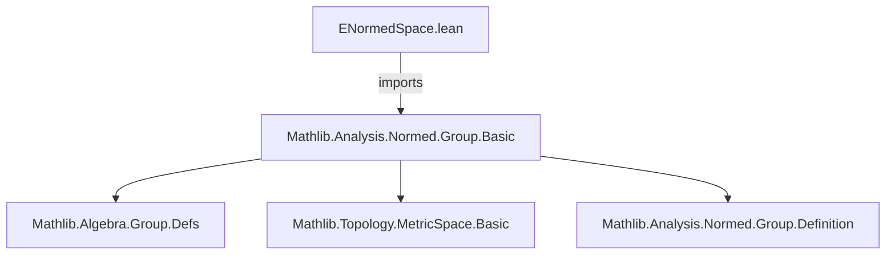
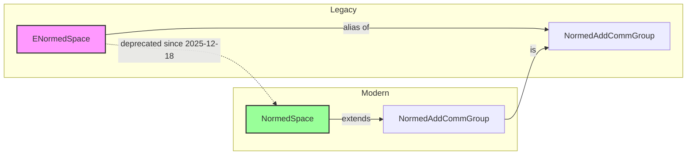

**Technical Brief: `ENormedSpace.lean`**

---

### 1. **Key Definitions & Theorems**

- **`ENormedSpace`**  
  *Type:* `Type u → Type v → Type (max u v)`  
  *Purpose:* A deprecated alias for `NormedAddCommGroup` over a normed field (typically `ℝ` or `ℂ`), intended to model extended/normed vector spaces. Now superseded by `NormedSpace`.

- **`deprecated_module (since := "2025-12-18")`**  
  *Type:* `DeprecatedModule` attribute  
  *Purpose:* Marks the entire module as deprecated as of the given date, signaling users to migrate to `NormedSpace` and related modern structures.

No theorems are defined in this file — it serves only as a re-export/alias layer with deprecation metadata.

---

### 2. **Naming Conventions**

- **Prefixes/Suffixes:** None specific to definitions in this file (since it’s a thin wrapper), but inherits conventions from `Mathlib.Analysis.Normed.Group.Basic`, e.g.:
  - `is_` (e.g., `is_normed_group`)
  - `norm_` (e.g., `norm_add_le`)
  - `dist_` (e.g., `dist_add_left`)
- **Module-level naming:** Uses `E` prefix (as in *extended*), consistent with older `ENormed*` hierarchy now phased out.

---

### 3. **Tactic Stack**

- **None used in this file.**  
  As a pure import + deprecation annotation, no proofs or tactic scripts appear.

---

### 4. **Proof Logic**

- **Not applicable.**  
  This file contains no proofs — only module-level declarations and attributes.

---

### 5. **Imports**

- **Primary dependency:**  
  `Mathlib.Analysis.Normed.Group.Basic`  
  *Role:* Provides foundational definitions for normed additive commutative groups (e.g., `NormedAddCommGroup`, `norm`, `dist`), which `ENormedSpace` historically relied on.

- **Implicit dependencies (via `Mathlib` hierarchy):**
  - `Mathlib.Algebra.Group.Defs`
  - `Mathlib.Analysis.Normed.Group.Definition`
  - `Mathlib.Topology.MetricSpace.Basic`

---

### 8. **Mermaid Diagrams**

#### **Dependency Graph**

#### **Overview of File & Theory Evolution**

**Explanation:**  
`ENormedSpace` was part of an older hierarchy for normed spaces (often over `ℝ`/`ℂ`) but has been unified under `NormedSpace`, which now subsumes both vector space and group structure. The file exists only for backward compatibility during migration.

--- 

*End of brief.*
