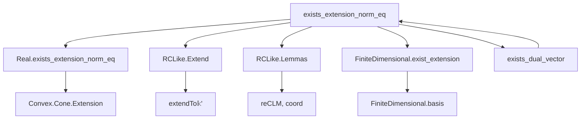
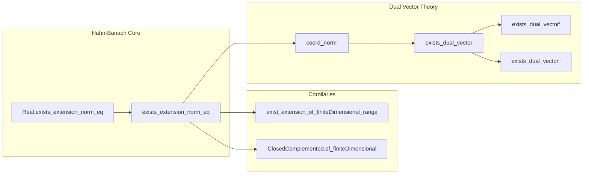

### Technical Brief: Hahn-Banach Extension Theorem in Lean 4 (Mathlib)

---

#### **1. Key Definitions & Theorems**

| Name | Type | Purpose |
|------|------|---------|
| `Real.exists_extension_norm_eq` | `∀ (p : Subspace ℝ E) (f : StrongDual ℝ p), ∃ g : StrongDual ℝ E, (∀ x : p, g x = f x) ∧ ‖g‖ = ‖f‖` | Hahn-Banach extension for real normed spaces: extends a continuous linear functional on a subspace to the whole space without changing norm. |
| `exists_extension_norm_eq` | `∀ (p : Subspace 𝕜 E) (f : StrongDual 𝕜 p), ∃ g : StrongDual 𝕜 E, (∀ x : p, g x = f x) ∧ ‖g‖ = ‖f‖` | Generalized Hahn-Banach for `𝕜 = ℝ` or `ℂ`, assuming `IsRCLikeNormedField 𝕜`. |
| `ContinuousLinearMap.exist_extension_of_finiteDimensional_range` | `∀ (p : Submodule 𝕜 E) (f : p →L[𝕜] F), [FiniteDimensional 𝕜 f.range] → ∃ g : E →L[𝕜] F, f = g.comp p.subtypeL` | Extends continuous linear maps with finite-dimensional range (no norm control). |
| `Submodule.ClosedComplemented.of_finiteDimensional` | `∀ (p : Submodule 𝕜 F), [FiniteDimensional 𝕜 p] → p.ClosedComplemented` | Finite-dimensional submodules over `ℝ`/`ℂ` are complemented (topologically). |
| `coord_norm'` | `∀ (x : E) (h : x ≠ 0), ‖(‖x‖ : 𝕜) • coord 𝕜 x h‖ = 1` | Norm of the normalized coordinate functional on the span of `x`. |
| `exists_dual_vector` | `∀ (x : E) (h : x ≠ 0), ∃ g : StrongDual 𝕜 E, ‖g‖ = 1 ∧ g x = ‖x‖` | Hahn-Banach corollary: existence of a norm-1 functional attaining the norm at a nonzero vector. |
| `exists_dual_vector'` | `∀ (x : E), [Nontrivial E] → ∃ g : StrongDual 𝕜 E, ‖g‖ = 1 ∧ g x = ‖x‖` | Same as above, but handles `x = 0` by choosing any unit-norm functional (requires nontriviality). |
| `exists_dual_vector''` | `∀ (x : E), ∃ g : StrongDual 𝕜 E, ‖g‖ ≤ 1 ∧ g x = ‖x‖` | Weaker version allowing `‖g‖ ≤ 1`, valid even in trivial space. |

---

#### **2. Naming Conventions**

- **Prefixes**:
  - `exists_`: existential theorems (e.g., `exists_extension_norm_eq`, `exists_dual_vector`).
  - `coord_`: coordinate functionals (e.g., `coord_norm'`).
  - `re_`: real part (e.g., `reCLM`, `fr := reCLM.comp ...`).
- **Suffixes**:
  - `_norm_eq`: norm-preserving extension.
  - `_of_`: derived from a condition (e.g., `of_finiteDimensional`, `of_finiteDimensional_range`).
  - `'`, `''`: variants (e.g., `exists_dual_vector'`, `exists_dual_vector''`).
- **Functional names**:
  - `extendTo𝕜'`: extension from real to complex (or scalar) structure.
  - `mkContinuous`: constructing a continuous linear map from a bounded one.
  - `comp`, `codRestrict`, `pi`, `equivFunL`: standard categorical/linear algebra operations.

---

#### **3. Tactic Stack**

| Tactic | Usage |
|--------|-------|
| `rcases` / `obtain` | Extracting witnesses from existential statements (e.g., `Real.exists_extension_norm_eq`). |
| `rw` / `simp` | Rewriting definitions, simplifying norms, algebra maps, and module actions. |
| `apply` / `exact` | Applying lemmas or hypotheses directly. |
| `le_antisymm` | Proving equality of norms by bounding both sides. |
| `calc` | Chain of inequalities (especially for norm estimates). |
| `dsimp` / `simp at` | Simplifying hypotheses. |
| `ext` | Extensionality for functions/maps. |
| `have` / `set` | Introducing intermediate results or definitions. |
| `cases` / `by_cases` | Case analysis on equalities (e.g., `x = 0`). |
| `ring` / `linarith` | Implicitly used in norm inequalities (e.g., `mul_left_comm`, `abs_of_pos`). |

---

#### **4. Proof Logic**

- **Main extension proof (`exists_extension_norm_eq`)**:
  1. Reduce to real case via `RestrictScalars` when working over `ℂ`.
  2. Apply `Real.exists_extension_norm_eq` to the real part `fr` of `f`.
  3. Extend the resulting real functional `g` to a complex-linear one via `g.extendTo𝕜'`.
  4. Verify it extends `f` (using `hextends` and properties of `reCLM`).
  5. Prove norm equality via two-sided bound using `le_antisymm`.

- **Finite-dimensional extension**:
  1. Choose a finite basis `b` of `f.range`.
  2. Express `f` in coordinates: `fi = b.coord i ∘ f`.
  3. Extend each `fi` using `exists_extension_norm_eq`.
  4. Reassemble via `pi` and `equivFunL`.

- **Dual vector construction**:
  1. Define `f` on the 1D subspace `𝕜 ∙ x` as `‖x‖ • coord`.
  2. Extend `f` to full space using `exists_extension_norm_eq`.
  3. Check norm and evaluation at `x` using `coord_norm'`.

---

#### **5. Imports & Dependencies**

| Import | Role |
|--------|------|
| `Mathlib.Analysis.Convex.Cone.Extension` | Sublinear extension lemmas (used in `Real.exists_extension_norm_eq`). |
| `Mathlib.Analysis.Normed.Module.RCLike.Extend` | Tools for extending functionals over `ℝ`/`ℂ` (e.g., `extendTo𝕜'`). |
| `Mathlib.Analysis.RCLike.Lemmas` | Basic properties of `RCLike` fields (e.g., `reCLM`, `coord`). |

**Key typeclasses used**:
- `SeminormedAddCommGroup`, `NormedSpace 𝕜 E`
- `NontriviallyNormedField`, `IsRCLikeNormedField`
- `FiniteDimensional`, `ClosedComplemented`

---

#### **6. Mermaid Diagrams**

##### **Dependency Graph (High-Level)**

##### **Overview of File Structure**

---

#### **7. Summary**

This module formalizes the **analytic Hahn-Banach theorem** in full generality for `ℝ` and `ℂ`, leveraging the `RCLike` abstraction to unify both cases. It provides:
- Norm-preserving extensions of continuous linear functionals.
- Extensions for finite-dimensional target spaces (without norm control).
- Dual vectors attaining the norm (a key tool in duality theory and geometry of Banach spaces).

The proofs rely on:
- Sublinear domination (via `Convex.Cone.Extension`).
- Restriction of scalars and complexification (`RCLike.Extend`).
- Finite-dimensional linear algebra (`Module.finBasis`, `coord`).

The structure reflects Lean’s modular design: core theorems are stated first, then corollaries are derived using standard tactics and reusable lemmas.
