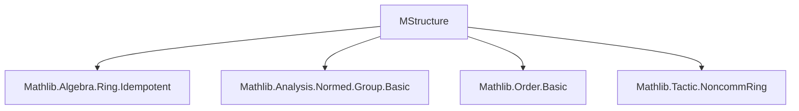

### Technical Brief: `MStructure.lean`

---

#### **1. Key Definitions & Theorems**

| Name | Type / Signature | Purpose |
|------|------------------|---------|
| `IsLprojection P` | `Prop` | Defines $P$ as an **L-projection**: idempotent and satisfies $\|x\| = \|P \cdot x\| + \|(1 - P) \cdot x\|$ |
| `IsMprojection P` | `Prop` | Defines $P$ as an **M-projection**: idempotent and satisfies $\|x\| = \max(\|P \cdot x\|, \|(1 - P) \cdot x\|)$ |
| `IsLprojection.Lcomplement` | `IsLprojection X P → IsLprojection X (1 - P)` | Complement of an L-projection is an L-projection |
| `IsLprojection.Lcomplement_iff` | `IsLprojection X P ↔ IsLprojection X (1 - P)` | Equivalence of projection and its complement |
| `IsLprojection.commute` | `[FaithfulSMul M X] → IsLprojection X P → IsLprojection X Q → Commute P Q` | Any two L-projections commute (under faithful action) |
| `IsLprojection.mul` | `[FaithfulSMul M X] → IsLprojection X P → IsLprojection X Q → IsLprojection X (P * Q)` | Product of commuting L-projections is an L-projection |
| `IsLprojection.join` | `[FaithfulSMul M X] → IsLprojection X P → IsLprojection X Q → IsLprojection X (P + Q - P * Q)` | Join (lattice sup) of L-projections is an L-projection |
| `IsLprojection.Subtype.BooleanAlgebra` | `[FaithfulSMul M X] → BooleanAlgebra { P // IsLprojection X P }` | L-projections form a Boolean algebra under the induced operations |

---

#### **2. Naming Conventions**

- **Structure names**: `IsLprojection`, `IsMprojection` — predicate-style naming for properties.
- **Theorem prefixes**:
  - `Lcomplement`, `Lcomplement_iff`: relate to complementation in L-projections.
  - `commute`, `mul`, `join`: algebraic operations on projections.
- **Subtype operations**:
  - `coe_zero`, `coe_one`, `coe_compl`, `coe_inf`, `coe_sup`, `coe_sdiff`: coercion lemmas for operations on subtype.
- **Instance names**: `Subtype.instCompl`, `Subtype.inf`, `Subtype.distribLattice`, `Subtype.BooleanAlgebra` — standard Lean naming for typeclass instances.

---

#### **3. Tactic Stack**

Frequent tactics used in proofs:

| Tactic | Usage |
|--------|-------|
| `rw` | Rewriting definitions (e.g., norm, smul, sub_smul) |
| `simp only [...]` | Simplifying with explicit lemmas (e.g., `zero_smul`, `one_smul`, `norm_zero`) |
| `noncomm_ring` | Reasoning about noncommutative ring expressions (e.g., expanding `P + Q - P * Q`) |
| `abel` | Simplifying additive expressions in abelian groups |
| `calc` | Chain-of-equalities reasoning (especially in norm inequalities) |
| `le_antisymm` | Proving equality by bounding both sides |
| `have ... := ...` + `rwa [...]` | Intermediate lemma introduction and rewriting |
| `convert ... using 1` | Matching goal up to definitional equality (e.g., using `Lcomplement_iff`) |

---

#### **4. Proof Logic**

The logical flow for proving L-projections form a Boolean algebra follows:

1. **Idempotency & norm condition** are verified for derived operations (e.g., `1 - P`, `P * Q`, `P + Q - P * Q`).
2. **Commutativity** is established first (via norm inequalities and faithfulness), enabling algebraic simplifications.
3. **Lattice structure** is built:
   - `inf` = `P * Q`
   - `sup` = `P + Q - P * Q`
   - Order defined by $P \le Q \iff P = P \land Q$
4. **Distributivity** is shown via algebraic manipulation (see `distrib_lattice_lemma`).
5. **Boolean algebra** is finalized by verifying complement laws:
   - $P \land \neg P = 0$
   - $1 \le P \lor \neg P$
   - $P \setminus Q = P \land \neg Q$

Induction is not used; proofs are mostly algebraic and norm-based, leveraging properties of norms and faithful module actions.

---

#### **5. Imports**

| Import | Role |
|--------|------|
| `Mathlib.Algebra.Ring.Idempotent` | `IsIdempotentElem`, foundational for projections |
| `Mathlib.Analysis.Normed.Group.Basic` | Normed additive commutative groups, norms, triangle inequality |
| `Mathlib.Order.Basic` | Lattices, bounded orders, complements |
| `Mathlib.Tactic.NoncommRing` | Reasoning about noncommutative ring expressions |

---

#### **6. Theory Overview & Dependencies**

##### **Mermaid: Module Dependency Graph**



##### **Mermaid: Lattice & Boolean Algebra Construction**

```mermaid
graph TD
  A[IsLprojection X P] --> B[IsIdempotentElem P]
  A --> C[∀ x, ‖x‖ = ‖P•x‖ + ‖(1-P)•x‖]
  
  B --> D[commute P Q]
  C --> E[mul, join, complement closed]
  
  D --> F[Lattice structure]
  E --> F
  
  F --> G[DistribLattice]
  G --> H[BooleanAlgebra]
```

##### **Mermaid: Relationship to M-structure Theory**

```mermaid
graph LR
  MStructure --> L_proj[L-projections = Boolean algebra]
  MStructure --> M_proj[M-projections = Boolean algebra (TODO)]
  L_proj --> L_summand[L-summands = ranges of L-projections]
  M_proj --> M_summand[M-summands = ranges of M-projections]
  M_summand --> M_ideal[M-ideals = annihilators of L-summands in dual]
  M_ideal --> JB_triple[JB*-triples: M-ideals = norm-closed ideals]
```

---

#### **7. Summary**

This file formalizes the **M-structure theory** in Lean 4, focusing on **L-projections** in normed modules. It introduces `IsLprojection` and `IsMprojection`, proves that L-projections form a **Boolean algebra** under the operations induced by the ring structure (assuming faithful action), and sets up the groundwork for M-ideals, M-summands, and connections to JB*-triples and C*-algebras.

The formalization uses a **module-theoretic abstraction** over `X`, allowing generality beyond `X →L[𝕜] X`, and leverages `FaithfulSMul` to lift algebraic identities to the module level.

The structure mirrors the classical treatment in Behrends and Harmand–Werner, with proofs emphasizing **norm identities**, **idempotent algebra**, and **order-theoretic properties**.

--- 

Let me know if you'd like a formalization plan for `IsMprojection` or the Boolean algebra completeness in the Banach space case.
