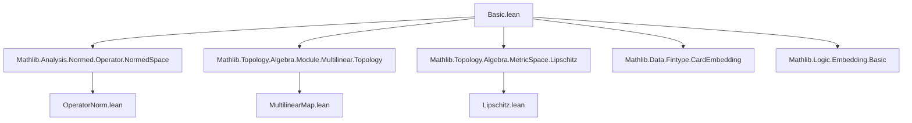
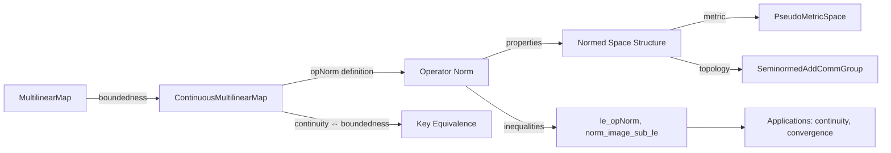

Here is the **technical metadata** extracted from the provided Lean 4 file `Basic.lean`, structured as requested:

---

### 1. **Key Definitions & Theorems**

| Name | Type / Signature | Purpose |
|------|------------------|---------|
| `opNorm` | `ContinuousMultilinearMap 𝕜 E G → ℝ` | Defines the operator norm of a continuous multilinear map as the infimum of all bounds $ C $ such that $ \|f\,m\| \le C \cdot \prod_i \|m_i\| $. |
| `le_opNorm` | `∀ f m, ‖f m‖ ≤ ‖f‖ * ∏ i, ‖m i‖` | Fundamental inequality: the norm of the image is bounded by the operator norm times the product of input norms. |
| `norm_image_sub_le` | `∀ f m₁ m₂, ‖f m₁ - f m₂‖ ≤ ‖f‖ * Fintype.card ι * max ‖m₁‖ ‖m₂‖ ^ (card ι - 1) * ‖m₁ - m₂‖` | Lipschitz-type control on the difference of outputs in terms of the operator norm and input distance. |
| `exists_bound_of_continuous` | `∀ f, Continuous f → ∃ C > 0, ∀ m, ‖f m‖ ≤ C * ∏ i, ‖m i‖` | Continuity implies a global polynomial bound. |
| `continuous_of_bound` | `∀ f C, (∀ m, ‖f m‖ ≤ C * ∏ i, ‖m i‖) → Continuous f` | A global bound implies continuity. |
| `mkContinuous` | `MultilinearMap 𝕜 E G → ℝ → (∀ m, ‖f m‖ ≤ C * ∏ i, ‖m i‖) → ContinuousMultilinearMap 𝕜 E G` | Constructs a continuous multilinear map from a bounded multilinear map. |
| `opNorm_add_le` | `∀ f g, ‖f + g‖ ≤ ‖f‖ + ‖g‖` | Triangle inequality for the operator norm. |
| `opNorm_smul_le` | `∀ c f, ‖c • f‖ ≤ ‖c‖ * ‖f‖` | Submultiplicativity of scalar multiplication. |
| `opNorm_prod` | `∀ f g, ‖f.prod g‖ = max ‖f‖ ‖g‖` | Operator norm of product maps is the max of norms. |
| `opNorm_pi` | `∀ f, ‖pi f‖ = ‖f‖` | Operator norm commutes with dependent products. |
| `norm_ofSubsingleton` | `∀ i f, ‖ofSubsingleton i f‖ = ‖f‖` | Norm preservation under restriction to subsingleton index types. |
| `seminorm` | `Seminorm 𝕜 (ContinuousMultilinearMap 𝕜 E G)` | The operator norm induces a seminorm structure. |
| `instPseudoMetricSpace` | `PseudoMetricSpace (ContinuousMultilinearMap 𝕜 E G)` | Induces a pseudo-metric space structure via the seminorm. |
| `seminormedAddCommGroup` | `SeminormedAddCommGroup (ContinuousMultilinearMap 𝕜 E G)` | Makes the space of continuous multilinear maps into a seminormed additive commutative group. |
| `normedSpace` | `NormedSpace 𝕜' (ContinuousMultilinearMap 𝕜 E G)` (under assumptions) | Makes it into a normed space over a larger scalar field. |

---

### 2. **Naming Conventions**

- **Prefixes**:
  - `opNorm_`: properties of the operator norm (`opNorm_add_le`, `opNorm_smul_le`, `opNorm_le_bound`, etc.)
  - `norm_`: norm-related lemmas (`norm_map_coord_zero`, `norm_image_sub_le`, `norm_constOfIsEmpty`, etc.)
  - `bound_`: bounding lemmas (`bound_of_shell_of_continuous`, `bound_of_shell_of_norm_map_coord_zero`)
  - `continuous_`: continuity-related results (`continuous_of_bound`, `continuous_uncurry_of_multilinear`)
  - `mkContinuous`: construction of continuous maps from bounded ones
  - `restr_`: restriction of multilinear maps (`restr_norm_le`, `restrictScalars`, `restrictScalarsₗᵢ`)
  - `ofSubsingleton_`: maps from linear maps when index type is subsingleton
  - `prod_`, `pi_`: product/dependent product constructions (`prodL`, `piₗᵢ`, `opNorm_prod`, `opNorm_pi`)

- **Suffixes**:
  - `_le`: inequality direction (e.g., `le_opNorm`, `opNorm_add_le`)
  - `_of_`: conditional version (e.g., `continuous_of_bound`, `norm_image_sub_le_of_bound`)
  - `_of_…_of_`: layered conditions (e.g., `bound_of_shell_of_continuous`)
  - `_ₗᵢ`: linear isometry (e.g., `prodL`, `piₗᵢ`, `restrictScalarsₗᵢ`)
  - `_ₗ`: linear map (e.g., `ofSubsingletonₗᵢ`)

---

### 3. **Tactic Stack**

Frequently used tactics in proofs:

| Tactic | Usage |
|--------|-------|
| `simp` / `simp only` | Simplification of products, norms, updates, piecewise definitions |
| `gcongr` | Generalized congruence for inequalities (especially with products/sums) |
| `rw` / `convert` | Rewriting using definitions or equalities (e.g., `norm_def`, `prod_update_of_mem`) |
| `exact` / `apply` | Direct proof steps, especially for `le_opNorm`, `opNorm_le_bound` |
| `have` / `suffices` | Intermediate claims, especially in induction proofs |
| `induction` (with `Finset.induction`) | Structural induction over finite sets |
| `cases` | Case analysis on emptiness/finiteness (`isEmpty_or_nonempty`, `nonempty_fintype`) |
| `fun_prop` | Proving continuity using properties of continuous functions/maps |
| `push_cast` / `norm_cast` | Casting between `ℝ` and `ℝ≥0` (e.g., in `le_opNNNorm`) |
| `ring` | Algebraic simplification of expressions involving products and powers |
| `isClosed_*` / `isLeast_*` | Topological arguments for infimum characterizations |
| `csInf_le`, `le_csInf` | Reasoning about infima in definitions like `opNorm` |

---

### 4. **Proof Logic**

- **Structure of proofs**:
  - **Induction on finite index sets** (`Finset.induction`) is common for bounding differences (`norm_image_sub_le_of_bound'`).
  - **Reduction to shells**: many lemmas first prove bounds on “shells” (annuli around 0), then extend to all inputs using continuity or rescaling.
  - **Continuity ⇔ boundedness**: the core equivalence is shown via:
    - `exists_bound_of_continuous` ⇒ `continuous_of_bound` ⇒ `mkContinuous`
  - **Norm properties** (triangle inequality, homogeneity) are proven via:
    - `opNorm_le_bound` + bounding lemmas (`norm_image_sub_le_of_bound`, `norm_add_le`, etc.)
  - **Metric structure**: the pseudo-metric space structure is derived from the seminorm via `uniformity_eq_seminorm`.

- **Key logical flow**:
  1. Prove boundedness ⇒ continuity (`continuous_of_bound`)
  2. Prove continuity ⇒ boundedness (`exists_bound_of_continuous`)
  3. Define `opNorm` as infimum of bounds
  4. Prove `opNorm` satisfies norm axioms
  5. Derive metric/topological structure

---

### 5. **Imports**

| Import | Purpose |
|--------|---------|
| `Mathlib.Analysis.Normed.Operator.NormedSpace` | Operator norm for linear maps, basic normed space theory |
| `Mathlib.Logic.Embedding.Basic` | Embeddings, cardinality lemmas |
| `Mathlib.Data.Fintype.CardEmbedding` | Counting embeddings in finite types |
| `Mathlib.Topology.Algebra.MetricSpace.Lipschitz` | Lipschitz continuity, metric space tools |
| `Mathlib.Topology.Algebra.Module.Multilinear.Topology` | Multilinear maps, continuity, topology on function spaces |

---

### 6. **Mermaid Diagrams**

#### **Dependency Graph (High-Level)**

#### **Overview of Theory Flow**

---

Let me know if you'd like a **formal API summary** or a **proof sketch** of a specific theorem (e.g., `norm_image_sub_le`).
