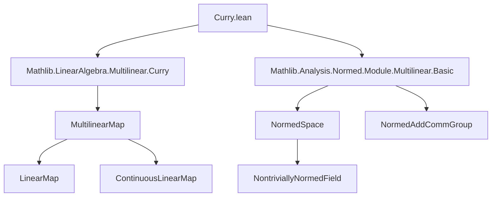
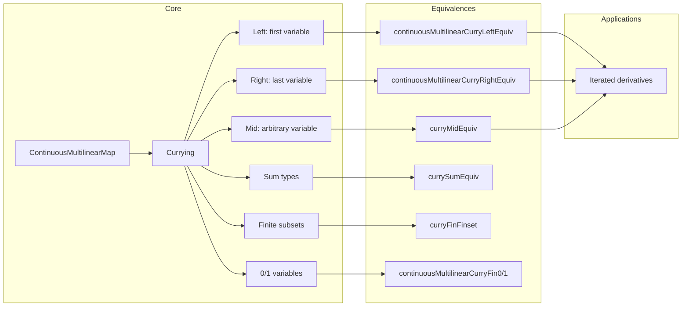

### Technical Metadata Brief: `Curry.lean`

---

#### **1. Key Definitions & Theorems**

| Name | Type / Purpose |
|------|----------------|
| `ContinuousLinearMap.uncurryLeft` | `Ei 0 →L[𝕜] ContinuousMultilinearMap 𝕜 (fun i : Fin n => Ei i.succ) G → ContinuousMultilinearMap 𝕜 Ei G` Uncurries a continuous linear map into a continuous multilinear map by prepending the first variable. |
| `ContinuousMultilinearMap.curryLeft` | `ContinuousMultilinearMap 𝕜 Ei G → Ei 0 →L[𝕜] ContinuousMultilinearMap 𝕜 (fun i : Fin n => Ei i.succ) G` Curries a continuous multilinear map by separating the first variable. |
| `continuousMultilinearCurryLeftEquiv` | `ContinuousMultilinearMap 𝕜 Ei G ≃ₗᵢ[𝕜] Ei 0 →L[𝕜] ContinuousMultilinearMap 𝕜 (fun i : Fin n => Ei i.succ) G` Linear isometric equivalence for left currying. |
| `ContinuousMultilinearMap.uncurryRight` | `ContinuousMultilinearMap 𝕜 (fun i : Fin n => Ei <| castSucc i) (Ei (last n) →L[𝕜] G) → ContinuousMultilinearMap 𝕜 Ei G` Uncurries a multilinear map into one with last variable separated. |
| `ContinuousMultilinearMap.curryRight` | `ContinuousMultilinearMap 𝕜 Ei G → ContinuousMultilinearMap 𝕜 (fun i : Fin n => Ei <| castSucc i) (Ei (last n) →L[𝕜] G)` Curries by separating the last variable. |
| `continuousMultilinearCurryRightEquiv` | `ContinuousMultilinearMap 𝕜 Ei G ≃ₗᵢ[𝕜] ContinuousMultilinearMap 𝕜 (fun i : Fin n => Ei <| castSucc i) (Ei (last n) →L[𝕜] G)` Linear isometric equivalence for right currying. |
| `ContinuousLinearMap.uncurryMid`, `ContinuousMultilinearMap.curryMid` | Generalizations of currying/uncurrying at arbitrary index `p : Fin (n+1)`. |
| `ContinuousMultilinearMap.curryMidEquiv` | `ContinuousMultilinearMap 𝕜 Ei G ≃ₗᵢ[𝕜] Ei p →L[𝕜] ContinuousMultilinearMap 𝕜 (fun i ↦ Ei (p.succAbove i)) G` |
| `continuousMultilinearCurryFin0` | `(G [×0]→L[𝕜] G') ≃ₗᵢ[𝕜] G'` Isomorphism between constants and 0-ary continuous multilinear maps. |
| `continuousMultilinearCurryFin1` | `(G [×1]→L[𝕜] G') ≃ₗᵢ[𝕜] G →L[𝕜] G'` Currying for 1-variable case. |
| `ContinuousMultilinearMap.currySum`, `ContinuousMultilinearMap.uncurrySum`, `currySumEquiv` | Currying over sum types `ι ⊕ ι'`. |
| `curryFinFinset`, `curryFinFinsetEquiv` | Currying w.r.t. finite subsets `s ⊆ Fin n`, splitting into `k` and `l = n−k` variables. |
| `ContinuousLinearMap.continuousMultilinearMapOption` | Embeds `G →L[𝕜] ContinuousMultilinearMap 𝕜 E F` into `ContinuousMultilinearMap 𝕜 (Option ι → _) F`, handling universe issues. |

**Theorems (selected):**
- `ContinuousLinearMap.curry_uncurryLeft`, `ContinuousMultilinearMap.uncurry_curryLeft`: Inverses.
- `ContinuousMultilinearMap.curryLeft_norm`, `ContinuousMultilinearMap.curryRight_norm`, etc.: Norm preservation.
- `ContinuousMultilinearMap.uncurry0_curry0`, `ContinuousMultilinearMap.curry0_uncurry0`: Inverses for 0-ary case.
- `ContinuousMultilinearMap.norm_domDomCongr`: Norm invariance under index permutation.

---

#### **2. Naming Conventions**

- **Prefixes:**
  - `curryLeft`, `curryRight`, `curryMid`: Currying at left, right, or middle index.
  - `uncurryLeft`, `uncurryRight`, `uncurryMid`: Inverse operations.
  - `currySum`, `curryFinFinset`: Currying over sum types or finite subsets.
  - `curry0`, `curry1`: Special cases for 0/1 variables.
- **Suffixes:**
  - `Equiv`: Linear isometric equivalence (`≃ₗᵢ[𝕜]`).
  - `'` (prime): Non-dependent version (e.g., `continuousMultilinearCurryRightEquiv'`).
- **Structure:**
  - `f.curryX` / `f.uncurryX`: Function notation for maps.
  - `continuousMultilinearCurryXEquiv`: Global equivalence names.

---

#### **3. Tactic Stack**

Frequent tactics used in proofs:
- `simp` / `simp only`: Simplify goals using lemmas and `@[simp]` theorems.
- `ext`: Extensionality for functions/multilinear maps.
- `rw`: Rewrite using equalities (especially `@[simp]` lemmas).
- `exact`, `refine`, `gcongr`: Construct proofs and inequalities.
- `dsimp`: Simplify definitional equalities.
- `norm_num`, `ring`: For numeric/ring simplifications (less frequent).
- `linarith`, `nlinarith`: For norm inequalities.
- `cases'`: On `Fin` indices or `Sum` types.
- `multilinear_map`-specific automation (e.g., `MultilinearMap.toMultilinearMap_injective`).

---

#### **4. Proof Logic**

- **Structure:** Most proofs follow a standard pattern:
  1. Define maps via `MultilinearMap.mkContinuous` / `mkContinuousLinear`.
  2. Prove boundedness using norm lemmas (e.g., `norm_map_cons_le`, `norm_map_insertNth_le`).
  3. Show inverses via `ext` + `simp` + `@[simp]` lemmas.
  4. Prove norm preservation using `LinearIsometryEquiv.ofBounds`.
- **Induction:** Not used directly; instead, structural decomposition via `Fin n`, `Fin n.succ`, `init`, `tail`, `cons`, `snoc`, `insertNth`, `removeNth`.
- **Case analysis:** On `i : Fin (n+1)` (e.g., `i = 0`, `i = last n`, or middle).
- **Norm estimates:** Central to continuity proofs; rely on operator norm inequalities and product estimates.

---

#### **5. Imports**

- `Mathlib.Analysis.Normed.Module.Multilinear.Basic`
- `Mathlib.LinearAlgebra.Multilinear.Curry`

These indicate heavy use of:
- Continuous multilinear maps (`ContinuousMultilinearMap`)
- Normed module theory
- Multilinear algebra over normed fields

---

#### **6. Mermaid Diagrams**

##### **Dependency Graph (High-Level)**

##### **Overview of Theory Flow**

---

#### **7. Domain-Specific AI Agent Notes**

- **Focus areas for automation:**
  - Recognizing currying patterns (`cons`, `tail`, `snoc`, `init`, `insertNth`, `removeNth`).
  - Applying norm lemmas (`norm_map_*_le`) to prove continuity.
  - Rewriting using `@[simp]` lemmas for currying/uncurrying.
- **Common proof goals:**
  - Show `f.curryX.uncurryX = f` or `f.uncurryX.curryX = f`.
  - Prove `‖f.curryX‖ = ‖f‖`.
  - Convert between `G [×n]→L[𝕜] G'` and nested `→L[𝕜]` forms.
- **Key heuristics:**
  - Use `curryMidEquiv` for arbitrary variable separation.
  - Prefer `curryLeft`/`curryRight` unless `p` is non-extreme.
  - Use `currySumEquiv` for product-type index splitting.
  - For `0`-ary maps, reduce to `curry0`/`uncurry0`.

--- 

Let me know if you'd like a formalized tactic guide or a Lean 4 AI agent prompt template based on this metadata.
