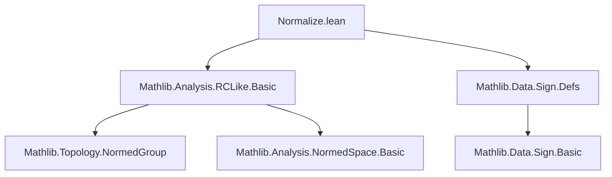
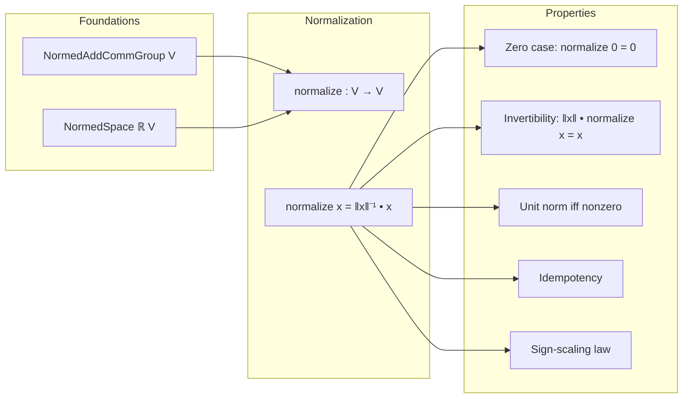

**Technical Brief: `Normalize.lean`**

---

### 1. **Key Definitions & Theorems**

| Name | Type / Signature | Purpose |
|------|------------------|---------|
| `NormedSpace.normalize` | `V → V` | Normalizes a vector: returns `x / ‖x‖` if `x ≠ 0`, else `0`. Implemented as `‖x‖⁻¹ • x`. |
| `normalize_zero_eq_zero` | `normalize (0 : V) = 0` | Confirms normalization of zero vector yields zero. |
| `normalize_eq_zero_iff` | `normalize x = 0 ↔ x = 0` | Characterizes when normalization yields zero. |
| `norm_smul_normalize` | `‖x‖ • normalize x = x` | Recovers original vector from its normalization. |
| `norm_normalize_eq_one_iff` | `‖normalize x‖ = 1 ↔ x ≠ 0` | Unit norm iff original vector nonzero. |
| `normalize_eq_self_of_norm_eq_one` | `‖x‖ = 1 → normalize x = x` | Vectors of unit norm are fixed points of normalization. |
| `normalize_normalize` | `normalize (normalize x) = normalize x` | Idempotency of normalization. |
| `normalize_neg` | `normalize (-x) = -normalize x` | Oddness of normalization (anti-symmetric under sign flip). |
| `normalize_smul_of_pos` | `0 < r → normalize (r • x) = normalize x` | Scaling by positive scalar doesn’t change normalization. |
| `normalize_smul_of_neg` | `r < 0 → normalize (r • x) = -normalize x` | Scaling by negative scalar flips sign of normalization. |
| `normalize_smul` | `normalize (r • x) = SignType.sign r • normalize x` | Full characterization of scaling behavior via sign function. |

---

### 2. **Naming Conventions**

- **Prefixes**:
  - `normalize_`: all lemmas about the `normalize` function.
  - `norm_`: lemmas about norms (e.g., `norm_smul_normalize`, `norm_normalize_eq_one_iff`).
- **Suffixes**:
  - `_eq_zero`: characterizes when result is zero.
  - `_of_pos` / `_of_neg`: conditional behavior under sign of scalar.
  - `_iff`: biconditional characterizations.
- **Function name**: `normalize` (no prefix/suffix beyond standard Lean style).

---

### 3. **Tactic Stack**

- **Core tactics**: `simp`, `by_cases`, `rcases`, `linarith`, `simpa`, `aesop` (implicit via `simp`-based automation).
- **Key tactic patterns**:
  - `by_cases hx : x = 0 <;> simp [...]`: case split on zero/nonzero, then simplify.
  - `rcases lt_trichotomy 0 r with (h_pos | rfl | h_neg)`: trichotomy on real scalar sign.
  - `simpa using [...]`: to rewrite using a lemma and discharge goals.

---

### 4. **Proof Logic**

- **Structure**: Most proofs follow a *case analysis* on whether a vector or scalar is zero or positive/negative.
  - For vector-based lemmas: split on `x = 0` vs `x ≠ 0`.
  - For scalar-based lemmas: use trichotomy on `r` to handle `r > 0`, `r = 0`, `r < 0`.
- **Leverage**: `simp`-based simplification using `norm_smul`, `normed_space.smul_smul`, and properties of `SignType.sign`.
- **Idempotency & consistency**: Proven via reduction to unit-norm case (`normalize_eq_self_of_norm_eq_one`).

---

### 5. **Imports**

- `Mathlib.Analysis.RCLike.Basic`: Provides `NormedAddCommGroup`, `NormedSpace ℝ`, and basic analysis over reals.
- `Mathlib.Data.Sign.Defs`: Defines `SignType`, `SignType.sign`, used in `normalize_smul`.

---

### 8. **Mermaid Diagrams**

#### **Dependency Graph (Module-Level)**

#### **Overview of Theory Flow**

#### **Relationship to Broader Theory**

- `normalize` serves as a *retraction* from nonzero vectors to the unit sphere.
- Used in constructing *projective spaces*, *directional analysis*, and *metric geometry* over normed spaces.
- Connects to:
  - `Mathlib.Geometry.MetricSpace.Sphere` (unit sphere as codomain of `normalize` on nonzero vectors),
  - `Mathlib.LinearAlgebra.Dimension.Finite` (when finite-dimensional, normalization is continuous),
  - `Mathlib.Data.Proj` (if constructing projectivization via normalization equivalence classes).

--- 

Let me know if you'd like a formalization roadmap or a proof sketch for `normalize_smul`.
