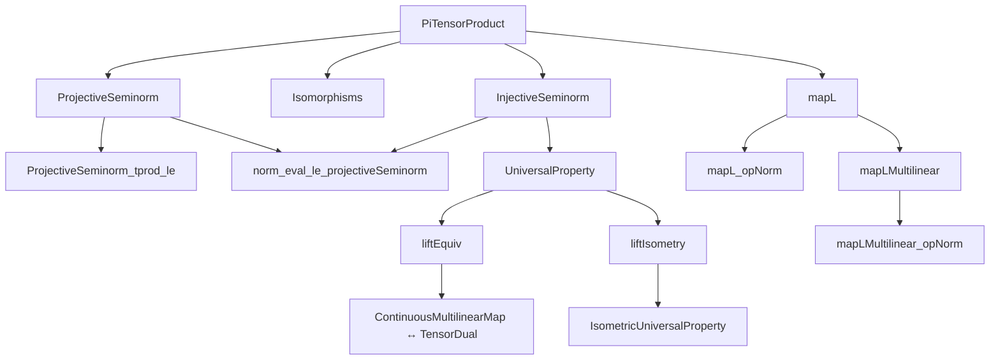

### Technical Metadata Brief: `InjectiveSeminorm.lean`

---

#### **1. Key Definitions & Theorems**

| Name | Type / Purpose |
|------|----------------|
| `toDualContinuousMultilinearMap F x` | Linear map $(\bigotimes_i E_i) \to (C\text{-}Multilin\_Map\ E\ F \to L[𝕜] F)$, sending $x \mapsto (f \mapsto f.lift\ x)$. Encodes evaluation of multilinear maps at tensor elements. |
| `injectiveSeminorm` | A seminorm on $\bigotimes_i E_i$, defined as the supremum over operator norms of `toDualContinuousMultilinearMap G x` for all normed spaces $G$ in the same universe. Captures the *injective* tensor seminorm. |
| `liftEquiv` | Linear equivalence $C\text{-}Multilin\_Map\ E\ F \simeq_L (\bigotimes_i E_i) \to_L F$, induced by universal property of tensor product. |
| `liftIsometry` | Isometric linear equivalence $C\text{-}Multilin\_Map\ E\ F \simeq_{L,i} (\bigotimes_i E_i) \to_L F$, upgrading `liftEquiv`. |
| `tprodL` | Canonical continuous multilinear map $\prod_i E_i \to \bigotimes_i E_i$, the *tensor product* of the family $E$. |
| `mapL f` | Continuous linear map $\bigotimes_i E_i \to \bigotimes_i E'_i$ induced by a family $f : \prod_i E_i \to_L E'_i$. |
| `mapLMultilinear` | Continuous multilinear map $(\prod_i E_i \to_L E'_i) \to ((\bigotimes_i E_i) \to_L \bigotimes_i E'_i)$, sending $(f_i)_i \mapsto \bigotimes_i f_i$. |
| `norm_eval_le_injectiveSeminorm` | Main property: $\|f.lift\ x\| \le \|f\| \cdot \text{injectiveSeminorm}\ x$. Ensures injective seminorm controls evaluation. |
| `injectiveSeminorm_le_projectiveSeminorm` | $\text{injectiveSeminorm} \le \text{projectiveSeminorm}$. Shows injective seminorm is weaker than projective. |
| `mapL_opNorm` | $\|\text{mapL}\ f\| \le \prod_i \|f_i\|$. Norm control of tensor map. |
| `mapLMultilinear_opNorm` | $\|\text{mapLMultilinear}\| \le 1$. Norm control of the multilinear tensor map. |

---

#### **2. Naming Conventions**

- **Prefixes**:
  - `toDual...`: Maps *into* dual-like spaces (e.g., `toDualContinuousMultilinearMap`).
  - `lift...`: Related to the universal property of tensor product (e.g., `liftEquiv`, `liftIsometry`).
  - `mapL...`: Continuous linear/tensor maps induced by families of linear maps.
  - `tprodL`: Tensor product of the *family* $E$, as a multilinear map.

- **Suffixes**:
  - `...Equiv`: Linear equivalence (`≃ₗ[𝕜]`).
  - `...Isometry`: Isometric linear equivalence (`≃ₗᵢ[𝕜]`).
  - `...L`: Continuous linear maps (`→L[𝕜]`).
  - `...Multilinear`: Continuous multilinear maps (`ContinuousMultilinearMap`).

- **Other**:
  - `...Seminorm`: Seminorms (e.g., `injectiveSeminorm`, `projectiveSeminorm`).
  - `norm_...`: Norm/evaluation inequalities (e.g., `norm_eval_le_...`).

---

#### **3. Tactic Stack**

- **Core automation**:
  - `simp only [...]` with explicit simplification lemmas (e.g., `LinearMap.coe_mk`, `ContinuousMultilinearMap.coe_coe`, `lift.tprod`).
  - `ext _` for extensionality (e.g., proving equality of linear maps).
  - `rw [...]` for rewriting using definitions and lemmas.

- **Norm/inequality reasoning**:
  - `exact norm_eval_le_projectiveSeminorm _ _ _`
  - `exact mul_le_mul_of_nonneg_right ...`
  - `apply le_trans ...`
  - `apply le_antisymm ...` (in `liftIsometry.norm_map'`).
  - `refine csSup_le ...` (in `injectiveSeminorm_le_projectiveSeminorm`).
  - `induction x using PiTensorProduct.induction_on` (for structural induction on tensors).

- **Universe & typeclass management**:
  - `set G := ...` + `letI := ...` for constructing auxiliary normed spaces.
  - `existsi ...` for existential witnesses (e.g., bounding seminorms).
  - `grind` (in `mapL_add_smul_aux`) for decidable equality simplification.

---

#### **4. Proof Logic**

- **Inductive/structural reasoning**:
  - Proofs about tensors often use `PiTensorProduct.induction_on`, reducing to:
    - `smul_tprod`: scalar multiples of pure tensors.
    - `add`: sums of tensors.

- **Factorization trick**:
  - To handle universes, factor a multilinear map $f : E \to F$ through its *coimage* $G = (\bigotimes E_i)/\ker(\text{lift}\ f)$, which lives in the correct universe.
  - Use `LinearMap.quotKerEquivRange` to relate $G$ and $\text{range}(\text{lift}\ f)$.

- **Norm comparison**:
  - Use `injectiveSeminorm` as a *supremum* over seminorms induced by duals of tensor maps.
  - Prove inequalities via:
    - Bounding each seminorm individually (e.g., `toDualContinuousMultilinearMap_le_projectiveSeminorm`).
    - Using `csSup_le` or `le_csSup`.

- **Functoriality**:
  - `mapL` is defined via `liftIsometry` and `tprodL`.
  - Properties like `mapL_comp`, `mapL_id`, `mapL_pow` follow from universal properties and `ext` lemmas.

---

#### **5. Imports**

- `Mathlib.Analysis.Normed.Module.PiTensorProduct.ProjectiveSeminorm`: Defines projective seminorm and related lemmas (e.g., `norm_eval_le_projectiveSeminorm`).
- `Mathlib.LinearAlgebra.Isomorphisms`: Provides `LinearEquiv`, `LinearIsometryEquiv`, and related infrastructure.

---

#### **8. Mermaid Diagrams**

##### **Dependency Graph (High-Level)**



##### **Overview of File Structure**

```mermaid
flowchart LR
  subgraph Setup
    U[Universe Parameters] --> V[Finite Type ι]
    V --> W[Family E : ι → NormedSpace]
    W --> X[Target Space F]
  end

  subgraph SeminormConstruction
    Y[toDualContinuousMultilinearMap] --> Z[dualSeminorms_bounded]
    Z --> AA[injectiveSeminorm := sSup]
    AA --> AB[norm_eval_le_injectiveSeminorm]
    AB --> AC[injectiveSeminorm ≤ projectiveSeminorm]
  end

  subgraph UniversalProperty
    AC --> AD[liftEquiv]
    AD --> AE[liftIsometry]
    AE --> AF[tprodL]
    AF --> AG[Functoriality]
  end

  subgraph Functoriality
    AG --> AH[mapL]
    AH --> AI[mapL_opNorm]
    AH --> AJ[mapLMultilinear]
    AJ --> AK[mapLMultilinear_opNorm]
  end

  subgraph FutureWork
    AK --> AL[SeparatingDual ⇒ injectiveSeminorm is norm]
    AL --> AM[Basis construction (PR #11156)]
  end
```

---

This file formalizes the *injective tensor seminorm* on finite tensor products of normed spaces, establishing its universal property, norm estimates, and functorial behavior. It builds on the projective seminorm and uses careful universe management to avoid set-theoretic issues.
