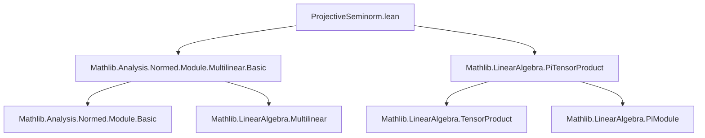

**Technical Brief: `ProjectiveSeminorm.lean`**

---

### 1. **Key Definitions & Theorems**

| Name | Type / Signature | Purpose |
|------|------------------|---------|
| `projectiveSeminormAux` | `FreeAddMonoid (𝕜 × Π i, E i) → ℝ` | Lift of projective seminorm to free additive monoid of formal sums; used to define the actual seminorm via infimum. |
| `projectiveSeminorm` | `Seminorm 𝕜 (⨂[𝕜] i, E i)` | The projective seminorm on the tensor product of a finite family of normed spaces. Defined as the infimum over all representations of an element as a sum of simple tensors. |
| `projectiveSeminorm_apply` | `projectiveSeminorm x = iInf (fun (p : lifts x) ↦ projectiveSeminormAux p.1)` | Explicit formula for the value of the projective seminorm at a point. |
| `projectiveSeminorm_tprod_le` | `projectiveSeminorm (⨂ₜ[𝕜] i, m i) ≤ ∏ i, ‖m i‖` | Upper bound on the projective seminorm of a simple tensor. |
| `norm_eval_le_projectiveSeminorm` | `‖lift f.toMultilinearMap x‖ ≤ projectiveSeminorm x * ‖f‖` | Key inequality: evaluation of any continuous multilinear map on a tensor is bounded by the product of the projective seminorm and the operator norm. |

---

### 2. **Naming Conventions**

- **Prefixes**:
  - `projectiveSeminormAux`: auxiliary construction.
  - `norm_`, `bddBelow_`, `le_`, `add_le`, `smul`: standard Lean/analysis naming for properties (non-negativity, subadditivity, homogeneity).
- **Suffixes**:
  - `_le`: inequality direction (e.g., `projectiveSeminorm_tprod_le`).
  - `_apply`: definition of application (e.g., `projectiveSeminorm_apply`).
- **Operators**:
  - `⨂ₜ[𝕜] i, m i`: simple tensor (tensor product of a family `m`).
  - `lifts x`: type of representations of `x` as sums of simple tensors.

---

### 3. **Tactic Stack**

Frequently used tactics in this file:

| Tactic | Usage |
|--------|-------|
| `simp` / `simp only` | Simplify definitions, especially for `projectiveSeminormAux`, norms, products, sums. |
| `rw` | Rewrite using equalities or definitions (e.g., `← hp`, `← hp` in `norm_eval_le_projectiveSeminorm`). |
| `exact`, `refine`, `convert` | Construct proofs, especially for inequalities and equalities involving infima. |
| `le_antisymm`, `ciInf_le_of_le`, `le_ciInf` | Handle infimum-based inequalities (core to projective seminorm definition). |
| `norm_num`, `ring`, `linarith` | Not heavily used here; focus is on structural reasoning. |
| `conv_lhs => rw [...]` | Local rewriting in complex expressions (e.g., in `norm_eval_le_projectiveSeminorm`). |
| `multiset`/`list` lemmas (`List.sum_map_hom`, `Multiset.sum_coe`, etc.) | Used to manipulate sums over representations. |

---

### 4. **Proof Logic**

The logical flow is **constructive + infimum-based**, with heavy use of:

- **Induction / structural decomposition** on representations (`lifts x`) of tensors.
- **Infimum calculus** over `lifts x`, leveraging:
  - `bddBelow_projectiveSemiNormAux`: ensures infimum exists (bounded below by 0).
  - `Seminorm.ofSMulLE`: constructs the seminorm from a subadditive, homogeneous, nonnegative function on a lift.
- **Norm estimates** for multilinear maps via:
  - `norm_multiset_sum_le`
  - `f.le_opNorm` (i.e., `‖f m‖ ≤ ‖f‖ * ‖m‖`)
  - `norm_smul`, `mul_le_mul_of_nonneg_left`

**Typical proof pattern**:
1. Reduce to a representation `p` of `x` via `lifts x`.
2. Bound the expression using properties of `projectiveSeminormAux`.
3. Conclude via infimum properties.

---

### 5. **Imports**

| Import | Purpose |
|--------|---------|
| `Mathlib.Analysis.Normed.Module.Multilinear.Basic` | Multilinear maps, continuous multilinear maps, operator norm. |
| `Mathlib.LinearAlgebra.PiTensorProduct` | Tensor product over finite families (`⨂[𝕜] i, E i`), simple tensors, lifts, etc. |

---

### 6. **Mermaid Diagrams**

#### **Dependency Graph (Module-Level)**



#### **Overview of Theory Flow**

```mermaid
graph LR
  A[Finite family of normed spaces Eᵢ] --> B[Tensor product ⨂[𝕜] i, Eᵢ]
  B --> C[FreeAddMonoid representation of tensors]
  C --> D[projectiveSeminormAux: pre-seminorm on representations]
  D --> E[projectiveSeminorm: seminorm on tensor product]
  E --> F[Inequality for multilinear maps: ‖f(x)‖ ≤ ‖f‖·projectiveSeminorm(x)]
  F --> G[Universal property: projective seminorm is maximal such seminorm]
```

---

### 7. **TODO & Future Work**

- Prove equality `projectiveSeminorm (⨂ₜ[𝕜] i, m i) = ∏ i, ‖m i‖` under additional assumptions (e.g., `𝕜 = ℝ` or `ℂ`, or reflexive spaces).
- Establish **functoriality**: behavior under linear maps between the `Eᵢ`.
- Possibly relate to **dual norms** or **nuclear norms** in infinite-dimensional settings.

---

### 8. **Summary**

This file formalizes the **projective seminorm** on the tensor product of a finite family of normed spaces over a nontrivially normed field. It constructs the seminorm via an auxiliary function on formal sums, proves its seminorm properties, and establishes a key inequality bounding evaluations of continuous multilinear maps. The formalization is clean, modular, and leverages Lean’s `Seminorm.ofSMulLE` constructor for smooth integration with the normed space library.

--- 

Let me know if you'd like a formalization-level dependency graph or a proof sketch of `norm_eval_le_projectiveSeminorm`.
