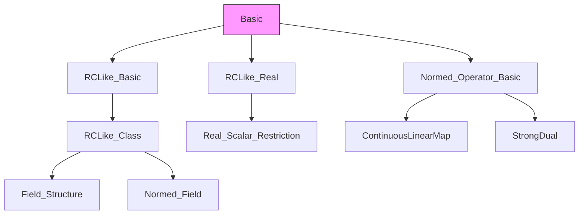
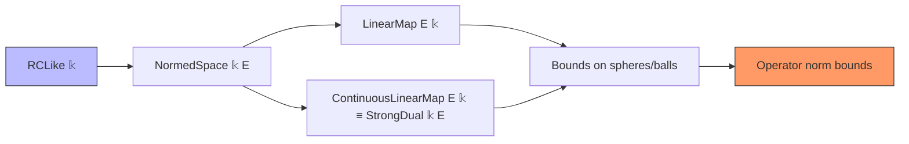

**Technical Brief: `Basic.lean` — Normed Spaces over `ℝ` or `ℂ`**

---

### 1. **Key Definitions & Theorems**

| Name | Type / Signature | Purpose |
|------|------------------|---------|
| `RCLike.norm_coe_norm` | `∀ z : E, ‖(‖z‖ : 𝕜)‖ = ‖z‖` | Shows that embedding a real norm into `𝕜 ∈ {ℝ, ℂ}` preserves norm. |
| `norm_smul_inv_norm` | `∀ x ≠ 0, ‖‖x‖⁻¹ • x‖ = 1` | Normalizes a nonzero vector to unit length via scalar multiplication. |
| `norm_smul_inv_norm'` | `∀ r ≥ 0, x ≠ 0, ‖r * ‖x‖⁻¹ • x‖ = r` | Generalizes normalization to arbitrary nonnegative length `r`. |
| `LinearMap.bound_of_sphere_bound` | `∀ r > 0, (∀ z ∈ sphere 0 r, ‖f z‖ ≤ c) ⇒ ‖f z‖ ≤ (c / r) * ‖z‖` | Bounds a linear functional using its behavior on a sphere. |
| `LinearMap.bound_of_ball_bound'` | Same conclusion as above, assuming bound on *closed ball* instead of sphere. | Extension of previous theorem to closed balls (weaker hypothesis, same conclusion). |
| `ContinuousLinearMap.opNorm_bound_of_ball_bound` | `∀ r > 0, (∀ z ∈ closedBall 0 r, ‖f z‖ ≤ c) ⇒ ‖f‖ ≤ c / r` | Bounds the operator norm of a continuous linear functional via its sup on a ball. |
| `NormedSpace.sphere_nonempty_rclike` | `∀ r ≥ 0, Nonempty (sphere 0 r)` (under `Nontrivial E`) | Guarantees existence of vectors of any nonnegative norm in a nontrivial normed space over `𝕜 ∈ {ℝ, ℂ}`. |

---

### 2. **Naming Conventions**

- **Prefixes**:
  - `norm_`: relates to norm computations (e.g., `norm_smul_inv_norm`, `norm_coe_norm`)
  - `bound_of_`: bounds derived from geometric constraints (e.g., `bound_of_sphere_bound`, `bound_of_ball_bound'`)
  - `opNorm_`: operator norm–related (e.g., `opNorm_bound_of_ball_bound`)
- **Suffixes**:
  - `'` (prime): variant of a previous theorem (e.g., `norm_smul_inv_norm'` vs `norm_smul_inv_norm`)
- **Structure**:
  - `theorem <module>_<description>` pattern (e.g., `LinearMap.bound_of_sphere_bound`)
  - `include`/`variable` patterns for parameter management (`variable (𝕜)` + `include 𝕜 in`)

---

### 3. **Tactic Stack**

Frequently used tactics in proofs:

| Tactic | Role |
|--------|------|
| `simp` / `simp only` | Simplify using `RCLike` and norm axioms; often with `rclike_simps` |
| `rw` | Rewrite using definitions (e.g., `mem_sphere_zero_iff_norm`, `map_smul`) |
| `field_simp` (via `field` in `simp [field, ...]`) | Handle inverses and division in fields |
| `apply` / `exact` | Apply lemmas or hypotheses |
| `have`, `set`, `by_cases` | Introduce intermediate facts and split cases |
| `div_le_div₀` | Prove inequalities involving division of nonnegative reals |
| `mul_le_mul` | Multiply inequalities (with nonnegativity conditions) |
| `norm_nonneg` | Use nonnegativity of norms |

---

### 4. **Proof Logic**

- **Structure**: Most proofs follow a *geometric normalization* strategy:
  1. **Case split** on whether the vector is zero (`by_cases z = 0`).
  2. **Normalize** the vector to lie on a sphere or ball using `norm_smul_inv_norm`/`norm_smul_inv_norm'`.
  3. **Relate** the value of the functional on the original vector to its value on the normalized vector via algebraic manipulation (`rw [hz₁, map_smul, ...]`).
  4. **Apply hypothesis** (e.g., bound on sphere/ball) to the normalized point.
  5. **Simplify and bound** using norm properties (`norm_smul`, `norm_div`, `norm_mul`, `RCLike.norm_coe_norm`, etc.).
- **Induction**: Not used here — geometry and algebra dominate.
- **Key insight**: Scaling vectors to fit within a region where bounds are known, then rescaling back.

---

### 5. **Imports & Dependencies**

| Import | Purpose |
|--------|---------|
| `Mathlib.Analysis.RCLike.Basic` | Provides `RCLike` typeclass (models `ℝ` or `ℂ`), with algebraic and topological structure. |
| `Mathlib.Analysis.Normed.Module.RCLike.Real` | Connects `RCLike` to real scalars and normed spaces over `ℝ`. |
| `Mathlib.Analysis.Normed.Operator.Basic` | Defines `StrongDual`, operator norm, `ContinuousLinearMap`, etc. |
| `Metric` (via `open Metric`) | Provides `sphere`, `closedBall`, `dist`, etc. |

**Key typeclasses used**:
- `[RCLike 𝕜]`: `𝕜` is `ℝ` or `ℂ` (or any real-closed-like field).
- `[NormedAddCommGroup E]`: additive structure + norm.
- `[NormedSpace 𝕜 E]`: scalar multiplication compatible with norm.

---

### 6. **Mermaid Diagrams**

#### **Dependency Graph (Module-Level)**



#### **Overview of Theoretical Flow**



#### **Proof Strategy Flow (for `bound_of_sphere_bound`)**

```mermaid
flowchart TD
  Start[Given f: E →ₗ 𝕜, bound on sphere] --> CaseSplit{z = 0?}
  CaseSplit -->|Yes| Trivial[0 bound holds]
  CaseSplit -->|No| Normalize[Define z₁ = (r/‖z‖) • z]
  Normalize --> SphereCheck[z₁ ∈ sphere 0 r]
  SphereCheck --> ApplyHyp[Apply h: ‖f z₁‖ ≤ c]
  Normalize --> Algebra[Relate f z = (‖z‖/r) • f z₁]
  Algebra --> NormCalc[Compute ‖f z‖ = (‖z‖/r) ‖f z₁‖]
  NormCalc --> BoundFinal[≤ (c/r) ‖z‖]
  Trivial --> End
  BoundFinal --> End
```

---

### 7. **Notes & Design Intent**

- This module isolates `RCLike`-dependent results to avoid polluting core `NormedSpace` files.
- Theorems are *field-agnostic*: work uniformly for `ℝ` and `ℂ` via `RCLike`.
- `bound_of_sphere_bound` gives *sharp* constants (`c/r`), while `bound_of_ball_bound'` is a more flexible variant (bound on larger set).
- `opNorm_bound_of_ball_bound` is the main tool for bounding operator norms in applications (e.g., Hahn–Banach, dual space estimates).

--- 

Let me know if you'd like a formalized dependency graph (e.g., for `leanproject`), or a summary of how this file interfaces with `RieszRepresentation.lean` or `HahnBanach.lean`.
