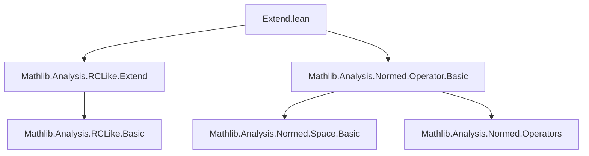

**Technical Brief: `Extend.lean` — Norm Preservation of `extendTo𝕜`**

---

### 1. **Key Definitions & Theorems**

| Name | Type / Signature | Purpose |
|------|------------------|---------|
| `extendTo𝕜'` | `fr : StrongDual ℝ F ↦ fr.extendTo𝕜' : StrongDual 𝕜 F` | Extension of a real-linear continuous functional to a `𝕜`-linear one, assuming `𝕜` is a `RCLike` field and `F` is a `NormedSpace 𝕜 F` with scalar tower over `ℝ`. |
| `extendTo𝕜` | `fr : StrongDual ℝ (RestrictScalars ℝ 𝕜 F) ↦ fr.extendTo𝕜 : StrongDual 𝕜 F` | Variant of extension when the domain is expressed via `RestrictScalars`. Defined as `extendTo𝕜'` under the hood. |
| `norm_extendTo𝕜'_bound` | `∀ fr x, ‖fr.extendTo𝕜' x‖ ≤ ‖fr‖ * ‖x‖` | Shows that the extended functional is bounded by the original norm pointwise. |
| `norm_extendTo𝕜'` | `∀ fr, ‖fr.extendTo𝕜'‖ = ‖fr‖` | Main theorem: the operator norm is *preserved* under extension. |
| `norm_extendTo𝕜` | `∀ fr, ‖fr.extendTo𝕜‖ = ‖fr‖` | Immediate corollary of `norm_extendTo𝕜'`, for the `RestrictScalars`-based version. |

---

### 2. **Naming Conventions**

- **Prefixes**:
  - `extendTo𝕜'`: `'` suffix indicates a *canonical* or *primary* extension map (vs. `extendTo𝕜`, which is a wrapper).
  - `norm_...`: Standard for norm-related lemmas.
- **Suffixes**:
  - `_bound`: For inequalities bounding norms.
  - `_apply`: For lemmas about application of maps (e.g., `extendTo𝕜'_apply_re` used implicitly).
- **Notable**:
  - `conj` used for complex conjugation (in `RCLike` context).
  - `re` for real part.

---

### 3. **Tactic Stack**

Frequent tactics used in proofs:

| Tactic | Role |
|--------|------|
| `set` | Introduce intermediate definitions (e.g., `lm := fr.extendTo𝕜'`). |
| `by_cases` | Split on equality to zero (for division/positivity). |
| `rw` | Rewrite using lemmas (e.g., `← mul_le_mul_iff_right₀`, `norm_smul`, `norm_conj`). |
| `calc` | Chain inequalities/equalities step-by-step (used heavily in both theorems). |
| `le_antisymm` | Prove equality of norms by bounding both sides. |
| `opNorm_le_bound` | Standard tool to bound operator norm via pointwise bound. |
| `abs_re_le_norm`, `le_abs_self` | Real/complex norm inequalities. |
| `norm_pos_iff`, `norm_nonneg` | Positivity/nonnegativity of norms. |
| `congr_arg` | Apply function to both sides of equality (e.g., `norm`). |

---

### 4. **Proof Logic**

- **Structure of `norm_extendTo𝕜'_bound`**:
  1. Define `lm := fr.extendTo𝕜'`.
  2. Handle `lm x = 0` trivially.
  3. For nonzero case, reduce inequality to squared norm.
  4. Use identity: `‖lm x‖² = fr(conj(lm x) • x)` (key algebraic property of extension).
  5. Bound via operator norm: `‖fr(y)‖ ≤ ‖fr‖·‖y‖`.
  6. Simplify using `norm_smul`, `norm_conj`, and commutativity.

- **Structure of `norm_extendTo𝕜'`**:
  1. Prove `≤` using `norm_extendTo𝕜'_bound` + `opNorm_le_bound`.
  2. Prove `≥` by relating `fr x` to `re(lm x)` and using `abs_re_le_norm`.
  3. Conclude via `le_antisymm`.

- **Key idea**: The extension is isometric — the real part recovers the original functional, and the complex norm dominates the real part.

---

### 5. **Imports & Dependencies**

| Import | Purpose |
|--------|---------|
| `Mathlib.Analysis.RCLike.Extend` | Core definitions of `extendTo𝕜'`, `extendTo𝕜`, and basic properties. |
| `Mathlib.Analysis.Normed.Operator.Basic` | Operator norm machinery (`opNorm`, `le_opNorm`, etc.). |
| `RCLike` namespace | Provides `conj`, `re`, `norm_conj`, `norm_smul`, and scalar tower assumptions. |
| `ComplexConjugate` scope | Enables notation like `conj`. |

**Assumptions**:
- `𝕜` is `RCLike` (e.g., `ℝ` or `ℂ`).
- `F` is a seminormed additive commutative group and a normed space over `𝕜`.
- Scalar tower: `IsScalarTower ℝ 𝕜 F` ensures compatibility of scalar multiplication.

---

### 6. **Mermaid Diagrams**

#### **Dependency Graph (Module-Level)**



#### **Theoretical Flow Overview**

```mermaid
flowchart LR
  A[fr : StrongDual ℝ F] --> B[extendTo𝕜' fr : StrongDual 𝕜 F]
  B --> C[Pointwise bound: ‖fr.extendTo𝕜' x‖ ≤ ‖fr‖·‖x‖]
  C --> D[Operator norm ≤ ‖fr‖]
  A --> E[fr x = re(fr.extendTo𝕜' x)]
  E --> F[Operator norm ≥ ‖fr‖]
  D & F --> G[Isometry: ‖extendTo𝕜' fr‖ = ‖fr‖]
```

#### **Proof Dependency Tree (for `norm_extendTo𝕜'`)**

```mermaid
graph TD
  norm_extendTo𝕜' --> norm_extendTo𝕜'_bound
  norm_extendTo𝕜' --> opNorm_le_bound_left
  norm_extendTo𝕜' --> abs_re_le_norm
  norm_extendTo𝕜' --> le_opNorm
  norm_extendTo𝕜'_bound --> fr.norm_extendTo𝕜'_apply_sq
  fr.norm_extendTo𝕜'_apply_sq --> norm_smul
  fr.norm_extendTo𝕜'_apply_sq --> norm_conj
```

---

### 7. **Summary**

This file establishes that the canonical extension of a real continuous linear functional to a complex (or more generally `RCLike`) continuous linear functional is **isometric** — it preserves the operator norm. The proof leverages the interplay between real and complex structures (via `conj`, `re`) and standard normed-space operator norm techniques. It is foundational for duality theory over `RCLike` fields, especially in contexts like Hilbert space theory or Pontryagin duality.
