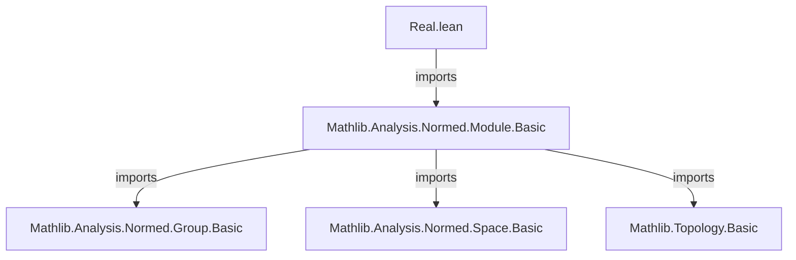
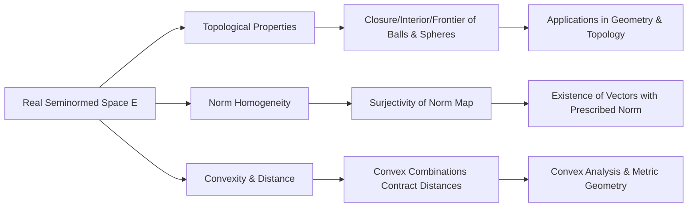

### Technical Brief: `Real.lean` — Basic Facts About Real (Semi)normed Spaces

---

#### **1. Key Definitions & Theorems**

| Name | Type / Signature | Purpose |
|------|------------------|---------|
| `Real.punctured_nhds_module_neBot` | `NeBot (𝓝[≠] x)` | Shows that in a nontrivial topological $\mathbb{R}$-module, every point has no isolated points (punctured neighborhoods are nontrivial). |
| `inv_norm_smul_mem_unitClosedBall` | `‖x‖⁻¹ • x ∈ closedBall 0 1` | Shows that scaling any vector by the inverse of its norm lands in the closed unit ball. |
| `norm_smul_of_nonneg` | `0 ≤ t ⇒ ‖t • x‖ = t * ‖x‖` | Norm is homogeneous for nonnegative real scalars. |
| `dist_smul_add_one_sub_smul_le` | `r ∈ [0,1] ⇒ dist(r•x + (1−r)•y, x) ≤ dist(y,x)` | Convex combinations are nonexpansive toward $x$. |
| `closure_ball` | `r ≠ 0 ⇒ closure(ball x r) = closedBall x r` | Closure of an open ball equals the closed ball in a real seminormed space (when radius ≠ 0). |
| `frontier_ball` | `r ≠ 0 ⇒ frontier(ball x r) = sphere x r` | Boundary of an open ball is the sphere (when radius ≠ 0). |
| `interior_closedBall` | `r ≠ 0 ⇒ interior(closedBall x r) = ball x r` | Interior of a closed ball is the open ball (when radius ≠ 0). |
| `frontier_closedBall` | `r ≠ 0 ⇒ frontier(closedBall x r) = sphere x r` | Boundary of a closed ball is the sphere (when radius ≠ 0). |
| `interior_sphere` | `r ≠ 0 ⇒ interior(sphere x r) = ∅` | Spheres have empty interior (when radius ≠ 0). |
| `frontier_sphere` | `r ≠ 0 ⇒ frontier(sphere x r) = sphere x r` | Spheres are their own boundary (closed with empty interior). |
| `exists_norm_eq` | `0 ≤ c ⇒ ∃ x, ‖x‖ = c` | In a nontrivial real normed space, every nonnegative real is attained as a norm. |
| `range_norm` | `range norm = Ici 0` | The norm map surjects onto $[0, \infty)$. |
| `nnnorm_surjective` | `Surjective nnnorm` | The nonnegative norm map is surjective onto $\mathbb{R}_{\ge 0}$. |
| `range_nnnorm` | `range nnnorm = univ` | Follows from surjectivity. |
| `sphere_nonempty` | `(sphere x r).Nonempty ↔ 0 ≤ r` | Sphere is nonempty iff radius is nonnegative. |
| `interior_closedBall'` | `interior(closedBall x r) = ball x r` | Same as `interior_closedBall`, but assumes *space* is nontrivial instead of $r ≠ 0$. |
| `frontier_closedBall'` | `frontier(closedBall x r) = sphere x r` | Same as `frontier_closedBall`, no $r ≠ 0$ assumption. |
| `interior_sphere'` | `interior(sphere x r) = ∅` | Same as `interior_sphere`, no $r ≠ 0$ assumption. |
| `frontier_sphere'` | `frontier(sphere x r) = sphere x r` | Same as `frontier_sphere`, no $r ≠ 0$ assumption. |

---

#### **2. Naming Conventions**

- **Prefixes**:
  - `is_`, `mem_`, `range_`, `frontier_`, `closure_`, `interior_`, `norm_`, `dist_`, `sphere_`, `closedBall_`, `ball_`
- **Suffixes**:
  - `'` (prime): variants without explicit $r ≠ 0$ assumption (e.g., `interior_closedBall'`)
  - `surjective`, `nonempty`, `neBot`: properties of maps or spaces
- **Logical structure**:
  - `of_nonneg`, `of_nonpos`, `of_lt`, `of_le`: conditions on parameters
  - `mem_`, `subset_`, `diff_`, `interior_`, `closure_`, `frontier_`: topological operations

---

#### **3. Tactic Stack**

Frequently used tactics in proofs:
- `simp_rw`, `simp`, `rw`: rewriting with definitions and lemmas
- `gcongr`: for monotonicity in inequalities
- `exact`, `assumption`, `intro`, `rcases`, `cases'`: basic proof structure
- `fun_prop`: for proving continuity/functoriality properties
- `linarith`, `nlinarith`: for linear/nonlinear real inequalities
- `convert`, `apply`, `refine`: for constructing proofs via intermediate goals
- `set`: for introducing local definitions (e.g., `f : ℝ → E`)
- `ext`, `Subset.antisymm`: for set equality via double inclusion

---

#### **4. Proof Logic**

- **Induction**: Not used directly (no inductive types involved).
- **Case analysis**: Common on `r = 0` vs `r ≠ 0`, or `r < 0` vs `r ≥ 0`.
- **Continuity arguments**: Used in `closure_ball`, `interior_closedBall`, where continuity of the line map $c \mapsto c \cdot (y - x) + x$ is leveraged to pull back closures/interiors.
- **Norm homogeneity & triangle inequality**: Core tools for bounding distances and norms.
- **Topological properties**: Use of `isClosed`, `isOpen`, `frontier`, `closure`, `interior`, and their algebraic interactions (e.g., `frontier A = closure A ∩ closure (Aᶜ)`).
- **Surjectivity arguments**: For norm maps, via construction of explicit preimages using scalar multiplication.

---

#### **5. Imports**

- `Mathlib.Analysis.Normed.Module.Basic`: Core theory of normed modules over $\mathbb{R}$, including continuity of addition/scalar mult, seminormed group structure, etc.
- `Metric`, `Set`, `Function`, `Filter`: for topology and set-theoretic reasoning.
- `NNReal`, `Topology`: for nonnegative reals and topological constructions.

---

#### **8. Mermaid Diagrams**

##### **Dependency Graph (Module-Level)**



##### **Overview of Theory Flow**



##### **Proof Structure for `closure_ball`**

```mermaid
flowchart LR
  start[Assume r ≠ 0] --> line_map[Define f(c) = c•(y−x)+x]
  line_map --> cont[Show f is continuous at 1]
  cont --> pull_back[Pull back closure of Ico 0 1]
  pull_back --> closure_Ico[Use closure_Ico = [0,1]]
  closure_Ico --> eval[Evaluate f(1) = y]
  eval --> mem_ball[Show f(c) ∈ ball x r for c < 1]
  mem_ball --> conclude[y ∈ closure(ball x r)]
```

---

This file forms a foundational layer for real normed geometry in `Mathlib`, enabling later development of convex analysis, differentiability, and manifold theory over $\mathbb{R}$.
