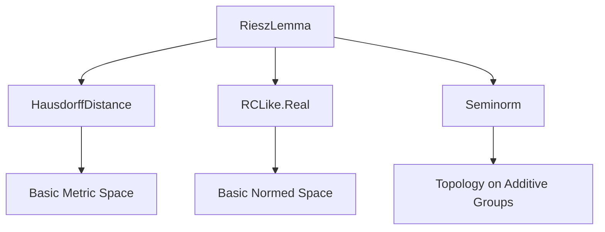

**Technical Brief: `RieszLemma.lean`**

---

### 1. **Key Definitions & Theorems**

| Name | Type / Signature | Purpose |
|------|------------------|---------|
| `riesz_lemma` | `{r : ℝ} → r < 1 → ∃ x₀ ∉ F, ∀ y ∈ F, r * ‖x₀‖ ≤ ‖x₀ - y‖` | For any closed proper subspace `F ⊆ E`, there exists a vector `x₀` whose distance to `F` is at least `r * ‖x₀‖` for any `r < 1`. Generalizes the classical Riesz lemma to arbitrary normed spaces over normed fields (no unit vector assumption). |
| `riesz_lemma_of_norm_lt` | `{c : 𝕜} → 1 < ‖c‖ → {R : ℝ} → ‖c‖ < R → ∃ x₀, ‖x₀‖ ≤ R ∧ ∀ y ∈ F, 1 ≤ ‖x₀ - y‖` | Refinement: under existence of an element `c ∈ 𝕜` with `‖c‖ > 1`, one can find `x₀` with bounded norm (`≤ R`) and uniform distance ≥ 1 from `F`. Handles gaps in possible norms in nontrivially normed fields. |
| `Metric.closedBall_infDist_compl_subset_closure` | `x ∈ s → closedBall x (infDist x sᶜ) ⊆ closure s` | Geometric lemma: the closed ball centered at `x ∈ s` with radius equal to the distance from `x` to the complement `sᶜ` lies inside `closure s`. Used in approximation arguments involving boundaries. |

---

### 2. **Naming Conventions**

- **Prefixes**:
  - `riesz_lemma*`: Standard naming for core lemmas in functional analysis.
  - `infDist_*`: Refers to *infimum distance* to a set.
  - `closedBall_*`: Refers to closed balls in metric/normed spaces.

- **Suffixes**:
  - `_of_norm_lt`: Indicates a variant constrained by norm inequalities.
  - `_subset_closure`: Describes inclusion into a topological closure.

- **Variable naming**:
  - `F`: Subspace (often closed).
  - `x, y, y₀`: Elements of the ambient space `E` or `F`.
  - `d, r, R`: Real scalars (often distances or bounds).
  - `c`: Field element with `‖c‖ > 1`.

---

### 3. **Tactic Stack**

Frequent tactics used in proofs:

| Tactic | Role |
|--------|------|
| `rcases`, `obtain`, `cases` | Extract witnesses from existential hypotheses. |
| `gcongr` | Apply monotonicity of multiplication/scaling under inequalities. |
| `field`, `ring`, `simp` | Simplify field/ring expressions and normalize equalities. |
| `rw [dist_eq_norm]`, `rw [sub_eq_add_neg]` | Rewrite norms/distances in terms of subtraction. |
| `lt_of_le_of_ne`, `lt_div_iff₀`, `mul_lt_iff_lt_one_right` | Manipulate strict inequalities involving norms and division. |
| `norm_num` | Normalize numeric inequalities (e.g., `2⁻¹ < 1`). |
| `closure_mono`, `singleton_subset_iff` | Topological reasoning about closures and inclusions. |
| `by_contra` | Proof by contradiction (e.g., to show `x ≠ 0`). |

---

### 4. **Proof Logic**

- **`riesz_lemma` proof sketch**:
  1. Pick `x ∉ F` (exists by `hF`).
  2. Define `d = infDist x F > 0` (since `F` closed and `x ∉ F`).
  3. Choose `y₀ ∈ F` such that `dist(x, y₀) < d / r'` for `r' = max(r, 1/2)`.
  4. Set `x₀ = x - y₀ ∉ F` (closed under addition ⇒ contradiction otherwise).
  5. For any `y ∈ F`, use triangle inequality and infimum property to bound:
     $$
     r \|x_0\| \le r' \|x_0\| < d \le \|x - (y_0 + y)\| = \|x_0 - y\|.
     $$

- **`riesz_lemma_of_norm_lt` proof sketch**:
  1. Apply `riesz_lemma` with `r = ‖c‖ / R < 1`.
  2. Obtain `x` with `r * ‖x‖ ≤ dist(x, F)`.
  3. Rescale `x` using `rescale_to_shell` to get `d • x` with norm in `[R/‖c‖, R)` and control over `‖d‖`.
  4. Show `1 ≤ ‖d • x - y‖` for all `y ∈ F` via norm estimates and substitution `y = d • y'`.

- **`Metric.closedBall_infDist_compl_subset_closure`**:
  - If `infDist x sᶜ = 0`, then `x ∈ closure s` trivially.
  - Otherwise, use density of open balls in closed balls and monotonicity of closure.

---

### 5. **Imports & Dependencies**

| Import | Purpose |
|--------|---------|
| `Mathlib.Analysis.Normed.Module.RCLike.Real` | Provides `normed_space`, `normed_field`, and real scalar multiplication properties. |
| `Mathlib.Analysis.Seminorm` | Seminormed additive commutative groups and their interaction with norms. |
| `Mathlib.Topology.MetricSpace.HausdorffDistance` | Defines `infDist`, `closedBall`, `dist`, and related metric topology tools. |

> **Note**: The file builds on `MetricSpace`, `NormedSpace`, and `Topology.Closure` infrastructure.

---

### 6. **Mermaid Diagrams**

#### **Dependency Graph (File-Level)**



#### **Theoretical Overview (Module Scope)**

```mermaid
flowchart LR
  A[Normed Space E over 𝕜] --> B[Closed Subspace F ⊂ E]
  B --> C[riesz_lemma: distance ≥ r·‖x‖]
  B --> D[riesz_lemma_of_norm_lt: bounded norm, dist ≥ 1]
  A --> E[infDist & closure geometry]
  E --> F[Metric.closedBall_infDist_compl_subset_closure]
  C & D --> G[Applications in functional analysis (e.g., non-separability, Riesz’s lemma corollaries)]
```

---

### 7. **Summary**

This module formalizes foundational applications of the **Hausdorff distance** in normed spaces, with the **Riesz lemma** as the central result. It provides two variants:
- A classical quantitative version (`riesz_lemma`) for any `r < 1`.
- A refined version (`riesz_lemma_of_norm_lt`) that ensures bounded norm under mild field assumptions (`∃ c, ‖c‖ > 1`).

The supporting lemma `Metric.closedBall_infDist_compl_subset_closure` connects metric geometry (infimum distance to complement) with topological closure, enabling fine control over neighborhoods near boundaries.

These results are essential for further developments in functional analysis (e.g., non-reflexivity, Riesz’s lemma applications to compactness, Riesz representation theorems).
