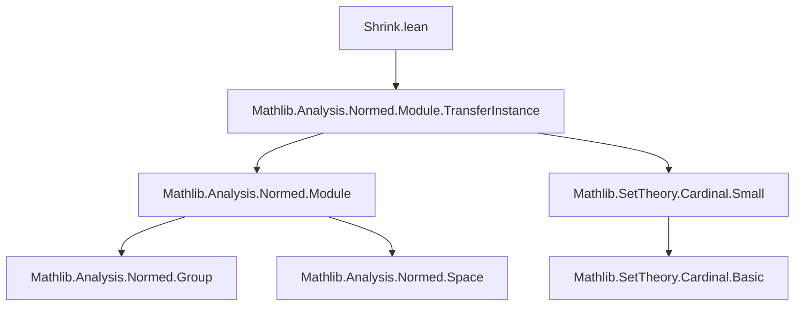

**Technical Brief: `Shrink.lean`**

---

### 1. **Key Definitions & Theorems**

| Name | Type / Purpose |
|------|----------------|
| `equivShrink α` | An equivalence `α ≃ Shrink.{v} α`, used to *transfer* structures along a equivalence (via `.symm.*`). |
| `instance SeminormedAddCommGroup (Shrink α)` | Transfers a `SeminormedAddCommGroup` structure from `α` to `Shrink α` via `equivShrink α`. |
| `instance NormedAddCommGroup (Shrink α)` | Transfers a `NormedAddCommGroup` structure from `α` to `Shrink α`. |
| `instance NormedSpace 𝕜 (Shrink α)` | Transfers a `NormedSpace 𝕜` structure from `α` to `Shrink α`, assuming `α` is both a `SeminormedAddCommGroup` and a `NormedSpace`. |

> **Purpose**: To enable *structure transfer* of normed algebraic structures (additive groups, normed spaces) from a type `α` to its *shrink* `Shrink α`, leveraging the equivalence `equivShrink α : α ≃ Shrink α`.

---

### 2. **Naming Conventions**

- **Prefixes / Suffixes**:
  - `equivShrink`: Standard naming for the canonical equivalence `α ≃ Shrink α`.
  - `seminormedAddCommGroup`, `normedAddCommGroup`, `normedSpace`: Standard Mathlib naming for typeclass instances.
- **No custom prefixes/suffixes** beyond standard Mathlib conventions.

---

### 3. **Tactic Stack**

- **No explicit tactics** appear in the file.
- Proof automation is delegated to:
  - `equivShrink α`.symm.* — leveraging `TransferInstance` infrastructure (e.g., `equiv.seminormedAddCommGroup`, `equiv.normedSpace`).
- Implicit use of:
  - `rfl`, ` rfl`, ` rfl`-style reasoning via `@[instance]`/`@[simp]`-compatible definitions.
  - Likely relies on `TransferInstance` lemmas (e.g., `equiv.seminormedAddCommGroup`, `equiv.normedSpace`) from `Mathlib.Analysis.Normed.Module.TransferInstance`.

---

### 4. **Proof Logic**

- **Strategy**: *Structure transfer via equivalence*.
  - Given `α` with a normed structure, use `equivShrink α : α ≃ Shrink α` to *pull back* the structure along the inverse equivalence.
  - This is standard in Lean for “transporting” structures along equivalences (e.g., `equiv.seminormedAddCommGroup`).
- **No induction or case analysis** is visible — the proofs are *definitionally* or *by instance resolution*.

---

### 5. **Imports**

| Import | Role |
|--------|------|
| `Mathlib.Analysis.Normed.Module.TransferInstance` | Provides infrastructure for transferring normed module structures along equivalences (e.g., `equiv.seminormedAddCommGroup`, `equiv.normedSpace`). |
| `Mathlib.Analysis.Normed.Module` (via above) | Supplies `SeminormedAddCommGroup`, `NormedAddCommGroup`, `NormedSpace`. |
| `Mathlib.SetTheory.Cardinal.Small` (via `Small.{v} α`) | Ensures `α` is small (i.e., lives in a universe level `v`), required for `Shrink α` to be well-defined. |

---

### 8. **Mermaid Diagrams**

#### **Dependency Graph (File-Level)**



#### **Conceptual Overview (Structure Transfer)**

```mermaid
flowchart LR
  α[Type α with structure] -->|equivShrink α : α ≃ Shrink α| Shrink_α[Shrink α]
  SeminormedAddCommGroup[seminormedAddCommGroup α] -->|Transfer| SeminormedAddCommGroup_shrink[seminormedAddCommGroup (Shrink α)]
  NormedAddCommGroup[normedAddCommGroup α] -->|Transfer| NormedAddCommGroup_shrink[normedAddCommGroup (Shrink α)]
  NormedSpace[normedSpace 𝕜 α] -->|Transfer| NormedSpace_shrink[normedSpace 𝕜 (Shrink α)]
```

#### **Module Scope & Theory Context**

- **Domain**: Functional analysis / normed algebra over `ℝ` or `ℂ` (via `NormedField 𝕜`).
- **Theory**: *Shrink* is a construction to embed a type into a *small* type (in a given universe level), often used to avoid universe polymorphism issues while preserving structure.
- **Goal**: Ensure `Shrink α` inherits all relevant normed algebraic structure from `α`, *canonically* and *without loss*.

--- 

Let me know if you'd like a formalization of `Shrink α`’s universal property or further expansion into `Shrink`-based transfer lemmas.
