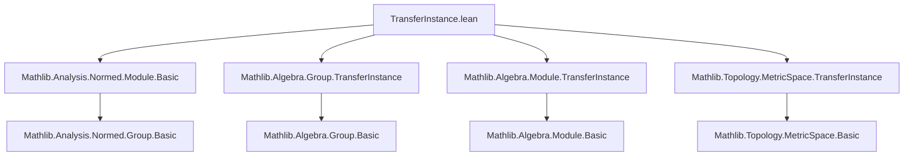

### Technical Brief: `TransferInstance.lean`

---

#### **1. Key Definitions & Theorems**

| Name | Type | Purpose |
|------|------|---------|
| `Equiv.seminormedCommGroup` | `[SeminormedCommGroup β] → α ≃ β → SeminormedCommGroup α` | Transfers a seminormed commutative group structure across an equivalence `e : α ≃ β`, using the induced structure via the multiplicative equivalence. |
| `Equiv.normedCommGroup` | `[NormedCommGroup β] → α ≃ β → NormedCommGroup α` | Transfers a normed commutative group structure across `e`, extending `seminormedCommGroup` with norm compatibility (via injectivity). |
| `Equiv.normedSpace` | `[NormedField 𝕜] → [SeminormedAddCommGroup β] → [NormedSpace 𝕜 β] → α ≃ β → NormedSpace 𝕜 α` | Transfers a normed space structure over a normed field `𝕜` across `e`, using the induced additive structure and module structure. |
| `Equiv.seminormedAddCommGroup` *(to_additive)* | `[SeminormedAddCommGroup β] → α ≃ β → SeminormedAddCommGroup α` | Additive counterpart of `seminormedCommGroup`, used for additive groups. |
| `Equiv.normedAddCommGroup` *(to_additive)* | `[NormedAddCommGroup β] → α ≃ β → NormedAddCommGroup α` | Additive counterpart of `normedCommGroup`. |

> **Note**: The `to_additive` attributes indicate that additive versions are automatically generated (e.g., via `to_additive` attribute machinery in Lean).

---

#### **2. Naming Conventions**

- **Prefixes**:
  - `seminormed*`, `normed*`: Reflects the level of normed structure (seminorm vs norm).
  - `CommGroup` vs `AddCommGroup`: Multiplicative vs additive notation.
- **Suffixes**:
  - `Group` vs `Space`: Group-level vs module/normed space-level structures.
- **Pattern**:
  - `Equiv.[structure] [instances] (e : α ≃ β) : [structure] α`
  - Uses `letI` to introduce derived instances (e.g., `e.commGroup`, `e.module 𝕜`).
  - Leverages `induced` constructions for metric/normed structures.

---

#### **3. Tactic Stack**

- `letI`: To introduce instances derived from equivalences (e.g., `e.commGroup`, `e.module`, `e.seminormedAddCommGroup`).
- Implicit use of `induced` constructor (not a tactic, but a constructor pattern).
- No explicit tactics (e.g., `aesop`, `ring`, `simp`) appear in the *definition* — proofs are deferred to `induced` infrastructure and underlying lemmas.

---

#### **4. Proof Logic**

- **Strategy**: Structural transfer via *pullback along equivalence*.
  - For algebraic structure: Use `e.commGroup`, `e.module`, etc., which are already defined in `Mathlib.Algebra.Group.TransferInstance` and `Mathlib.Algebra.Module.TransferInstance`.
  - For metric/normed structure: Use `e.pseudometricSpace`, `e.induced`, and `Equiv.induced` (from `Mathlib.Topology.MetricSpace.TransferInstance`).
- **Key logical flow**:
  1. Transfer algebraic structure via `e` (e.g., `e.commGroup : CommGroup α`).
  2. Transfer topological/metric structure via `e.pseudometricSpace` (induced from `β`).
  3. Combine using `induced` to ensure compatibility (e.g., norm = distance to identity).
  4. For normed spaces: Ensure scalar multiplication is continuous (via `linearEquiv`).

---

#### **5. Imports**

| Module | Role |
|--------|------|
| `Mathlib.Analysis.Normed.Module.Basic` | Provides `NormedSpace`, `SeminormedAddCommGroup`, etc. |
| `Mathlib.Algebra.Group.TransferInstance` | Provides group-level transfer (`commGroup`, `mulEquiv`, etc.). |
| `Mathlib.Algebra.Module.TransferInstance` | Provides module-level transfer (`module`, `linearEquiv`). |
| `Mathlib.Topology.MetricSpace.TransferInstance` | Provides metric/pseudometric space transfer (`pseudometricSpace`, `induced`). |

---

#### **8. Mermaid Diagrams**

##### **Dependency Graph (File-Level)**



##### **Theoretical Overview (Structure Transfer)**

```mermaid
flowchart LR
  β[β : Type*] -->|e : α ≃ β| α[α : Type*]
  β -->|SeminormedCommGroup β| Sβ[SeminormedCommGroup β]
  α -->|Equiv.seminormedCommGroup e| Sα[SeminormedCommGroup α]
  Sβ -->|induced via e.mulEquiv| Sα

  β -->|NormedSpace 𝕜 β| Nβ[NormedSpace 𝕜 β]
  α -->|Equiv.normedSpace e| Nα[NormedSpace 𝕜 α]
  Nβ -->|induced via e.linearEquiv| Nα

  subgraph "Algebraic Transfer"
    Cβ[CommGroup β] -->|e.commGroup| Cα[CommGroup α]
    Mβ[Module 𝕜 β] -->|e.module| Mα[Module 𝕜 α]
  end

  subgraph "Metric Transfer"
    PMβ[PseudoMetricSpace β] -->|e.pseudometricSpace| PMα[PseudoMetricSpace α]
  end

  Sα <-->|norm = dist(0, ·)| PMα
  Nα <-->|scalar mult. continuous| PMα
```

---

### Summary

This file extends the *transfer instance* pattern (from algebra → topology → analysis) to **normed algebraic structures** across equivalences. It leverages:
- `Equiv`-induced algebraic structures (`commGroup`, `module`),
- `Equiv`-induced metric structures (`pseudometricSpace`),
- `induced` constructions to unify them coherently.

It is part of a broader effort to automate structure transport in Lean’s `Mathlib`, following the principle: *“if two types are equivalent, they should support the same structure.”*
