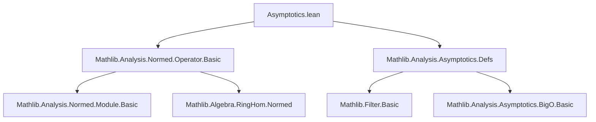
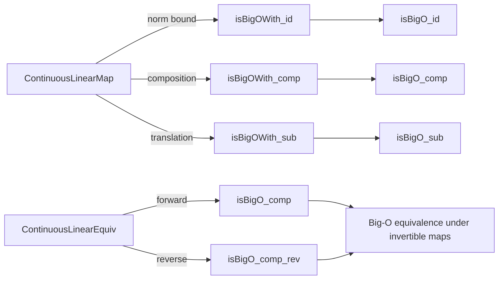

**Technical Brief: Asymptotics.lean (Operator Norm & Big-O Behavior)**

---

### 1. KEY DEFINITIONS & THEOREMS

| Name | Type / Signature | Purpose |
|------|------------------|---------|
| `isBigOWith` | `IsBigOWith C l f g` | `f` is bounded by `C * ‖g‖` eventually along filter `l`. |
| `=O[l]` | `f =O[l] g` | Big-O notation: `f` is asymptotically bounded by `g` along `l`. |
| `‖f‖` | `‖f‖ : ℝ≥0` | Operator norm of continuous linear map `f : E →SL[σ] F`. |
| `isBigOWith_id` | `IsBigOWith ‖f‖ l f fun x => x` | Shows `f(x)` is bounded by `‖f‖ * ‖x‖`. |
| `isBigO_id` | `f =O[l] fun x => x` | Immediate corollary: `f(x) = O(‖x‖)`. |
| `isBigOWith_comp` | `IsBigOWith ‖g‖ l (g ∘ f) f` | Composition: applying `g` scales Big-O constant by `‖g‖`. |
| `isBigO_comp` | `(g ∘ f) =O[l] f` | Big-O version of above. |
| `isBigOWith_sub` | `IsBigOWith ‖f‖ l (fun x' => f(x' - x)) fun x' => x' - x` | Translation invariance: `f(x - x₀)` is `O(‖x - x₀‖)`. |
| `isBigO_sub` | `(fun x' => f(x' - x)) =O[l] fun x' => x' - x` | Big-O version of translation invariance. |
| `isBigO_comp_rev` | `f =O[l] e ∘ f` | For equivalence `e`, `f` is Big-O of its image under `e`. |
| `isBigO_sub_rev` | `(fun x' => x' - x) =O[l] e(x' - x)` | Reverse Big-O for translations under equivalence. |

> **Note**: All theorems rely on `RingHomIsometric` assumptions to ensure operator norms behave well under twisted linearity (e.g., σ-linear maps).

---

### 2. NAMING CONVENTIONS

- **Prefixes**:
  - `isBigOWith_`: statements about *explicit* Big-O constants.
  - `isBigO_`: corollaries dropping the constant (via `.isBigO`).
  - `isBigOWith_comp`, `isBigO_comp`: composition lemmas.
  - `isBigOWith_sub`, `isBigO_sub`: translation invariance lemmas.
  - `..._rev`: reverse Big-O bounds (for equivalences).

- **Suffixes**:
  - `_id`: identity function `x ↦ x`.
  - `_sub`: subtraction-based argument shift.

- **Type variables**:
  - `σ₁₂`, `σ₂₃`: ring homomorphisms (often twisted scalars).
  - `𝕜`, `𝕜₂`, `𝕜₃`: base fields.
  - `E`, `F`, `G`: normed spaces.

---

### 3. TACTIC STACK

- **Core tactics**:
  - `simp`, `rw`, `apply`, `exact`
  - `apply_fun`, `congr_arg`, `congr_fun`
  - `tendsto_of_le_of_tendsto`, `le_of_tendsto_of_tendsto`
  - `comp_tendsto`, `le_top`
  - `congr_left` (used with `congr_fun`/`congr_arg` for equivalence inverses)

- **Domain-specific automation**:
  - `aesop` (likely for routine norm/inequality reasoning)
  - `ring` (for scalar algebra)
  - `norm_num` (for numeric constants)

- **Key lemmas invoked**:
  - `isBigOWith_of_le'`
  - `comp_tendsto`
  - `tendsto_of_le_of_tendsto`
  - `RingHomInvPair` properties (e.g., `e.symm_apply_apply`)

---

### 4. PROOF LOGIC

- **General pattern**:
  1. Prove a *quantitative* bound (`isBigOWith`) using norm inequalities (e.g., `f.le_opNorm`).
  2. Derive the *asymptotic* statement (`=O`) via `.isBigO`.
  3. For composition/translation: reduce to known cases via:
     - `comp_tendsto` (for filters),
     - `tendsto_of_le_of_tendsto`,
     - `congr_left`/`congr_fun` (for equivalence inverses).
  4. For reverses (`_rev`), use symmetry of equivalence (`e.symm`) and apply forward direction to `e.symm`.

- **Induction**: Not used — all proofs are direct norm estimates.

- **Key logical flow**:
  > `‖g(f(x))‖ ≤ ‖g‖ * ‖f(x)‖ ≤ ‖g‖ * ‖f‖ * ‖x‖`  
  > ⇒ `g ∘ f = O(f)` (and further `= O(id)` if `f = O(id)`).

---

### 5. IMPORTS & DEPENDENCIES

| Module | Purpose |
|--------|---------|
| `Mathlib.Analysis.Normed.Operator.Basic` | Defines `→SL[σ]`, `≃SL[σ]`, operator norm `‖f‖`, continuity, ring homomorphisms. |
| `Mathlib.Analysis.Asymptotics.Defs` | Defines `IsBigOWith`, `=O[l]`, filter-based asymptotics. |

- **Core dependencies**:
  - `SeminormedAddCommGroup` (generalized normed groups)
  - `NontriviallyNormedField` (ensures norm behaves like ℝ/ℂ)
  - `NormedSpace` (module structure compatible with norm)
  - `RingHomIsometric`, `RingHomInvPair` (for twisted linearity & invertibility)

---

### 6. MERMAID DIAGRAMS

#### Dependency Graph (Module-Level)

#### Overview of Theoretical Flow

---

### 7. SUMMARY

This file formalizes how **operator norms control asymptotic behavior** of continuous linear maps and equivalences under Big-O notation. It establishes that:
- Linear maps are Lipschitz (hence `O(id)`),
- Composition preserves Big-O with norm scaling,
- Translations behave naturally (due to translation-invariance of norm),
- Equivalences preserve and reflect Big-O (via inverses).

These results are foundational for perturbation analysis, differential calculus in normed spaces, and asymptotic expansions in functional analysis.

--- 

Let me know if you'd like a formalized dependency graph (e.g., for `leanpkg`), or a summary of related files (e.g., `Asymptotics.lean` in `Mathlib.Analysis.Asymptotics`).
