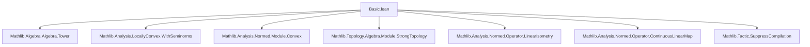

### Technical Brief: Operator Norm on Continuous Linear Maps in Lean 4

---

#### **1. Key Definitions & Theorems**

| Name | Type / Signature | Purpose |
|------|------------------|---------|
| `opNorm` | `E →SL[σ₁₂] F → ℝ` | Defines the operator norm as the infimum of all bounds $c \ge 0$ such that $\|f x\| \le c \|x\|$ for all $x$. |
| `hasOpNorm` | `Norm (E →SL[σ₁₂] F)` | Installs `opNorm` as the norm on continuous linear maps. |
| `le_opNorm` | `∀ f x, ‖f x‖ ≤ ‖f‖ * ‖x‖` | Fundamental property: the operator norm bounds the action of $f$. |
| `opNorm_le_bound` | `∀ f M, 0 ≤ M → (∀ x, ‖f x‖ ≤ M * ‖x‖) → ‖f‖ ≤ M` | If $M$ is a uniform bound, then $\|f\| \le M$. |
| `opNorm_add_le` | `∀ f g, ‖f + g‖ ≤ ‖f‖ + ‖g‖` | Triangle inequality for operator norm. |
| `opNorm_comp_le` | `∀ f g, ‖g.comp f‖ ≤ ‖g‖ * ‖f‖` | Submultiplicativity of operator norm under composition. |
| `norm_id_le` / `norm_id` | `‖id‖ ≤ 1`, and `= 1` if $E$ is nontrivial topologically | Identity map has norm ≤ 1; equals 1 in nontrivial spaces. |
| `opNorm_zero` | `‖(0 : E →SL[σ₁₂] F)‖ = 0` | Zero map has zero norm. |
| `opNorm_neg` | `‖-f‖ = ‖f‖` | Norm is even. |
| `opNorm_le_iff_lipschitz` | `‖f‖ ≤ K ↔ LipschitzWith K f` | Operator norm characterizes Lipschitz constant. |
| `norm_restrictScalars` | `‖f.restrictScalars‖ = ‖f‖` | Norm is preserved under scalar restriction. |
| `restrictScalarsIsometry` | `(E →L[𝕜] Fₗ) →ₗᵢ[𝕜''] E →L[𝕜'] Fₗ` | Scalar restriction is an isometry. |
| `toSeminormedAddCommGroup` | `SeminormedAddCommGroup (E →SL[σ₁₂] F)` | Continuous linear maps form a seminormed additive commutative group. |
| `toNormedSpace` | `NormedSpace 𝕜' (E →SL[σ₁₂] F)` | Under suitable assumptions, continuous linear maps form a normed space over a scalar extension. |
| `toSeminormedRing` / `toNormedAlgebra` | `SeminormedRing (E →L[𝕜] E)`, `NormedAlgebra 𝕜 (E →L[𝕜] E)` | Endomorphisms form a seminormed ring / normed algebra. |
| `norm_pi_le_of_le` | `‖pi L‖ ≤ C` if each component has norm ≤ C | Norm of product map is bounded by uniform bound on components. |
| `ball_subset_range_iff_surjective`, `closedBall_subset_range_iff_surjective`, `sphere_subset_range_iff_surjective` | `ball x r ⊆ range f ↔ f.surjective` (under surjectivity of σ) | Surjectivity of a semilinear map is equivalent to containing a ball in its range. |
| `norm_image_of_norm_eq_zero` | `‖x‖ = 0 → ‖f x‖ = 0` for continuous $f$ | Continuity preserves zero-norm images. |
| `bound_of_continuous` | `∃ C > 0, ∀ x, ‖f x‖ ≤ C * ‖x‖` | Continuous linear maps are globally bounded (under nontrivially normed field). |

---

#### **2. Naming Conventions**

- **Prefixes**:
  - `opNorm_`: operator norm properties (`opNorm_le_bound`, `opNorm_add_le`, etc.)
  - `norm_`: norm-related facts (`norm_id`, `norm_zero`, `norm_neg`, `norm_pi_le_of_le`)
  - `le_`: inequalities involving norms (`le_opNorm`, `le_of_opNorm_le`, etc.)
  - `bound_`: boundedness results (`bound_of_continuous`, `bound_of_shell_semi_normed`)
  - `isLeast_`, `isClosed_`, `isVonNBounded_`: structural properties of sets or operators.

- **Suffixes**:
  - `_le`: upper bound lemmas (`opNorm_le_bound`, `norm_id_le`)
  - `_iff_surjective`: surjectivity characterizations (`ball_subset_range_iff_surjective`)
  - `_enorm`: extended norm variants (`le_opNorm_enorm`)
  - `_nnnorm`: NNReal-valued norm (`nnnorm_id`)
  - `_of_`: construction from assumptions (`opNorm_le_of_ball`, `opNorm_le_of_nhds_zero`)
  - `_isometry`: isometric constructions (`restrictScalarsIsometry`, `toSpanSingleton`)

- **Variable suffixes**:
  - `ₗ`: for linear (as opposed to semilinear) maps (`Fₗ`, `𝓕ₗ`)
  - `σ₁₂`, `σ₂₃`, `σ₁₃`: ring homomorphisms for semilinearity
  - `𝕜`, `𝕜₂`, `𝕜₃`: base fields

---

#### **3. Tactic Stack**

Frequently used tactics in this file:

| Tactic | Usage |
|--------|-------|
| `simp_rw` | Rewriting with simplification (e.g., `← LinearMap.coe_range`) |
| `grw` | `gcongr` + `rw` combo for inequalities |
| `rcases`, `obtain`, `cases'` | Decomposing existential or disjunctive hypotheses |
| `gcongr` | Congruence for inequalities |
| `linarith`, `nlinarith` | Solving linear/nonlinear inequalities |
| `exact`, `assumption`, `intro` | Basic proof steps |
| `apply`, `refine`, `exact?` | Goal-directed proof construction |
| `set_option` | For internal consistency (e.g., `backward.privateInPublic`) |
| ` continuity` | Proving continuity of composite maps |
| ` positivity` | Proving positivity of expressions (e.g., norms) |
| ` aesop` | Not used heavily here — more manual automation via `simp`, `rw`, `gcongr` |
| ` ring` / `norm_num` | Minimal use — mostly algebraic simplifications via `simp` |

---

#### **4. Proof Logic**

- **Inductive/structural style**: Most proofs are *direct* and *constructive*, leveraging:
  - **Infimum properties** (`csInf_le`, `le_csInf_iff`) for operator norm definitions.
  - **Scaling arguments** (e.g., rescaling $x$ to lie in a shell or ball where bounds are known).
  - **Continuity + nontrivial norm ⇒ boundedness** via rescaling into a neighborhood where continuity gives control.
  - **Topological arguments** (e.g., using `eventually_nhds_iff_ball`, `closedBall_mem_nhds`) for local-to-global norm control.
  - **Convex hull arguments** (e.g., `convexHull_sphere_eq_closedBall`) for sphere/range surjectivity equivalences.

- **Common proof patterns**:
  - *Bounding via infimum*: Show a candidate bound $M$ satisfies the defining property of the set over which `opNorm` is the infimum.
  - *Rescaling trick*: For nonzero $x$, scale to $x' = c x$ such that $\|x'\| \in [\varepsilon / \|c\|, \varepsilon)$, then apply assumed bound on that shell.
  - *Equivalence via double inequality*: Prove $\|f\| = M$ by showing both $\|f\| \le M$ and $M \le \|f\|$ (e.g., `opNorm_eq_of_bounds`, `homothety_norm`).
  - *Isometric constructions*: Use `norm_map'` to upgrade linear maps to isometries (`LinearIsometry.toSpanSingleton`).

---

#### **5. Imports & Dependencies**

**Primary dependencies** (from `import` lines):

| Module | Role |
|--------|------|
| `Mathlib.Algebra.Algebra.Tower` | Scalar tower and compatibility (e.g., `IsScalarTower`) |
| `Mathlib.Analysis.LocallyConvex.WithSeminorms` | Seminormed spaces, convexity, locally convex structures |
| `Mathlib.Analysis.Normed.Module.Convex` | Convexity in normed modules |
| `Mathlib.Topology.Algebra.Module.StrongTopology` | Strong topology on dual/module spaces |
| `Mathlib.Analysis.Normed.Operator.LinearIsometry` | Linear isometries and their properties |
| `Mathlib.Analysis.Normed.Operator.ContinuousLinearMap` | Core theory of `ContinuousLinearMap` (this file extends it) |
| `Mathlib.Tactic.SuppressCompilation` | For performance tuning (e.g., `suppress_compilation`) |

**Key typeclasses used**:
- `SeminormedAddCommGroup`, `NormedSpace`, `NontriviallyNormedField`
- `RingHomCompTriple`, `RingHomIsometric`, `RingHomSurjective`
- `FunLike`, `SemilinearMapClass`
- `NormedAlgebra`, `IsScalarTower`, `ContinuousConstSMul`, `SMulCommClass`

---

#### **6. Mermaid Diagrams**

##### **Dependency Graph (Module-Level)**



##### **Theory Overview (Conceptual Flow)**

```mermaid
graph LR
  A[Seminormed spaces E, F] --> B[Continuous linear maps E →SL[σ] F]
  B --> C[Operator norm opNorm]
  C --> D[Induced seminormed structure]
  D --> E[SeminormedAddCommGroup]
  D --> F[NormedSpace over extensions]
  C --> G[Key properties: le_opNorm, opNorm_add_le, opNorm_comp_le]
  G --> H[Topological algebra structure]
  B --> I[Surjectivity ⇔ ball ⊆ range]
  I --> J[Semilinear maps with surjective σ]
```

##### **Operator Norm Construction Pipeline**

```mermaid
graph LR
  K[Continuous f : E → F] --> L[∃ C > 0, ∀ x, ‖f x‖ ≤ C ‖x‖]
  L --> M[Set of bounds B = {c ≥ 0 | ∀ x, ‖f x‖ ≤ c ‖x‖}]
  M --> N[opNorm f := sInf B]
  N --> O[Normed space structure on E →SL[σ] F]
```

---

#### **7. Summary**

This file formalizes the **operator norm** on the space of continuous (semi)linear maps between seminormed spaces over nontrivially normed fields. It establishes:

- The **definition** of `opNorm` as an infimum,
- Its **fundamental properties** (triangle inequality, submultiplicativity, Lipschitz equivalence),
- Its role in endowing `E →SL[σ] F` with **algebraic and topological structures** (seminormed group, normed space, algebra),
- **Surjectivity criteria** via ball containment,
- **Rescaling techniques** to derive global bounds from local ones,
- **Isometric constructions** (e.g., `restrictScalarsIsometry`, `toSpanSingleton`).

The development is carefully layered: starting with seminormed spaces, specializing later to normed spaces (in `NormedSpace.lean`), and emphasizing the role of **isometric ring homomorphisms** for semilinearity.

This forms the foundation for functional analysis in Lean, especially for dual spaces, tensor products, and operator algebras.
