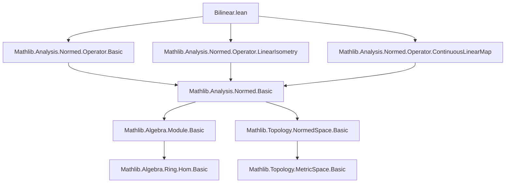
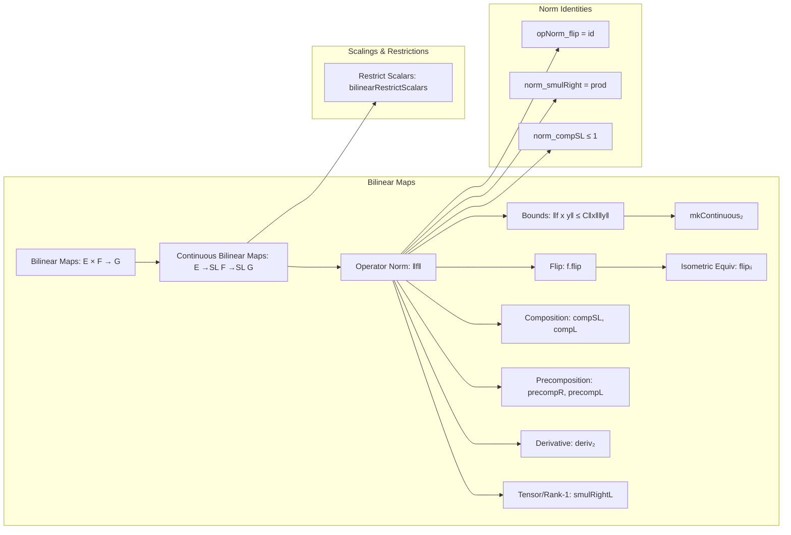

### Technical Brief: Bilinear Operator Norm in Lean 4 (`Bilinear.lean`)

---

#### **1. Key Definitions & Theorems**

| Name | Type / Signature | Purpose |
|------|------------------|---------|
| `opNorm_ext` | `(f : E →SL[σ₁₂] F) (g : E →SL[σ₁₃] G) → (∀ x, ‖f x‖ = ‖g x‖) → ‖f‖ = ‖g‖` | Operator norm is determined by pointwise norm equality. |
| `opNorm_le_bound₂` | `(f : E →SL[σ₁₃] F →SL[σ₂₃] G) → (0 ≤ C) → (∀ x y, ‖f x y‖ ≤ C * ‖x‖ * ‖y‖) → ‖f‖ ≤ C` | Bounds on bilinear maps imply bounds on operator norm. |
| `le_opNorm₂` | `(f : E →SL[σ₁₃] F →SL[σ₂₃] G) → ‖f x y‖ ≤ ‖f‖ * ‖x‖ * ‖y‖` | Fundamental inequality for bilinear operator norm. |
| `le_of_opNorm₂_le_of_le` | `(hf : ‖f‖ ≤ a) → (hx : ‖x‖ ≤ b) → (hy : ‖y‖ ≤ c) → ‖f x y‖ ≤ a * b * c` | Transitivity of norm bounds for bilinear maps. |
| `mkContinuous₂` | `(f : E →ₛₗ[σ₁₃] F →ₛₗ[σ₂₃] G) → C : ℝ → (∀ x y, ‖f x y‖ ≤ C * ‖x‖ * ‖y‖) → E →SL[σ₁₃] F →SL[σ₂₃] G` | Construct continuous bilinear map from bounded semilinear one. |
| `mkContinuous₂_norm_le` | `(0 ≤ C) → (∀ x y, ‖f x y‖ ≤ C * ‖x‖ * ‖y‖) → ‖f.mkContinuous₂ C hC‖ ≤ C` | Norm estimate for `mkContinuous₂`. |
| `flip` | `(f : E →SL[σ₁₃] F →SL[σ₂₃] G) → F →SL[σ₂₃] E →SL[σ₁₃] G` | Flip arguments of a continuous bilinear map. |
| `opNorm_flip` | `‖f.flip‖ = ‖f‖` | Flip preserves operator norm. |
| `flipₗᵢ'`, `flipₗᵢ` | `≃ₗᵢ[𝕜₃]` / `≃ₗᵢ[𝕜]` | Linear isometry equivalences for flipping arguments. |
| `compSL`, `compL` | `(F →SL[σ₂₃] G) →L[𝕜₃] (E →SL[σ₁₂] F) →SL[σ₂₃] E →SL[σ₁₃] G` | Composition as a continuous (bi)linear map. |
| `norm_compSL_le`, `norm_compL_le` | `‖compSL‖ ≤ 1`, `‖compL‖ ≤ 1` | Composition has norm ≤ 1. |
| `precompR`, `precompL` | Continuous bilinear maps for precomposition on right/left. | Used in derivative and chain rule contexts. |
| `deriv₂` | `(f : E →L[𝕜] Fₗ →L[𝕜] Gₗ) → E × Fₗ →L[𝕜] E × Fₗ →L[𝕜] Gₗ` | Derivative of bilinear map as bilinear map. |
| `map_add_add` | `f (x + x') (y + y') = f x y + f.deriv₂ (x, y) (x', y') + f x' y'` | Bilinear expansion formula. |
| `smulRightL` | `StrongDual 𝕜 E →L[𝕜] Fₗ →L[𝕜] E →L[𝕜] Fₗ` | Rank-one operator as continuous trilinear map. |
| `norm_smulRight_apply` | `‖smulRight c f‖ = ‖c‖ * ‖f‖` | Norm of rank-one operator. |
| `bilinearRestrictScalars` | `(E →L[𝕜'] F →L[𝕜'] G) → E →L[𝕜] F →L[𝕜] G` | Restrict scalars in bilinear maps. |

---

#### **2. Naming Conventions**

- **Prefixes**:
  - `opNorm_`: operator norm lemmas.
  - `mkContinuous_`: constructing continuous maps from bounded ones.
  - `flip_`: argument-flipping constructions/lemmas.
  - `comp_`: composition-related.
  - `precomp_`: precomposition.
  - `deriv_`: derivative constructions.
  - `smulRight_`: tensor/rank-one operator constructions.

- **Suffixes**:
  - `₂`: bilinear variant (e.g., `opNorm₂`, `mkContinuous₂`).
  - `L`: linear (not semilinear) variant (e.g., `compL`, `flipₗᵢ`).
  - `ₗ`: special linear case (e.g., `Eₗ`, `Fₗ`, `𝓕`).
  - `₃`: trilinear or third space (e.g., `compSL`, `smulRightL`).

- **Other**:
  - `apply'`, `apply`: evaluation maps.
  - `toSpanSingleton`, `smulRight`: tensor-like constructions.

---

#### **3. Tactic Stack**

Frequently used tactics in proofs:

| Tactic | Usage |
|--------|-------|
| `ext` | Extensionality for functions/maps. |
| `simp` / `simp only` | Simplify using definitional equalities and lemmas. |
| `rw` | Rewrite using equalities (often with `←`, `→`). |
| `gcongr` | Congruence for inequalities (e.g., `≤`). |
| `ring` | Simplify arithmetic in `ℝ`. |
| `abel` | Abelian group simplification (e.g., for additive structure). |
| `exact`, `assumption` | Immediate proof steps. |
| `le_antisymm` | Prove equality via two inequalities. |
| `calc` | Chain of inequalities/equalities. |
| `have`, `suffices` | Intermediate claims. |
| `cases'` / `rcases` | Case analysis on existentials or products. |
| `norm_num` | Numeric normalization (rare, but used in `NNReal` contexts). |

---

#### **4. Proof Logic**

- **Structure**: Most proofs follow a standard pattern:
  1. **Bound derivation**: Show `‖f x y‖ ≤ C * ‖x‖ * ‖y‖`.
  2. **Apply `opNorm_le_bound₂` or `mkContinuous₂_norm_le`** to get `‖f‖ ≤ C`.
  3. **Use `le_opNorm₂`** to get lower bounds or verify tightness.
  4. **Flip symmetry**: Use `flip`, `opNorm_flip`, and `flip_flip` to reduce to symmetric cases.
  5. **Derivative expansions**: Use `map_add_add`, `deriv₂`, and bilinear algebra.

- **Induction**: Not used (no inductive types involved).
- **Cases**: Mostly on `norm_nonneg`, `eq_or_lt'`, or `or`-splitting (e.g., `hf | hf`).
- **Equality via antisymmetry**: Common for norm equalities (`le_antisymm`).
- **Simplification-heavy**: Many proofs are short due to heavy use of `simp` and definitional equalities.

---

#### **5. Imports & Dependencies**

**Core Imports**:
```lean
Mathlib.Analysis.Normed.Operator.Basic
Mathlib.Analysis.Normed.Operator.LinearIsometry
Mathlib.Analysis.Normed.Operator.ContinuousLinearMap
```

**Key Dependencies**:
- `SeminormedAddCommGroup`, `NontriviallyNormedField`, `NormedSpace`
- `FunLike`, `RingHomCompTriple`, `RingHomIsometric`
- `ContinuousLinearMap`, `LinearMap`, `StrongDual`
- `NNReal`, `Filter`, `Bornology`, `Metric`, `Topology`, `Uniformity`

**Scope**: This file is part of the *normed operator theory* in `Mathlib`, specifically handling **bilinear continuous maps** and their operator norms, with support for semilinear variants via ring homomorphisms (`σ₁₂`, `σ₂₃`, etc.).

---

#### **6. Mermaid Diagrams**

##### **Dependency Graph (Module-Level)**



##### **Conceptual Overview of Theory**



---

#### **7. Theory Context**

- **Purpose**: Extend operator norm theory from linear to bilinear (and semilinear) maps.
- **Motivation**: Needed for calculus on normed spaces (e.g., chain rule, differentiability of multiplication), tensor products, and duality theory.
- **Design Philosophy**:
  - Use `→SL[σ]` for semilinear maps, `→L[𝕜]` for linear.
  - Leverage `FunLike` and `RingHomCompTriple` for flexible scalar actions.
  - Provide both unbundled (`flip`) and bundled (`flipₗᵢ`) versions.
  - Ensure compatibility with `ContinuousLinearMap` and `LinearMap` infrastructure.

---

This file is foundational for multilinear analysis in `Mathlib`, especially in contexts requiring derivative calculus, tensor products, and operator algebras.
