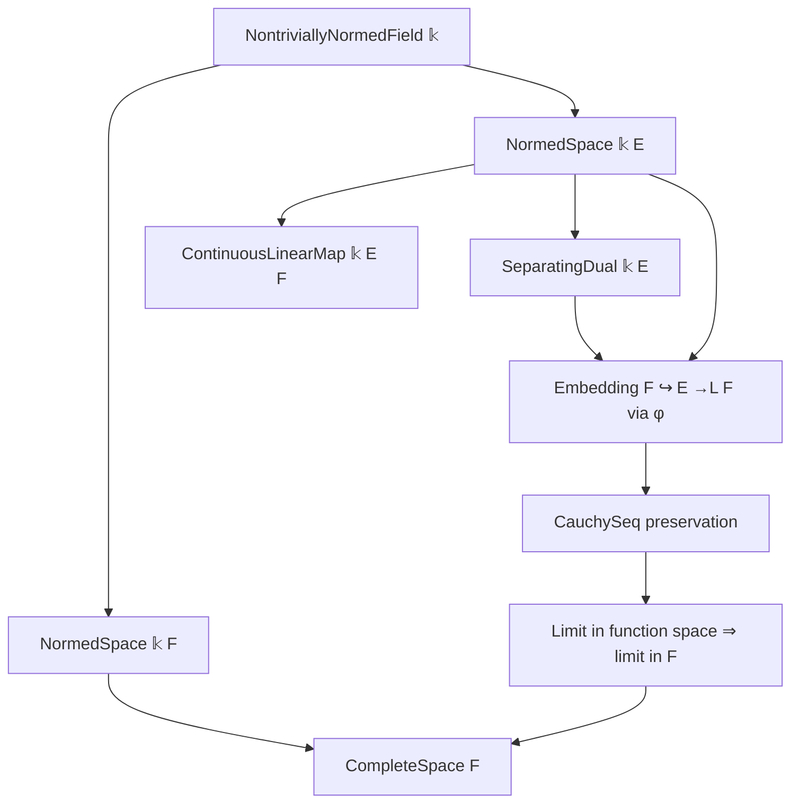
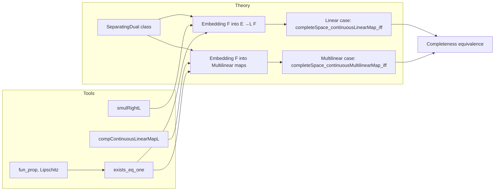

### Technical Brief: `CompleteCodomain.lean`

---

#### **1. Key Definitions & Theorems**

| Name | Type / Signature | Purpose |
|------|------------------|---------|
| `SeparatingDual` | Class | Asserts that the strong dual of a normed space separates points (i.e., for any $x \ne 0$, there exists a continuous linear functional $\varphi$ with $\varphi(x) \ne 0$). |
| `completeSpace_of_completeSpace_continuousLinearMap` | `[CompleteSpace (E →L[𝕜] F)] → CompleteSpace F` | Shows that if the space of continuous linear maps $E \to F$ is complete and $E$ is nontrivial with separating dual, then $F$ must be complete. |
| `completeSpace_continuousLinearMap_iff` | `CompleteSpace (E →L[𝕜] F) ↔ CompleteSpace F` | Equivalence: completeness of $E \to_L F$ iff completeness of $F$, under assumptions. |
| `completeSpace_of_completeSpace_continuousMultilinearMap` | `[CompleteSpace (ContinuousMultilinearMap 𝕜 M F)] → CompleteSpace F` | Multilinear analogue: if continuous multilinear maps from $\prod_i M_i$ to $F$ are complete and each $M_i$ has a nonzero element, then $F$ is complete. |
| `completeSpace_continuousMultilinearMap_iff` | `CompleteSpace (ContinuousMultilinearMap 𝕜 M F) ↔ CompleteSpace F` | Equivalence for multilinear maps, assuming each factor has a nonzero element. |
| `smulRightL` | `φ : E →L[𝕜] F`, `r : 𝕜` ↦ `λ x, φ x • r` | Right scalar multiplication on continuous linear maps (used to embed $F$ into $E \to_L F$ via a functional). |
| `compContinuousLinearMapL` | Precomposition with a continuous linear map on the domain of a multilinear map. |
| `mkPiAlgebra` | Constructs the canonical multilinear map from a family of linear maps (here, the constant family $i \mapsto (λ x, x)$). |

---

#### **2. Naming Conventions**

- **Prefixes**:
  - `completeSpace_`: Indicates theorems about completeness of function spaces.
  - `smulRightL`: “Scalar multiplication on the right” for linear maps (`L` = linear).
  - `compContinuousLinearMapL`: Composition on the left with a continuous linear map (`L` = linear/multilinear).
  - `mkPiAlgebra`: “Product algebra” construction for multilinear maps.

- **Suffixes**:
  - `_iff`: Biconditional equivalence.
  - `_of_`: One direction of an implication (e.g., completeness of function space implies completeness of codomain).

- **Variables**:
  - `𝕜`: The base nontrivially normed field.
  - `E`, `F`, `M i`: Normed spaces over `𝕜`.
  - `φ`, `v`, `m i`: Elements used to “test” nontriviality and separation.

---

#### **3. Tactic Stack**

- **Core tactics**:
  - `refine`, `obtain`, `choose`, `cases`, `simpa`
- **Analysis-specific**:
  - `Metric.complete_of_cauchySeq_tendsto`: Standard completeness criterion via Cauchy sequences.
  - `cauchy_iff_exists_le_nhds`: Converts Cauchy sequence to convergence.
  - `fun_prop`: Propagates continuity goals.
  - `tendsto.comp`: Composes convergence statements.
- **Algebraic/Linear algebra**:
  - `inferInstance`: Automatically fills class instances (e.g., `CompleteSpace F`).
  - `lipschitz`: Used to lift Lipschitz continuity to Cauchy-sequence preservation.

---

#### **4. Proof Logic**

- **General strategy**:
  1. Use `Metric.complete_of_cauchySeq_tendsto` to reduce to constructing a limit for an arbitrary Cauchy sequence in $F$.
  2. Embed $F$ into the function space via evaluation at a carefully chosen point (e.g., $v \ne 0$ in $E$, or $m(i) \ne 0$ in $M_i$).
  3. Use the separating dual to pick a functional $\varphi$ with $\varphi(v) = 1$ (or $\varphi_i(m(i)) = 1$).
  4. Construct a sequence in the function space (linear or multilinear maps) using `smulRightL` or `compContinuousLinearMapL`.
  5. Show this sequence is Cauchy (via Lipschitz continuity of the embedding maps).
  6. Use completeness of the function space to get a limit $a$.
  7. Show that $a(v)$ (or $a(m)$) is the desired limit in $F$.

- **Induction / recursion**: None — proofs are direct and constructive, relying on functional-analytic embeddings.

---

#### **5. Imports & Dependencies**

| Module | Role |
|--------|------|
| `Mathlib.Algebra.Central.Defs` | Central algebraic infrastructure (e.g., scalar multiplication). |
| `Mathlib.Analysis.LocallyConvex.SeparatingDual` | Defines `SeparatingDual` class and basic properties. |
| `Mathlib.Analysis.Normed.Module.Multilinear.Basic` | Multilinear maps, continuity, and basic operations (`smulRightL`, `compContinuousLinearMapL`, `mkPiAlgebra`). |
| `Mathlib.LinearAlgebra.Dual.Lemmas` | Dual space lemmas, especially `exists_eq_one` (separating dual ⇒ existence of functional with value 1 at nonzero vector). |

---

#### **6. Mermaid Diagrams**

##### **Dependency Graph (Theoretical)**

##### **Overview of File Structure**

---

#### **7. Summary**

This file establishes a fundamental equivalence: **completeness of the codomain $F$ is equivalent to completeness of spaces of continuous linear or multilinear maps into $F$**, provided the domain(s) are nontrivial and have separating duals. The proofs rely on embedding $F$ into these function spaces using functionals from the dual (or product constructions), and then pulling limits back via evaluation. The structure is highly uniform across linear and multilinear cases, showcasing Lean’s ability to abstract over shared patterns in functional analysis.
