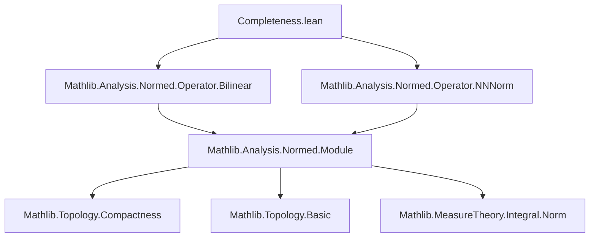
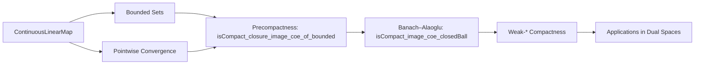
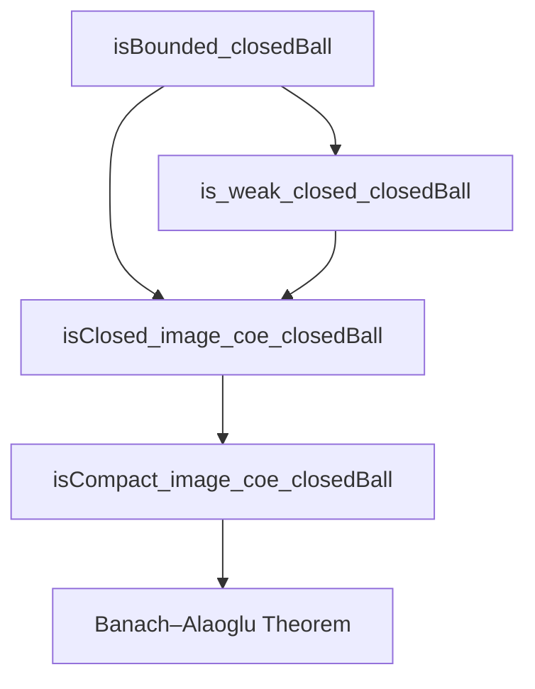

### Technical Brief: Completeness.lean

---

#### **1. Key Definitions & Theorems**

| Name | Type / Signature | Purpose |
|------|------------------|---------|
| `ofMemClosureImageCoeBounded` | `f : E' → F → {s : Set (E' →SL[σ₁₂] F)} → IsBounded s → f ∈ closure (coerce '' s) → E' →SL[σ₁₂] F` | Constructs a bounded continuous (semi)linear map from a function lying in the closure of a bounded set of such maps. |
| `ofTendstoOfBoundedRange` | `{α l} [l.NeBot] → f : E' → F → g : α → E' →SL[σ₁₂] F → Tendsto (a,x ↦ g a x) l (𝓝 f) → IsBounded (range g) → E' →SL[σ₁₂] F` | Shows that a pointwise limit of a bounded net of continuous (semi)linear maps is itself continuous (semi)linear. |
| `tendsto_of_tendsto_pointwise_of_cauchySeq` | `{f : ℕ → E' →SL[σ₁₂] F} {g} → Tendsto (n,x ↦ f n x) atTop (𝓝 g) → CauchySeq f → Tendsto f atTop (𝓝 g)` | If a Cauchy sequence of operators converges pointwise to `g`, then it converges in operator norm — key step toward completeness of `E →SL[σ₁₂] F`. |
| `isCompact_closure_image_coe_of_bounded` | `{s : Set (E' →SL[σ₁₂] F)} → IsBounded s → ProperSpace F → IsCompact (closure (coerce '' s))` | Bounded sets of operators are precompact in the topology of pointwise convergence (Tychonoff-style). |
| `isCompact_image_coe_of_bounded_of_closed_image` | `{s : Set (E' →SL[σ₁₂] F)} → IsBounded s → IsClosed (coerce '' s) → IsCompact (coerce '' s)` | Closed bounded sets of operators are compact in pointwise topology. |
| `isClosed_image_coe_of_bounded_of_weak_closed` | `{s : Set (E' →SL[σ₁₂] F)} → IsBounded s → (∀ f, f ∈ closure (coerce '' s) → f ∈ s) → IsClosed (coerce '' s)` | Characterizes weak-* closed bounded sets via closure condition. |
| `isCompact_image_coe_of_bounded_of_weak_closed` | Same as above + `ProperSpace F` → compactness. | Weak-* compactness criterion for bounded sets. |
| `is_weak_closed_closedBall` | `f₀ : E' →SL[σ₁₂] F → r : ℝ → (⇑f ∈ closure (coerce '' closedBall f₀ r)) → f ∈ closedBall f₀ r` | Closed balls are weak-* closed — crucial for Banach–Alaoglu. |
| `isClosed_image_coe_closedBall` | `f₀ : E →SL[σ₁₂] F → r : ℝ → IsClosed (coerce '' closedBall f₀ r)` | Closed balls in operator space are closed in pointwise topology. |
| `isCompact_image_coe_closedBall` | `[ProperSpace F] → f₀ : E →SL[σ₁₂] F → r : ℝ → IsCompact (coerce '' closedBall f₀ r)` | **Banach–Alaoglu theorem**: closed unit ball in dual is weak-* compact. |

---

#### **2. Naming Conventions**

- **Prefixes**:
  - `of*`: Construction lemmas (e.g., `ofMemClosureImageCoeBounded`, `ofTendstoOfBoundedRange`)
  - `is*`: Properties of sets/maps (e.g., `isCompact_`, `isClosed_`, `is_weak_closed_`)
  - `tendsto_*`: Convergence-related results
- **Suffixes**:
  - `_of_*`: Conditions or assumptions (e.g., `closed_of_weak_closed`, `bounded_of_closed_image`)
  - `_image_coe_*`: Statements about coercion to underlying functions (`E →SL[σ] F → E → F`)
- **Variables**:
  - `σ₁₂`, `σ`: Ring homomorphisms for semilinearity
  - `f, g`: Operators (`E →SL[σ] F`)
  - `s`: Sets of operators
  - `hb`, `hc`: Hypotheses for boundedness/closedness

---

#### **3. Tactic Stack**

Frequent tactics used in proofs:
- `rcases`, `rintro`, `exact`, `refine`: For destructuring and constructing proofs
- `simp_rw`, `simp`: Simplification using definitional equalities and lemmas
- `closure_mono`, `closure_subset_iff`, `mem_closure_of_tendsto`: Closure-related reasoning
- `tendsto_iff_norm_sub_tendsto_zero`, `squeeze_zero`: Operator norm convergence arguments
- `le_of_tendsto`, `eventually_atTop`, `tendsto_pi_nhds`: Filter-based convergence
- `isClosed_Iic.preimage`, `continuous_apply`, `continuous_const`, `norm`: Topological properties of norm
- `opNorm_le_bound`, `le_of_opNorm_le`: Operator norm inequalities
- `image_subset_iff`, `mem_image_of_mem`: Set-theoretic image manipulations

---

#### **4. Proof Logic**

The logical flow across most proofs follows this pattern:

1. **Reduction to boundedness & closure**: Show that a candidate map lies in the closure of a bounded set of operators.
2. **Use of `ofMemClosureImageCoeBounded`**: Construct the operator as a continuous linear map.
3. **Operator norm control**: Derive uniform bounds using `opNorm_le_bound` and closure arguments.
4. **Convergence arguments**:
   - For `tendsto_of_tendsto_pointwise_of_cauchySeq`: Use Cauchy condition + pointwise convergence to get norm convergence.
   - For compactness: Use Tychonoff-style diagonalization (`isCompact_pi_infinite`) + closure arguments.
5. **Weak-* topology handling**: Use equivalent closure-based characterizations (`isClosed_induced_iff'`), since no explicit weak-* topology is defined.

Induction is not used; instead, the proofs rely heavily on:
- Filter convergence (`tendsto`, `cauchySeq`)
- Topological closure properties
- Boundedness criteria (`isBounded_iff_forall_norm_le`)
- Norm inequalities (`opNorm_le_bound`, `le_of_opNorm_le`)

---

#### **5. Imports**

- `Mathlib.Analysis.Normed.Operator.Bilinear`: Bilinear maps and their norms
- `Mathlib.Analysis.Normed.Operator.NNNorm`: Non-negative extended normed space machinery

These imports provide foundational tools for:
- Continuous (semi)linear maps (`→SL[σ]`)
- Operator norm (`‖f‖`)
- Bounded sets in normed spaces
- Topology of pointwise convergence (`𝓝`, `tendsto`, `pi_nhds`)

---

#### **6. Mermaid Diagrams**

##### **Dependency Graph (Module-Level)**

##### **Overview of Theory Flow**

##### **Proof Structure for Banach–Alaoglu**

---

#### **7. Summary**

This file establishes foundational completeness and compactness results for spaces of continuous (semi)linear maps between normed spaces, especially over nontrivially normed fields. It culminates in a version of the **Banach–Alaoglu theorem**, showing that closed balls in `E →SL[σ] F` are compact in the topology of pointwise convergence (i.e., weak-* topology), assuming the codomain `F` is proper (i.e., closed balls are compact).

The key insight is to treat `E →SL[σ] F` as a subspace of `E → F` with the product topology, and use boundedness + closure conditions to lift compactness from Tychonoff’s theorem.

This is foundational for functional analysis in `mathlib`, especially for duality theory and weak-* topologies (see also `Analysis.Normed.Module.WeakDual`).
