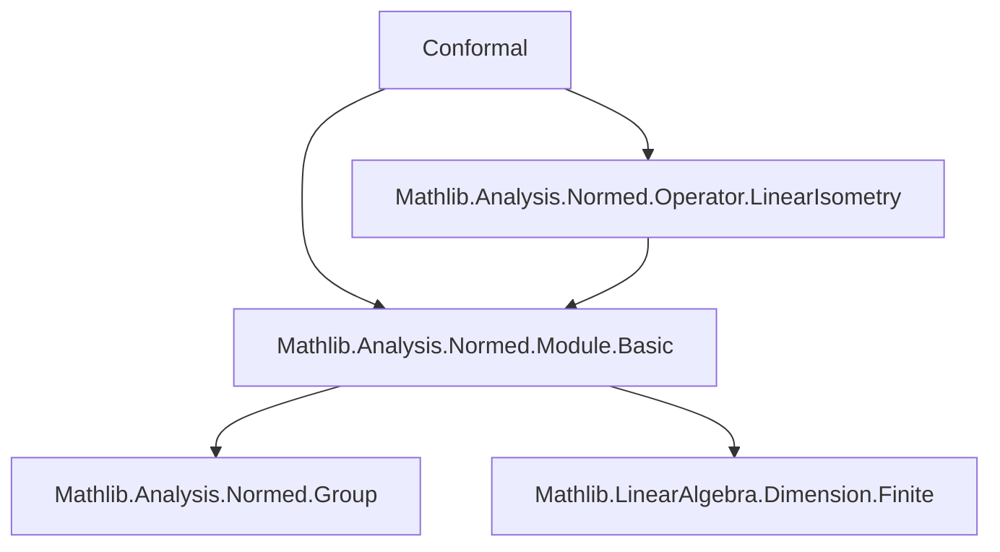

**Technical Brief: `Conformal.lean` Module**

---

### 1. **Key Definitions & Theorems**

| Name | Type / Signature | Purpose |
|------|------------------|---------|
| `IsConformalMap` | `f' : X →L[R] Y → Prop` | Defines a continuous linear map as *conformal* if it is a nonzero scalar multiple of a linear isometry. Formally: $\exists c \ne 0,\ \exists \ell i : X \to_{\ell i} Y,\ f' = c \cdot \ell i$. |
| `isConformalMap_id` | `IsConformalMap (.id R M)` | Identity map is conformal (with scalar $1$). |
| `IsConformalMap.smul` | `IsConformalMap f → c ≠ 0 → IsConformalMap (c • f)` | Scaling a conformal map by a nonzero scalar preserves conformality. |
| `isConformalMap_const_smul` | `c ≠ 0 → IsConformalMap (c • .id R M)` | Multiplication-by-nonzero-constant map is conformal. |
| `LinearIsometry.isConformalMap` | `f' : M →ₗᵢ[R] N → IsConformalMap f'.toContinuousLinearMap` | Every linear isometry is conformal (scalar $1$). |
| `isConformalMap_of_subsingleton` | `[Subsingleton M] → f' : M →L[R] N → IsConformalMap f'` | In singleton domain, all continuous linear maps are conformal. |
| `IsConformalMap.comp` | `IsConformalMap g → IsConformalMap f → IsConformalMap (g.comp f)` | Composition of conformal maps is conformal. |
| `IsConformalMap.injective` | `IsConformalMap f → Function.Injective f` | Conformal maps are injective. |
| `IsConformalMap.ne_zero` | `[Nontrivial M'] → IsConformalMap f' → f' ≠ 0` | Nontrivial domain + conformality ⇒ nonzero map. |

---

### 2. **Naming Conventions**

- **Prefixes**:
  - `isConformalMap_`: for theorems establishing `IsConformalMap` for specific constructions (`id`, `const_smul`, `of_subsingleton`).
  - `IsConformalMap.`: for instance methods/lemmas about the class (e.g., `injective`, `comp`, `ne_zero`).
- **Suffixes**:
  - None prominent; suffixes are mostly implicit in `isConformalMap_*` pattern.
- **Variable naming**:
  - `f`, `g`: generic continuous linear maps.
  - `c`, `c'`: scalars; `c ≠ 0` is a recurring hypothesis.
  - `li`, `lif`, `lig`: linear isometries.
  - `R`, `X`, `Y`, `M`, `N`, `G`, `M'`: type variables for normed spaces over a normed field $R$.

---

### 3. **Tactic Stack**

- `rcases`: destruct existential quantifiers in definitions (`hf : ∃ c ≠ 0, ∃ li, ...`).
- `simp`: simplify goals involving identity, zero, scalar multiplication, and subsingleton elimination.
- `rw`: rewrite using algebraic identities (`smul_comp`, `comp_smul`, `mul_smul`, `one_smul`, etc.).
- `rfl`: reflexivity for definitional equalities.
- `exact`: supply immediate proofs (e.g., `⟨1, one_ne_zero, id, by simp⟩`).
- `by simp [Subsingleton.elim x 0]`: handle trivial cases via subsingleton properties.
- `mul_ne_zero`: used to prove nonzero scalar products.

No heavy automation (e.g., `aesop`, `ring`, `linarith`) is used—proofs are mostly direct algebraic manipulations.

---

### 4. **Proof Logic**

- **Structure**: Most proofs follow a *constructive existential pattern*:
  1. Unpack the hypothesis `IsConformalMap f` as `⟨c, hc, li, hf_eq⟩`.
  2. Construct a new witness `⟨c_new, hc_new, li_new, proof⟩`.
  3. Use algebraic properties (e.g., `smul_comp`, `comp_smul`, `mul_smul`) to verify equality.
- **Induction**: Not used—no inductive types involved.
- **Case analysis**: Only on equality hypotheses (e.g., `rfl`) or subsingleton properties.
- **Key reasoning**:
  - Scalar multiplication interacts with composition via `smul_comp` and `comp_smul`.
  - Injectivity of conformal maps follows from injectivity of linear isometries and nonzero scalar multiplication.
  - Subsingleton case collapses all maps to zero, yet still satisfies the definition via trivial equality.

---

### 5. **Imports**

- `Mathlib.Analysis.Normed.Module.Basic`: foundational normed module theory.
- `Mathlib.Analysis.Normed.Operator.LinearIsometry`: linear isometries and their continuous versions.

These imports define:
- `NormedField`, `SeminormedAddCommGroup`, `NormedSpace`.
- `ContinuousLinearMap` (`→L[R]`), `LinearIsometry` (`→ₗᵢ[R]`), and their operations (`smul`, `comp`, `toContinuousLinearMap`).

---

### 6. **Mermaid Diagrams**

#### **Dependency Graph (Module Level)**



#### **Overview of Theoretical Flow**

```mermaid
flowchart LR
  A[Continuous Linear Maps X →L Y] --> B[IsConformalMap f']
  B -->|def| C[∃ c ≠ 0, li, f' = c • li]
  C --> D[LinearIsometry → Conformal]
  C --> E[Scalar mult by c ≠ 0 preserves conformality]
  C --> F[Composition closed]
  C --> G[Injective & nonzero (if domain nontrivial)]
  C --> H[All maps conformal if domain subsingleton]
  D & E & F & G & H --> I[Conformal Maps Form a Submonoid? (Not stated here)]
```

> **Note**: The file sets up the *basic algebraic and topological closure properties* of conformal maps. The inner-product characterization (`isConformalMap_iff`) is deferred to `Analysis.InnerProductSpace.ConformalLinearMap`, indicating modular separation of structure (normed vs. inner product).

--- 

Let me know if you'd like the corresponding Lean code annotated with proof sketches or a formalization roadmap for extending this module.
