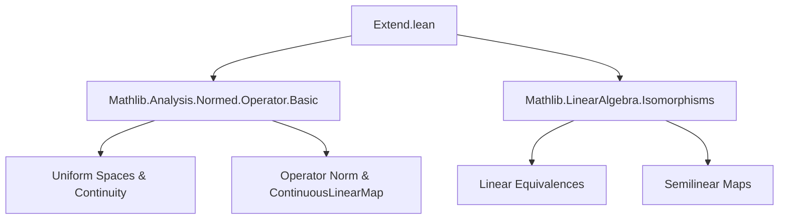

### Technical Brief: Extension of Continuous Linear Maps on Banach Spaces (Lean 4)

---

#### **1. Key Definitions & Theorems**

| Name | Type / Signature | Purpose |
|------|------------------|---------|
| `extend` | `Eₗ →SL[σ₁₂] F` | Extends a continuous linear map `f : E →SL[σ₁₂] F` along a uniform dense embedding `e : E →L[𝕜] Eₗ`, assuming `e` is uniformly inducing and dense. |
| `extend_eq` | `extend f e (e x) = f x` | Shows that the extension agrees with `f` on the image of `e`. |
| `extend_unique` | `extend f e = g` if `g ∘ e = f` | Uniqueness of the extension under the same conditions. |
| `opNorm_extend_le` | `‖f.extend e‖ ≤ N * ‖f‖` | Bounds the operator norm of the extension in terms of a norm-expansion constant `N`. |
| `compLeftInverse` | `range g →SL[σ₁₂] F` | Constructs a continuous linear map from `range g` using a boundedness condition `‖f x‖ ≤ C * ‖g x‖`. |
| `extendOfNorm` | `Eₗ →SL[σ₁₂] F` | Extends a *linear* (not necessarily continuous) map `f : E →ₛₗ[σ₁₂] F` to a *continuous* linear map, using a dense `e : E →ₗ[𝕜] Eₗ` and a norm bound `‖f x‖ ≤ C * ‖e x‖`. |
| `extendOfNorm_eq` | `f.extendOfNorm e (e x) = f x` | Agreement of `extendOfNorm` with `f` on the dense subspace. |
| `norm_extendOfNorm_apply_le` | `‖f.extendOfNorm e x‖ ≤ C * ‖x‖` | Norm bound for the extension. |
| `extendOfNorm_unique` | `extendOfNorm f e = g` if `g ∘ e = f` and `g` satisfies the same norm bound. |
| `opNorm_extendOfNorm_le` | `‖f.extendOfNorm e‖ ≤ C` | Operator norm bound for `extendOfNorm`. |
| `extend` (for `LinearEquiv`) | `Eₗ ≃SL[σ₁₂] Fₗ` | Extends a semilinear equivalence `f : E ≃ₛₗ[σ₁₂] F` to a continuous linear equivalence, using dense embeddings `e₁, e₂` and mutual norm bounds. |
| `extendOfIsometry` | `Eₗ ≃ₛₗᵢ[σ₁₂] Fₗ` | Extends a semilinear isometry equivalence `f : E ≃ₛₗ[σ₁₂] F` to a *linear isometry equivalence* between Banach completions, assuming `‖e₂ (f x)‖ = ‖e₁ x‖`. |

---

#### **2. Naming Conventions**

- **Prefixes**:
  - `extend`: core extension operation.
  - `extendOfNorm`: extension using a *norm bound* (not assuming continuity of original map).
  - `compLeftInverse`: intermediate construction for bounded linear maps on ranges.
  - `extendOfIsometry`: extension preserving *isometric structure*.

- **Suffixes**:
  - `_eq`: agreement on dense subspace.
  - `_unique`: uniqueness of extension.
  - `_le`: norm/operator norm bound.
  - `_apply`: evaluation formula.

- **Other patterns**:
  - `h_dense`, `h_norm`, `h_e`: hypotheses for density, norm bounds, uniform inducing.
  - `⟨C, h_norm⟩`: packaging a constant and its bound.

---

#### **3. Tactic Stack**

| Tactic | Usage Frequency | Purpose |
|--------|-----------------|---------|
| `simp` / `simp only` | Very High | Simplify goals using definitional equalities, especially for `coe_mk'`, `LinearMap.coe_mk`, etc. |
| `exact` / `refine` | High | Construct proofs using lemmas like `extend_eq`, `isClosed_eq`, `uniform_extend_unique`. |
| `induction` / `induction_on` | High | Use density to reduce to dense subspace (e.g., `h_dense.induction_on`). |
| `fun_prop` | Medium | Prove continuity/ measurability of constructions (e.g., `continuous_id`, `continuous_add`). |
| `ring` / `rw` | Medium | Handle algebraic manipulations (e.g., `mul_comm`, `mul_assoc`). |
| `convert` | Medium | Match goals up to definitional equality (e.g., `extendOfNorm_eq`). |
| `aesop` | Low | Not used in this file. |
| `cases` | Medium | Case analysis on `le_total 0 N`, `h_norm`, etc. |

---

#### **4. Proof Logic**

The logical flow across most theorems follows this pattern:

1. **Assumptions**:  
   - `e : E →ₗ[𝕜] Eₗ` is linear, dense (`DenseRange e`), and often uniformly inducing or an isometric embedding.
   - `F` (or `Fₗ`) is complete (Banach).
   - A norm bound or uniform condition (e.g., `‖f x‖ ≤ C * ‖e x‖` or `‖e₂ (f x)‖ ≤ C * ‖e₁ x‖`).

2. **Construction**:  
   - Use `extend` (via `uniformly_extend`) or `extendOfNorm` (via `compLeftInverse` + `extend`) to define the extension.

3. **Verification**:  
   - **Agreement on dense subspace**: `extend_eq`, `extendOfNorm_eq`.
   - **Uniqueness**: `extend_unique`, `extendOfNorm_unique` — often via density + continuity.
   - **Norm bounds**: `opNorm_extend_le`, `norm_extendOfNorm_apply_le`, `norm_extend_le`.
   - **Equivalence properties** (for `LinearEquiv.extend`):  
     - `left_inv`, `right_inv` via density + `simp`.
     - `continuous_invFun` via `ContinuousLinearMap.continuous_`.

4. **Isometric case**:  
   - Use equality of norms (`h_norm : ‖e₂ (f x)‖ = ‖e₁ x‖`) to get `‖f.extendOfIsometry x‖ = ‖x‖`, via density and closedness of equality.

---

#### **5. Imports & Dependencies**

| Module | Role |
|--------|------|
| `Mathlib.Analysis.Normed.Operator.Basic` | Provides `→SL[σ₁₂]`, operator norm, continuity, uniform continuity, `uniformly_extend`, `opNorm`. |
| `Mathlib.LinearAlgebra.Isomorphisms` | Provides `LinearEquiv`, `≃ₛₗ[σ₁₂]`, `≃ₗᵢ[𝕜]`, etc. |
| `Classical` (scoped) | Used for ` Classical.choice` in `if ... then ... else`. |
| `NNReal` (scoped) | For nonnegative reals in norm bounds. |

---

#### **6. Theory Overview & Dependency Diagram**

##### **High-Level Theory Flow**

```
Dense Subspace E ──f──► Complete Space F
        │e
        ▼
     Banach Completion Eₗ

→ Extend f along e to Eₗ → F
```

Two main extension strategies:
1. **Uniform/dense embedding** (`extend`): requires `e` uniformly inducing + dense.
2. **Norm-bounded linear map** (`extendOfNorm`): only needs dense `e` + `‖f x‖ ≤ C * ‖e x‖`.

Then lifted to equivalences:
- `LinearEquiv.extend`: mutual norm bounds for `f` and `f.symm`.
- `LinearEquiv.extendOfIsometry`: equality of norms → isometry.

##### **Mermaid Diagrams**

**Dependency Graph (Module-Level)**



**Data Flow (Extension Construction)**

```mermaid
flowchart LR
  subgraph Input
    E[Dense embedding e : E → Eₗ]
    f[Map f : E → F]
    h[Assumptions: dense, bounded, etc.]
  end

  subgraph Construction
    CL[ContinuousLinearMap.extend]
    LN[LinearMap.extendOfNorm]
    LE[LinearEquiv.extend]
    LI[LinearEquiv.extendOfIsometry]
  end

  subgraph Output
    EₗF[Eₗ →SL[σ₁₂] F]
    LEq[Eₗ ≃SL[σ₁₂] Fₗ]
    LIso[Eₗ ≃ₛₗᵢ[σ₁₂] Fₗ]
  end

  E --> CL
  f --> CL
  h --> CL

  E --> LN
  f --> LN
  h --> LN

  E --> LE
  f --> LE
  h --> LE

  E --> LI
  f --> LI
  h --> LI

  CL --> EₗF
  LN --> EₗF
  LE --> LEq
  LI --> LIso
```

---

#### **7. Summary**

This file formalizes foundational extension theorems for continuous linear maps and equivalences between normed spaces and their Banach completions. It distinguishes between:
- **Uniform-theoretic extension** (requires uniform inducing + density),
- **Norm-estimate-based extension** (weaker, only needs boundedness),
- **Isometric extension** (preserves norms exactly).

The proofs rely heavily on density arguments, continuity, and closedness of equality sets. The naming and structure follow Lean’s `Mathlib` conventions, with clear separation of concerns across `ContinuousLinearMap`, `LinearMap`, and `LinearEquiv` namespaces.

--- 

Let me know if you'd like a formalized dependency graph (e.g., `.lean`-level imports) or a proof automation sketch.
