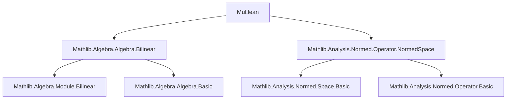
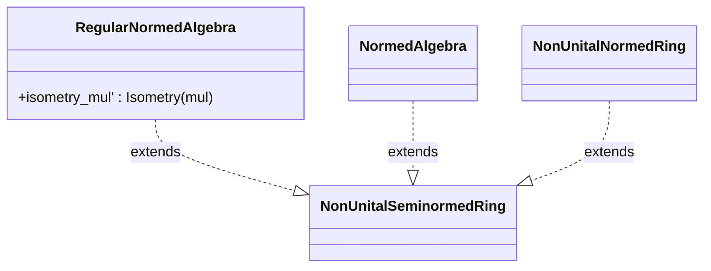

### Technical Brief: `Mul.lean` — Operator Norms in Normed Algebras

---

#### **1. Key Definitions & Theorems**

| Name | Type / Signature | Purpose |
|------|------------------|---------|
| `mul` | `R →L[𝕜] R →L[𝕜] R` | Continuous bilinear multiplication map in a non-unital normed algebra `R`. |
| `mul_apply'` | `mul 𝕜 R x y = x * y` | Confirms that `mul` recovers the algebra multiplication. |
| `opNorm_mul_apply_le` | `‖mul 𝕜 R x‖ ≤ ‖x‖` | Bounds operator norm of left-multiplication by element norm. |
| `opNorm_mul_le` | `‖mul 𝕜 R‖ ≤ 1` | Global bound on the operator norm of the bilinear `mul`. |
| `NonUnitalAlgHom.Lmul` | `R →ₙₐ[𝕜] R →L[𝕜] R` | Left regular representation as a *continuous* non-unital algebra homomorphism. |
| `mulLeftRight` | `R →L[𝕜] R →L[𝕜] R →L[𝕜] R` | Continuous trilinear map implementing `x, y, z ↦ x * z * y`. |
| `opNorm_mulLeftRight_apply_apply_le` | `‖mulLeftRight 𝕜 R x y‖ ≤ ‖x‖ * ‖y‖` | Operator norm bound for simultaneous left/right multiplication. |
| `RegularNormedAlgebra` | `Prop` | Class asserting `mul` is an *isometry* (i.e., `‖mul x‖ = ‖x‖`). |
| `isometry_mul'` | `Isometry (mul 𝕜 R)` | Axiom of `RegularNormedAlgebra`. |
| `opNorm_mul_apply` *(under `RegularNormedAlgebra`)* | `‖mul 𝕜 R x‖ = ‖x‖` | Equality version of operator norm for regular algebras. |
| `mulₗᵢ` | `R →ₗᵢ[𝕜] R →L[𝕜] R` | Linear isometry version of `mul`. |
| `lsmul` | `R →L[𝕜] E →L[𝕜] E` | Continuous bilinear scalar multiplication in a normed algebra acting on a module. |
| `opNorm_lsmul_apply_le` | `‖lsmul x‖ ≤ ‖x‖` | Operator norm bound for scalar multiplication. |
| `opNorm_lsmul` *(in normed case)* | `‖lsmul‖ = 1` | Exact norm of `lsmul` in nontrivial settings. |
| `ring_lmap_equiv_self` | `(𝕜 →L[𝕜] E) ≃ₗᵢ[𝕜] E` | Linear isometric equivalence between continuous linear maps `𝕜 → E` and `E`. |

---

#### **2. Naming Conventions**

- **Prefixes**:
  - `opNorm_`: operator norm bounds or equalities.
  - `mul`, `lsmul`, `mulLeftRight`: core operations (multiplication, left scalar multiplication, double multiplication).
  - `coe_`: coercion lemmas (e.g., `coe_Lmul`, `coe_mulₗᵢ`).
  - `isometry_`: properties of isometric embeddings.
- **Suffixes**:
  - `_apply`: action on arguments (e.g., `mul_apply'`, `lsmul_apply`).
  - `_le`, `_eq`: inequality/equality statements.
  - `_inj`, `_flip`: structural properties (injectivity, flip symmetry).
- **Class/Instance**:
  - `RegularNormedAlgebra`, `NonUnitalSeminormedRing`, `NormedAlgebra`, etc.

---

#### **3. Tactic Stack**

Frequent tactics used in proofs:

| Tactic | Usage |
|--------|-------|
| `simp` / `simp only` | Simplifying applications, coercions, and known equalities. |
| `rw` / `simp_rw` | Rewriting using lemmas like `mul_comm`, `one_mul`, `norm_smul`. |
| `exact`, `refine`, `convert` | Constructing proofs with minimal backtracking. |
| `le_antisymm` | Proving equalities by bounding both sides. |
| `opNorm_le_bound`, `opNorm_le_bound'` | Standard tool for bounding operator norms. |
| `ext` | Extensionality for functions/maps (e.g., proving maps equal by pointwise equality). |
| `norm_smul_le`, `norm_mul_le` | Core inequalities from normed algebra axioms. |
| `simpa using` | Simplifying a goal using a hypothesis. |
| `ring` / `abel` | Not used here (algebraic simplifications handled via `simp`). |
| `aesop` | Not present — proofs are mostly manual and tactic-scripted. |

---

#### **4. Proof Logic**

- **Structure**: Inductive-style but *not* by natural-number induction. Instead:
  1. **Case analysis** on algebraic structure (non-unital vs. unital, seminormed vs. normed).
  2. **Bounding operator norms** via `opNorm_le_bound` and `norm_*_le` axioms.
  3. **Equality proofs** via `le_antisymm` when regularity or `‖1‖ = 1` gives matching lower/upper bounds.
  4. **Use of continuity**: All maps are *continuous* linear maps (`→L[𝕜]`), so `mkContinuous₂` is used to upgrade algebraic maps.
  5. **Flipping & composition**: Trilinear maps like `mulLeftRight` are built via `comp`, `flip`, and `mul` composition.
  6. **Equivalence constructions**: `ring_lmap_equiv_self` uses explicit inverse and checks norm preservation.

**Typical proof pattern**:
```lean
apply opNorm_le_bound _ (norm_nonneg _) fun x => ?
-- Goal: ‖f x‖ ≤ C * ‖x‖
-- Use norm axioms (e.g., `norm_mul_le`, `norm_smul_le`) to bound.
```

---

#### **5. Imports & Dependencies**

| Import | Role |
|--------|------|
| `Mathlib.Algebra.Algebra.Bilinear` | Provides `LinearMap.mul`, bilinear maps, and `mkContinuous₂`. |
| `Mathlib.Analysis.Normed.Operator.NormedSpace` | Operator norm machinery, `→L[𝕜]`, continuity, boundedness. |
| `Metric`, `NNReal`, `Topology`, `Uniformity` | For metric/topological notions (norms, continuity, uniform structure). |
| `NontriviallyNormedField`, `SeminormedAddCommGroup`, `NormedSpace` | Core analytic/algebraic typeclass assumptions. |
| `NonUnitalSeminormedRing`, `IsScalarTower`, `SMulCommClass` | Algebraic coherence conditions for multiplication and scalar action. |

---

#### **6. Mermaid Diagrams**

##### **Dependency Graph (Module-Level)**



##### **Overview of Theory Flow**

```mermaid
flowchart LR
  A[NontriviallyNormedField 𝕜] --> B[Seminormed/Normed Space E]
  B --> C[Normed Algebra R over 𝕜]
  C --> D[Continuous Bilinear Maps]
  D --> E[mul : R →L[𝕜] R →L[𝕜] R]
  D --> F[lsmul : R →L[𝕜] E →L[𝕜] E]
  E --> G[Operator Norm Bounds]
  G --> H[RegularNormedAlgebra Class]
  H --> I[Isometry & Equality opNorm]
  I --> J[mulₗᵢ : R →ₗᵢ[𝕜] R →L[𝕜] R]
  F --> K[Isometric Equivalence ring_lmap_equiv_self]
```

##### **Class Hierarchy (Relevant Part)**



---

#### **7. Summary**

This file formalizes foundational analysis of multiplication and scalar multiplication in normed algebras, focusing on **operator norm behavior**. It distinguishes between:

- **Non-unital** and **unital** settings,
- **Seminormed** and **Normed** (i.e., Hausdorff) cases,
- **Bounded** vs. **isometric** representations.

Key innovations:
- Introduces `RegularNormedAlgebra`, a class capturing when the left regular representation preserves norms (e.g., C*-algebras, unital algebras with `‖1‖ = 1`).
- Constructs `mulₗᵢ`, a *linear isometry* version of multiplication.
- Proves exact operator norms (`= 1`) under nontriviality assumptions.

The file is a cornerstone for later developments in functional analysis (e.g., unitization, C*-algebras, group algebras like `L¹`).
