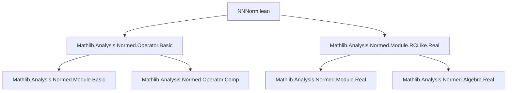
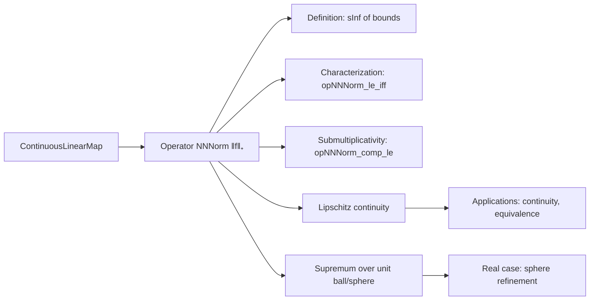
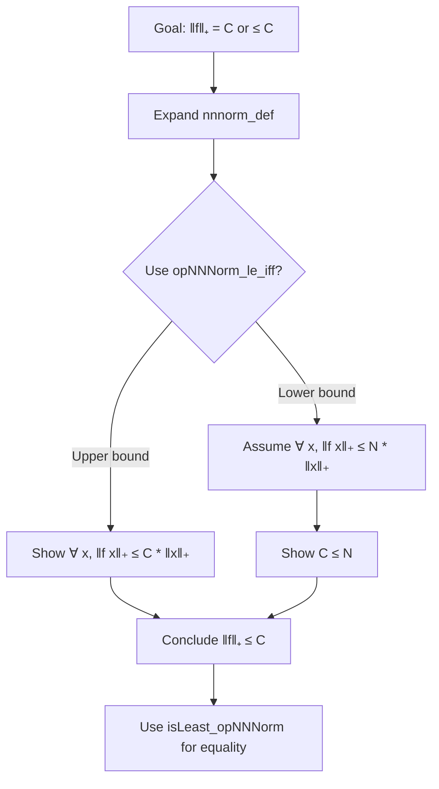

### Technical Brief: `NNNorm.lean`

---

#### **1. Key Definitions & Theorems**

| Name | Type / Signature | Purpose |
|------|------------------|---------|
| `nnnorm_def` | `∀ f : E →SL[σ₁₂] F, ‖f‖₊ = sInf { c | ∀ x, ‖f x‖₊ ≤ c * ‖x‖₊ }` | Defines the **non-negative extended norm** (`NNNorm`) of a continuous linear map as the infimum of bounding constants. |
| `opNNNorm_le_bound` | `∀ f M, (∀ x, ‖f x‖₊ ≤ M * ‖x‖₊) → ‖f‖₊ ≤ M` | Upper bound principle: if `M` bounds `‖f x‖₊` uniformly, then `‖f‖₊ ≤ M`. |
| `opNNNorm_le_iff` | `∀ f C, ‖f‖₊ ≤ C ↔ ∀ x, ‖f x‖₊ ≤ C * ‖x‖₊` | Characterizes the operator `NNNorm` via equivalence with uniform boundedness. |
| `isLeast_opNNNorm` | `∀ f, IsLeast {C | ∀ x, ‖f x‖₊ ≤ C * ‖x‖₊} ‖f‖₊` | States that `‖f‖₊` is the *least* such bound — foundational for uniqueness. |
| `opNNNorm_comp_le` | `∀ h f, ‖h.comp f‖₊ ≤ ‖h‖₊ * ‖f‖₊` | Submultiplicativity of the operator `NNNorm` under composition. |
| `lipschitz` | `∀ f, LipschitzWith ‖f‖₊ f` | Connects operator `NNNorm` to Lipschitz continuity. |
| `exists_mul_lt_apply_of_lt_opNNNorm` | `∀ f r, r < ‖f‖₊ → ∃ x, r * ‖x‖₊ < ‖f x‖₊` | Approximation lemma: any value below the norm is exceeded somewhere. |
| `sSup_unit_ball_eq_nnnorm` | `∀ f, sSup (‖f • _‖₊ '' ball 0 1) = ‖f‖₊` | Operator `NNNorm` equals supremum over unit ball — key geometric characterization. |
| `sSup_sphere_eq_nnnorm` | `[NormedAlgebra ℝ 𝕜] ⇒ ∀ f, sSup (‖f • _‖₊ '' sphere 0 1) = ‖f‖₊` | Refined version over the *unit sphere* in real case. |
| `lipschitz_apply` | `∀ x, LipschitzWith ‖x‖₊ fun f ↦ f x` | Evaluation map is Lipschitz in the operator argument. |
| `opNNNorm_subsingleton` | `[Subsingleton E] ⇒ ∀ f, ‖f‖₊ = 0` | Trivial case: zero norm when domain has only one point. |

---

#### **2. Naming Conventions**

- **Prefixes**:
  - `opNNNorm_`: operator `NNNorm`-related lemmas (e.g., `opNNNorm_le_bound`, `opNNNorm_comp_le`)
  - `nnnorm_`: basic properties of `NNNorm` itself (e.g., `nnnorm_def`, `nnnorm_smul`)
  - `le_opNNNorm`, `le_opENorm`: lower bounds for `‖f x‖₊` in terms of `‖f‖₊`
  - `exists_*_of_lt_opNNNorm`: existence lemmas from strict inequality with the norm.

- **Suffixes**:
  - `_le_bound`, `_le_bound'`: variants of bounding lemmas (with/without `‖x‖ ≠ 0` condition).
  - `_of_unit_nnnorm`, `_of_lipschitz`: derived from geometric or analytic assumptions.
  - `_eq_nnnorm`, `_eq_norm`: equality statements linking `NNNorm` and standard norm.
  - `_sphere`, `_unitClosedBall`, `_unit_ball`: domain restrictions for supremum.

- **Notation**:
  - `‖f‖₊`: `NNNorm` of `f` (non-negative reals).
  - `‖f‖`: standard norm (real-valued), often coerced from `‖f‖₊`.
  - `nndist`, `enorm`: related `NNReal`/`ENNReal` variants.

---

#### **3. Tactic Stack**

Frequently used tactics in proofs:

| Tactic | Role |
|--------|------|
| `ext` / `ext1` | Extensionality for functions/sets. |
| `rw [nnnorm_def, coe_nnnorm, ...]` | Rewriting definitions and coercion lemmas. |
| `simp_rw` | Simplified rewriting with `→`-directional lemmas. |
| `simpa` / `simp` | Simplification with target simplification. |
| `gcongr` | Goal-oriented congruence for inequalities. |
| `exact`, `refine`, `obtain` | Proof construction and destructing existentials. |
| `lift ... to ℝ≥0` | Lifting real numbers to non-negative reals. |
| `rwa`, `convert`, `congr` | Rewriting + applying lemmas, congruence closure. |
| `cases subsingleton_or_nontrivial` | Case analysis on domain structure. |
| `csSup_eq_of_forall_le_of_forall_lt_exists_gt` | Proving supremum equals a value via upper/lower bounds. |

---

#### **4. Proof Logic**

The logical flow across most theorems follows this pattern:

1. **Definitional setup**: Expand `nnnorm_def`, coerce to `ℝ`, simplify using `NNReal` lemmas.
2. **Bounding arguments**:
   - Use `opNNNorm_le_iff` to reduce to verifying `∀ x, ‖f x‖₊ ≤ C * ‖x‖₊`.
   - Apply `isLeast_opNNNorm` to get minimality.
3. **Existence lemmas**:
   - Use `notMem_of_lt_csInf` + `nnnorm_def` to extract a witness violating the bound.
   - Normalize witness (e.g., scale to unit norm) using field properties (`inv_mul_cancel`, `smul`).
4. **Supremum characterizations**:
   - Prove upper bound via `f.le_opNorm`.
   - Prove leastness via `exists_lt_apply_of_lt_opNNNorm`.
   - Use `csSup_eq_of_forall_le_of_forall_lt_exists_gt` or `le_antisymm`.
5. **Real-specific refinements**:
   - Use `NormedAlgebra ℝ 𝕜` to rescale vectors to unit sphere.
   - Apply `exists_nnnorm_eq_one_lt_apply_of_lt_opNNNorm` to get equality on sphere.

Induction is *not* used — proofs are mostly algebraic, order-theoretic, and geometric.

---

#### **5. Imports & Dependencies**

| Import | Purpose |
|--------|---------|
| `Mathlib.Analysis.Normed.Operator.Basic` | Core theory of `ContinuousLinearMap`, operator norm, composition. |
| `Mathlib.Analysis.Normed.Module.RCLike.Real` | Real scalars, `NormedAlgebra ℝ 𝕜`, restrict scalars. |
| `Bornology`, `Filter`, `Metric`, `Uniformity` | Topological and uniform structure tools (e.g., continuity, Lipschitz). |
| `NNReal`, `ENNReal` | Non-negative reals and extended non-negative reals arithmetic. |
| `Set`, `Real` | Set theory and real analysis utilities. |

---

#### **6. Theory Overview & Dependency Diagram**

##### **Module Scope**
This module formalizes the **operator norm as an `NNNorm`**, i.e., taking values in `ℝ≥0` (non-negative reals), rather than `ℝ`. It bridges:
- Normed module theory (`NormedSpace`, `SeminormedAddCommGroup`)
- Continuous linear maps (`→SL[σ]`)
- Non-negative real arithmetic (`NNReal`, `ENNReal`)
- Topological properties (Lipschitz, continuity, supremum over balls/spheres)

##### **Mermaid Diagrams**

**A. Dependency Graph (Top-Level)**

**B. Theoretical Flow (Conceptual)**

**C. Proof Strategy Skeleton**

---

#### **7. Summary**

This file formalizes the **operator norm in the `NNNorm` setting**, emphasizing:
- Equivalence between operator norm and uniform Lipschitz constant.
- Supremum characterizations over unit ball/sphere.
- Submultiplicativity and continuity properties.
- Real-specific refinements via `NormedAlgebra`.

It serves as a foundational module for analysis over non-archimedean or real normed spaces, especially where `NNNorm`-valued estimates simplify reasoning (e.g., in metric completions, measure theory, or functional analysis with non-archimedean fields).

--- 

Let me know if you'd like a formal dependency graph (e.g., Lean `leanpkg` tree), or a comparison with the `normed_group`/`normed_space` hierarchy.
