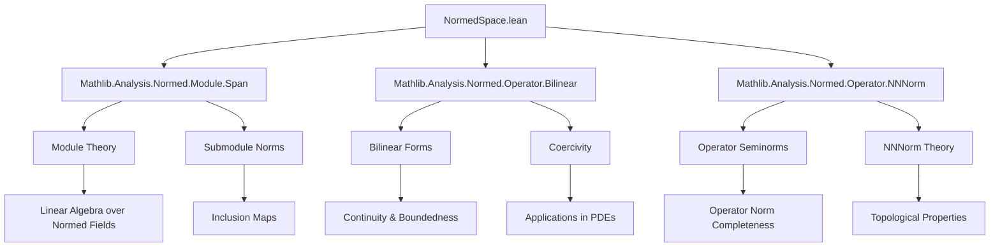
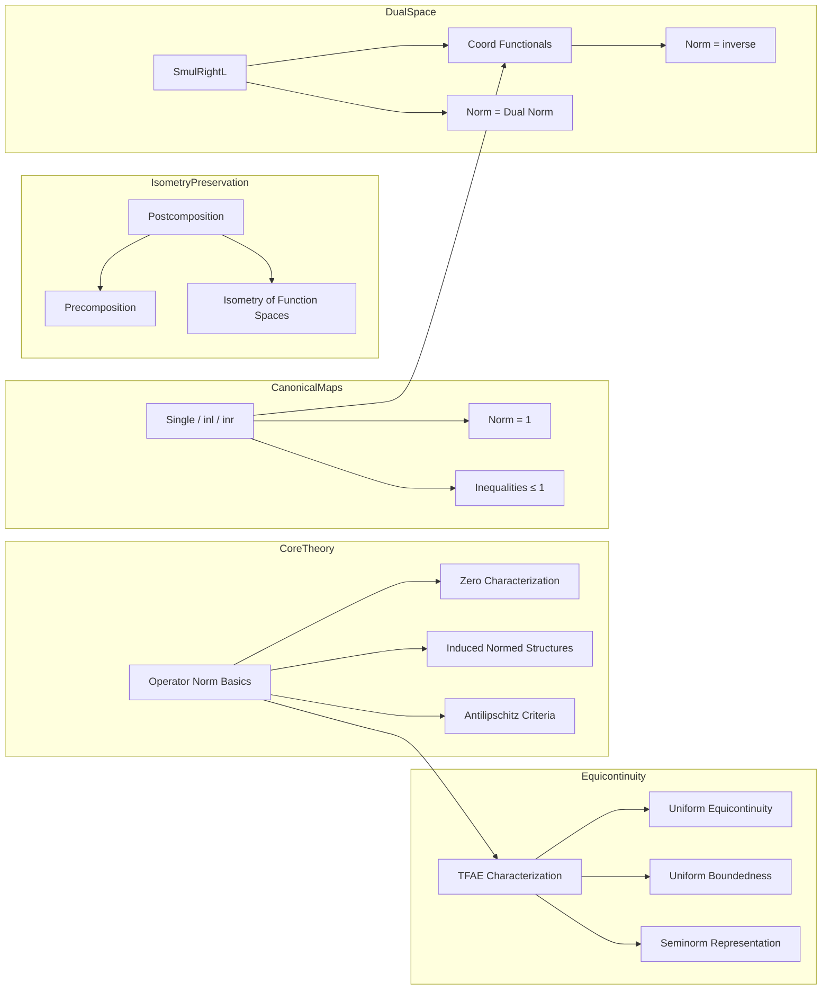

### Technical Brief: `NormedSpace.lean` — Operator Norm in Normed Spaces

---

#### **1. Key Definitions & Theorems**

| Name | Type / Signature | Purpose |
|------|------------------|---------|
| `opNorm_zero_iff` | `‖f‖ = 0 ↔ f = 0` | Characterizes zero operators via operator norm. |
| `toNormedAddCommGroup` | `NormedAddCommGroup (E →SL[σ₁₂] F)` | Induces normed additive commutative group structure on continuous linear maps. |
| `toNormedRing` | `NormedRing (E →L[𝕜] E)` | Makes endomorphisms into a normed ring. |
| `antilipschitz_of_isEmbedding` | `IsEmbedding f → ∃ K, AntilipschitzWith K f` | Links topological embeddings to metric expansion. |
| `antilipschitz_of_comap_nhds_le` | `(𝓝 0).comap f ≤ 𝓝 0 → ∃ K, AntilipschitzWith K f` | Gives antilipschitz constant from neighborhood condition. |
| `bound_of_shell` | `∀ x, ε / ‖c‖ ≤ ‖x‖ → ‖x‖ < ε → ‖f x‖ ≤ C * ‖x‖ ⇒ ∀ x, ‖f x‖ ≤ C * ‖x‖` | Extends local bound on a “shell” to global bound using scaling. |
| `bound_of_ball_bound` | `∀ z ∈ B(0, r), ‖f z‖ ≤ c ⇒ ∃ C, ∀ z, ‖f z‖ ≤ C * ‖z‖` | Produces global linear bound from local ball bound over `RCLike` fields. |
| `norm_toContinuousLinearMap_comp` | `‖f.toContinuousLinearMap.comp g‖ = ‖g‖` | Post-composition with linear isometry preserves operator norm. |
| `postcomp` | `(F →ₛₗᵢ[σ₂₃] G) → (E →SL[σ₁₂] F) →ₛₗᵢ[σ₂₃] (E →SL[σ₁₃] G)` | Left-postcomposition with isometry is itself an isometry between function spaces. |
| `opNorm_comp_linearIsometryEquiv` | `‖f.comp g.toLinearIsometry.toContinuousLinearMap‖ = ‖f‖` | Precomposition with linear isometry equivalence preserves norm. |
| `norm_smulRightL` | `‖smulRightL c‖ = ‖c‖` | Norm of right multiplication map equals dual norm. |
| `norm_subtypeL` | `‖K.subtypeL‖ = 1` | Norm of inclusion of a submodule is 1. |
| `one_le_norm_mul_norm_symm` | `1 ≤ ‖e‖ * ‖e.symm‖` | Lower bound on product of norms of inverse isomorphisms. |
| `coord_norm` | `‖coord x h‖ = ‖x‖⁻¹` | Norm of coordinate functional (dual vector) is inverse norm of point. |
| `equicontinuous_TFAE` | 9 equivalent conditions for equicontinuity of families | Central result linking uniform, equicontinuity, and boundedness in operator norm. |
| `norm_single`, `norm_inl`, `norm_inr` | `= 1` under nontriviality | Norms of canonical injections into products/sums are 1. |

---

#### **2. Naming Conventions**

- **Prefixes**:
  - `opNorm_`: Operator norm properties (`opNorm_zero_iff`, `opNorm_comp_le`, etc.)
  - `norm_`: Norm of specific constructions (`norm_toContinuousLinearMap`, `norm_subtypeL`, `norm_smulRightL`)
  - `antilipschitz_`: Antilipschitz constants (`antilipschitz_of_isEmbedding`, `antilipschitz_of_comap_nhds_le`)
  - `bound_`: Bounds on linear maps (`bound_of_shell`, `bound_of_ball_bound`)
  - `postcomp`, `inl`, `inr`, `single`: Canonical constructions (injections, projections)
  - `coord`: Coordinate functionals in dual space

- **Suffixes**:
  - `_le_one`, `_eq_one`, `_pos`: Inequalities or equalities with 0/1
  - `_iff`: Biconditional characterizations (`opNorm_zero_iff`)
  - `_TFAE`: “The following are equivalent” lists

- **Variable suffixes**:
  - `ₗ`: For linear (not semilinear) maps (`Fₗ`, `σ₁₂`, `σ₂₃`)
  - `ₗᵢ`: For linear isometries (`→ₛₗᵢ`)
  - `ₗ`: For semilinear maps (`→ₛₗ[σ]`), `→SL[σ]` for continuous semilinear

---

#### **3. Tactic Stack**

| Tactic | Usage Frequency | Purpose |
|--------|-----------------|---------|
| `simp` / `simp_rw` | Very High | Simplify using definitional equalities, `norm_zero`, `norm_smul`, etc. |
| `rw` | High | Rewrite using lemmas like `opNorm_le_iff`, `norm_smul`, `map_smulₛₗ` |
| `gcongr` | Medium | Handle inequalities with monotone functions (e.g., `*`, `inv`) |
| `rwa` | Medium | Rewrite + assume new hypothesis (e.g., `rwa [← norm_inv]`) |
| `convert` | Medium | Use transitivity of equality with partial unification |
| `tfae_have`, `tfae_finish` | Medium | Prove equivalence chains (used in `equicontinuous_TFAE`) |
| `rcases`, `obtain` | Medium | Extract witnesses from existential quantifiers |
| `by_cases`, `by_contra` | Low | Case analysis or contradiction proofs |
| `ring` | Low | Simplify algebraic expressions (e.g., in `bound_of_ball_bound`) |
| `exact`, `assumption` | Low | Direct proof steps |
| `ext` | Low | Extensionality for functions/maps |

---

#### **4. Proof Logic**

- **Inductive/Scaling Arguments**: Many proofs (e.g., `bound_of_shell`, `antilipschitz_of_comap_nhds_le`) use scaling by powers of an element $c$ with $\|c\| > 1$ to reduce to a “shell” region where bounds are assumed, then extend globally.
- **Neighborhood Filter Manipulation**: Antilipschitz results often use `comap`/`nhds` filter reasoning (`hf : (𝓝 0).comap f ≤ 𝓝 0`) and basis extraction (`nhds_basis_ball`).
- **Norm Equivalence via Isometries**: Proofs about operator norm invariance under composition with isometries rely on `opNorm_ext` or direct norm computation (`norm_map`, `norm_smul`).
- **Equicontinuity ↔ Boundedness**: The `equicontinuous_TFAE` proof uses:
  - Uniform equicontinuity from equicontinuity at 0 (standard topological fact).
  - Equivalence of uniform boundedness and uniform operator norm bounds.
  - Reduction to seminorm-based characterizations via `WithSeminorms`.
- **Subsingleton/Nontriviality Cases**: Many theorems split on `subsingleton_or_nontrivial` to handle degenerate cases (e.g., zero space), ensuring positivity or invertibility only where valid.

---

#### **5. Imports & Dependencies**

| Import | Role |
|--------|------|
| `Mathlib.Analysis.Normed.Module.Span` | Submodule structure, span, inclusion maps (`subtypeL`) |
| `Mathlib.Analysis.Normed.Operator.Bilinear` | Bilinear maps, coercivity definition (`IsCoercive`) |
| `Mathlib.Analysis.Normed.Operator.NNNorm` | Non-negative normed space structure, `‖·‖₊`, `‖·‖ₑ` |

**Core Dependencies**:
- `NormedAddCommGroup`, `NormedSpace`, `NontriviallyNormedField`
- `ContinuousLinearMap`, `LinearIsometry`, `Submodule`
- `Metric`, `Topology`, `NNReal`, `ENNReal`

---

#### **6. Mermaid Diagrams**

##### **Dependency Graph (Module-Level)**

##### **Overview of File Structure**

---

#### **7. Theory Scope**

This file formalizes foundational aspects of **operator norm theory** in the context of **normed spaces over nontrivially normed fields**, especially emphasizing:

- **Operator norm as a genuine norm** (not just seminorm), requiring separation (`toNormedAddCommGroup`).
- **Metric consequences of linearity + continuity**, such as antilipschitz behavior and expansion properties.
- **Invariance under isometries**, both pre- and post-composition.
- **Equicontinuity ↔ uniform boundedness**, a key step toward Banach–Steinhaus-type results.
- **Canonical embeddings** (single, inl, inr, subtype) and their norm behavior.

It serves as a **prerequisite** for deeper analysis (e.g., Riesz representation, Banach space duality, bilinear form theory), and is tightly integrated with `WithSeminorms`, `BoundedBilinearMap`, and `DualSpace` infrastructure.

--- 

Let me know if you'd like a formalized dependency graph (e.g., for `leanpkg`), or a summary of lemmas needed for a specific application (e.g., Hahn–Banach, Banach–Steinhaus).
