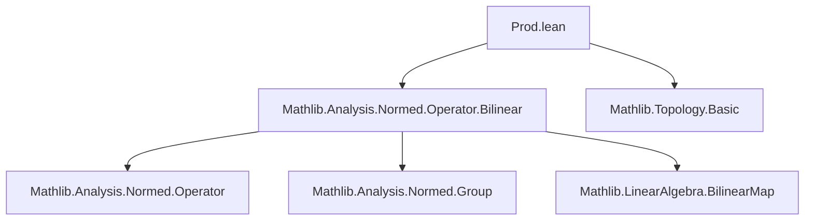

### Technical Brief: `Prod.lean` — Operator Norm and Cartesian Products in `ContinuousLinearMap`

---

#### **1. Key Definitions & Theorems**

| Name | Type / Signature | Purpose |
|------|------------------|---------|
| `norm_fst_le` | `‖fst 𝕜 E F‖ ≤ 1` | Upper bound on operator norm of first projection `E × F → E`. |
| `norm_snd_le` | `‖snd 𝕜 E F‖ ≤ 1` | Upper bound on operator norm of second projection `E × F → F`. |
| `opNorm_prod` | `‖f.prod g‖ = ‖(f, g)‖` | Equality of operator norm of product map `f.prod g` and norm of pair `(f, g)` in product space. |
| `opNNNorm_prod` | `‖f.prod g‖₊ = ‖(f, g)‖₊` | Nonnegative version of `opNorm_prod`, via subtype extensionality. |
| `prodₗᵢ` | `(E →L F) × (E →L G) ≃ₗᵢ[R] E →L (F × G)` | Linear isometry equivalence between product of maps and product map. |
| `prodMapL` | `(M₁ →L M₂) × (M₃ →L M₄) →L (M₁ × M₃ →L M₂ × M₄)` | Continuous linear map implementing `prodMap` (i.e., `(f, g) ↦ f.prodMap g`). |
| `prodMapL_apply` | `prodMapL p = p.1.prodMap p.2` | Definitional equality of `prodMapL` on elements. |
| `norm_fst` | `‖fst 𝕜 E F‖ = 1` (under `Nontrivial E`) | Exact norm of first projection when codomain is nontrivial. |
| `norm_snd` | `‖snd 𝕜 E F‖ = 1` (under `Nontrivial F`) | Exact norm of second projection when codomain is nontrivial. |

---

#### **2. Naming Conventions**

- **Prefixes**:
  - `norm_`: bounds or exact values of operator norms.
  - `opNorm_`: operator norm identities (e.g., `opNorm_prod`).
  - `opNNNorm_`: nonnegative operator norm variants.
  - `prod_`: constructions involving product maps (`prod`, `prodMap`, `prodₗᵢ`, `prodCongr`).
  - `fst`, `snd`: projections.

- **Suffixes**:
  - `_le`: inequality lemmas (e.g., `norm_fst_le`).
  - `_apply`: application lemmas (e.g., `prodMapL_apply`).
  - `ₗᵢ`: linear isometry equivalence (`prodₗᵢ`).
  - `L`: continuous linear maps (`prodMapL`, `prod_map_equivL`).

---

#### **3. Tactic Stack**

Frequent tactics used in proofs:

- `simp` / `simpa`: simplification using definitions (e.g., `norm_zero`, `max_mul_of_nonneg`, `prod_apply`).
- `refine` / `exact`: constructing proofs via `le_antisymm`, `ext`, etc.
- `rw`: rewriting using lemmas like `norm_zero`, `max_eq_left`, `mul_le_mul_iff_of_pos_right`.
- `apply funext`, `intro`, `rfl`: extensionality and definitional equality.
- `cases` / `rcases`: destructuring pairs.
- `ring`, `linarith`: for inequalities involving norms and scalars (implicit in `norm_fst`, `norm_snd`).
- `aesop`: not explicitly used here, but `normed_field` and `normed_space` infrastructure likely relies on it elsewhere.

---

#### **4. Proof Logic**

- **Structure**: Inductive-style reasoning over product spaces and continuous linear maps.
- **Common pattern**:
  1. Prove inequality `≤` via `opNorm_le_bound` (bounding the norm using sup over unit ball).
  2. Prove reverse inequality `≥` using evaluation at specific points (e.g., `(e, 0)` or `(0, f)`).
  3. Conclude equality via `le_antisymm`.
- **Key lemmas**:
  - `opNorm_prod`: uses `max_le_max` and `le_opNorm` to bound both directions.
  - `norm_fst`, `norm_snd`: use existence of nonzero vectors (`exists_ne`) and `norm_pos_iff`.
- **Continuity arguments**: rely on continuity of `prodMapL` and composition (`continuous.comp`, `prodMk`).

---

#### **5. Imports & Dependencies**

- **Core imports**:
  ```lean
  Mathlib.Analysis.Normed.Operator.Bilinear
  ```
- **Implicit dependencies** (via `open` and typeclass inference):
  - `Mathlib.Analysis.Normed.Group` (for `SeminormedAddCommGroup`, `NormedSpace`)
  - `Mathlib.Analysis.Normed.Operator` (for `ContinuousLinearMap`, `opNorm`)
  - `Mathlib.Topology.Basic` (for `Continuous`, `ContinuousOn`)
  - `Mathlib.LinearAlgebra.BilinearMap` (for `prodMap`, `prodCongr`)

---

#### **6. Theory Overview & Dependency Diagram**

##### **Conceptual Flow**

```
Seminormed → Normed
   │            │
   ├─ Projections fst/snd (norm bounds)
   ├─ Product maps: prod, prodMap
   └─ Equivalences: prodₗᵢ, prodMapL
```

##### **Mermaid Diagrams**

**Dependency Graph (Module-Level)**



**Theoretical Structure (Conceptual)**

```mermaid
graph LR
  subgraph "ContinuousLinearMap"
    P1["fst : E × F → E"]
    P2["snd : E × F → F"]
    PM["f.prod g : E → F × G"]
    PL["prodMapL : (M₁→L M₂) × (M₃→L M₄) →L (M₁×M₃ →L M₂×M₄)"]
    PE["prodₗᵢ : (E→L F) × (E→L G) ≃ₗᵢ E→L(F×G)"]
  end

  P1 -->|norm ≤ 1| N1["norm_fst_le"]
  P2 -->|norm ≤ 1| N2["norm_snd_le"]
  PM -->|norm =|(f,g)| N3["opNorm_prod"]
  PL -->|apply = prodMap| N4["prodMapL_apply"]
  PE -->|isometry| N5["opNorm_prod"]

  N1 -->|nontrivial| S1["norm_fst = 1"]
  N2 -->|nontrivial| S2["norm_snd = 1"]
```

---

#### **7. Summary**

This file formalizes how operator norms interact with Cartesian products in the context of continuous linear maps between normed spaces over a nontrivially normed field. It establishes:

- Exact and bounded norms for projections.
- Norm-preserving identification of product maps with pairs of maps.
- A continuous linear map `prodMapL` encoding `prodMap` as a morphism in the category of continuous linear maps.
- Continuity lemmas for families of product maps parameterized over topological spaces.

The results are foundational for building higher-level structures (e.g., product bundles, tensor products, or operator algebras) where product behavior of linear operators matters.

--- 

Let me know if you'd like a formalized dependency graph (e.g., `.lean`-level imports) or a proof sketch for `opNorm_prod`.
