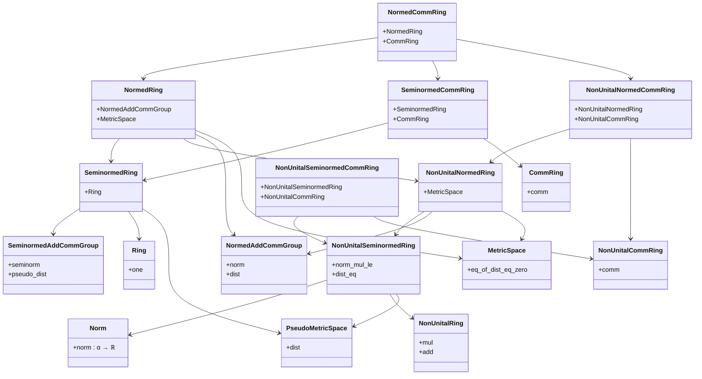

Here is the **technical metadata** extracted from the provided `Basic.lean` file:

---

### 1. **Key Definitions & Theorems**

| Name | Type / Class | Purpose |
|------|--------------|---------|
| `NonUnitalSeminormedRing` | `class` | A non-unital ring with a seminorm satisfying `‖a * b‖ ≤ ‖a‖ * ‖b‖` and induced distance. |
| `SeminormedRing` | `class` | A unital ring with a seminorm satisfying the same inequality. |
| `NonUnitalNormedRing` | `class` | A non-unital ring with a norm (not just seminorm) and induced metric. |
| `NormedRing` | `class` | A unital ring with a norm and induced metric. |
| `NonUnitalSeminormedCommRing`, `SeminormedCommRing`, `NonUnitalNormedCommRing`, `NormedCommRing` | `class` | Commutative variants of the above, extending the respective non-commutative classes. |
| `NormOneClass` | `class` | A mixin asserting `‖1‖ = 1`. |
| `RingHom.IsBounded` | `def` | A ring homomorphism `f` is bounded if `∃ C > 0, ∀ x, ‖f x‖ ≤ C * ‖x‖`. |
| `RingHomIsometric` | `class` | A ring homomorphism `σ` is isometric if `∀ x, ‖σ x‖ = ‖x‖`. |
| `NormMulClass` | `class` | A mixin asserting *strict* multiplicativity: `‖a * b‖ = ‖a‖ * ‖b‖`. |
| `norm_mul_le` | `theorem` | Submultiplicativity of the norm: `‖a * b‖ ≤ ‖a‖ * ‖b‖`. |
| `norm_pow_le`, `norm_pow_le'` | `theorem` | `‖a ^ n‖ ≤ ‖a‖ ^ n` (with/without `NormOneClass`). |
| `nnnorm_pow_le`, `nnnorm_pow_le'` | `theorem` | Non-negative norm version of the above. |
| `norm_sub_mul_le`, `norm_sub_mul_le'` | `lemma` | Inequality bounding `‖c - a * b‖` in terms of `‖c - a‖` and `‖1 - b‖`. |
| `norm_commutator_units_sub_one_le` | `lemma` | Bounds the norm of a commutator deviation from identity. |
| `List.norm_prod_le`, `List.norm_prod_le'` | `theorem` | Norm of a product of list elements ≤ product of norms. |
| `Finset.norm_prod_le`, `Finset.norm_prod_le'` | `theorem` | Same as above for finite products. |
| `Nat.norm_cast_le` | `theorem` | `‖(n : α)‖ ≤ n * ‖1‖` for natural numbers. |
| `norm_natAbs`, `norm_intCast_abs` | `lemma` | Compatibility of norm with absolute value on integers. |
| `ULift.*`, `Prod.*`, `MulOpposite.*` | `instance` | Structural instances for lifted, product, and opposite structures. |

---

### 2. **Naming Conventions**

- **Prefixes**:
  - `nonUnital*`: For structures without multiplicative identity.
  - `seminormed*`: For seminorms (possibly degenerate).
  - `normed*`: For genuine norms (non-degenerate).
  - `comm*`: For commutative variants.
  - `nnnorm*`, `enorm*`: For non-negative norm (`ℝ≥0`) and extended non-negative norm (`ENNReal`) versions.
  - `norm_*`: General norm lemmas (e.g., `norm_mul_le`, `norm_pow_le`).
  - `mulLeft_bound`, `mulRight_bound`: Boundedness of multiplication maps.

- **Suffixes**:
  - `_le`: Inequality lemmas (`≤`).
  - `_eq`: Equality lemmas (`=`).
  - `_le'`: Variant lemmas (often with weaker assumptions).
  - `_le_of_le`: Lemmas using bounding assumptions on inputs.

- **Class names**:
  - `*Class`: Mixin classes (e.g., `NormOneClass`, `NormMulClass`).
  - `*Ring`, `*CommRing`: Full algebraic structures.

---

### 3. **Tactic Stack**

Frequently used tactics in proofs:

| Tactic | Usage |
|--------|-------|
| `simp` / `simp only` | Simplification of norms, products, casts, `norm_one`, etc. |
| `gcongr` | For monotonicity in inequalities involving `≤` and `*`. |
| `exact`, `refine`, `apply` | Direct proof steps, especially for `norm_mul_le`-type goals. |
| `calc` | Chain of inequalities (e.g., in `norm_sub_mul_le`, `norm_commutator_units_sub_one_le`). |
| `abel_nf` | Simplifying abelian group expressions (e.g., in commutator lemmas). |
| `rw` / `simp_rw` | Rewriting using lemmas like `sub_one_mul`, `mul_sub_one`. |
| `ext` | Extensionality for `NNReal` or equality of functions. |
| `rcases` / `cases` | Decomposing existential or inductive hypotheses (e.g., `Finset`, `Int`). |
| `nontrivial_of_ne` | Proving nontriviality via inequality. |
| `mul_le_mul`, `mul_le_mul'`, `mul_le_mul_of_nonneg_left` | For bounding products. |
| `NNReal.coe_mono`, `NNReal.eq` | Reasoning about coercion from `NNReal`. |
| `by simp [ULift.norm_def]`, `by simp [Prod.norm_def]` | Instance proofs for lifted/product structures. |

---

### 4. **Proof Logic**

- **Inductive structure**: Many proofs (e.g., `norm_pow_le`, `norm_prod_le`) proceed by induction on natural numbers or lists.
- **Case analysis**: On integers (`Int.natAbs_eq`), finite sets (`Finset.mem_def`), or lists (`List.length`).
- **Chain of inequalities**: Common in norm estimates (e.g., `norm_sub_mul_le`, `norm_commutator_units_sub_one_le`).
- **Instance construction**: Most proofs are instance proofs, using `by` blocks to discharge subgoals via `simp`, `gcongr`, and `exact`.
- **Leveraging existing structure**: Many results reuse `norm_mul_le` as a base, then lift to subalgebras, products, etc., via `norm_mul_le a.1 b.1`.

---

### 5. **Imports**

| Module | Purpose |
|--------|---------|
| `Mathlib.Algebra.Algebra.Subalgebra.Basic` | Subalgebras, `Subalgebra`, `NonUnitalSubalgebra`. |
| `Mathlib.Analysis.Normed.Group.Constructions` | Basic constructions for normed additive groups (e.g., `ULift`, `Prod`). |
| `Mathlib.Analysis.Normed.Group.Subgroup` | Subgroups and submodules with induced norm. |
| `Mathlib.Analysis.Normed.Group.Submodule` | Submodules with induced structure. |

These imports define the foundational normed group and algebraic structures used to build normed rings.

---

### 6. **Mermaid Diagrams**

#### **Dependency Hierarchy (Class Inheritance)**

#### **Overview of File Structure**

```mermaid
graph TD
    A[Basic.lean] --> B[Class Definitions]
    A --> C[Instance Proofs]
    A --> D[Norm Inequalities]
    A --> E[Subalgebra Structures]
    A --> F[Product/Lift/Opposite Structures]
    A --> G[Ring Homomorphism Properties]
    A --> H[Integer/Natural Number Norms]

    B --> B1[NonUnitalSeminormedRing]
    B --> B2[SeminormedRing]
    B --> B3[NonUnitalNormedRing]
    B --> B4[NormedRing]
    B --> B5[Commutative Variants]

    C --> C1[Instance priorities]
    C --> C2[ULift/Prod/MulOpposite]

    D --> D1[norm_mul_le]
    D --> D2[norm_pow_le]
    D --> D3[norm_sub_mul_le]
    D --> D4[commutator bounds]

    E --> E1[Subalgebra instances]
    E --> E2[SubalgebraClass]

    F --> F1[ULift.*]
    F --> F2[Prod.*]
    F --> F3[MulOpposite.*]

    G --> G1[IsBounded]
    G --> G2[RingHomIsometric]

    H --> H1[nat_cast]
    H --> H2[int_cast]
    H --> H3[natAbs]
```

---

Let me know if you'd like a **dependency graph of theorems**, or a **proof automation summary** (e.g., which lemmas are mostly `simp`-friendly).
