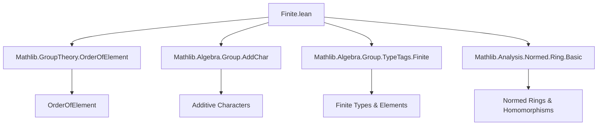
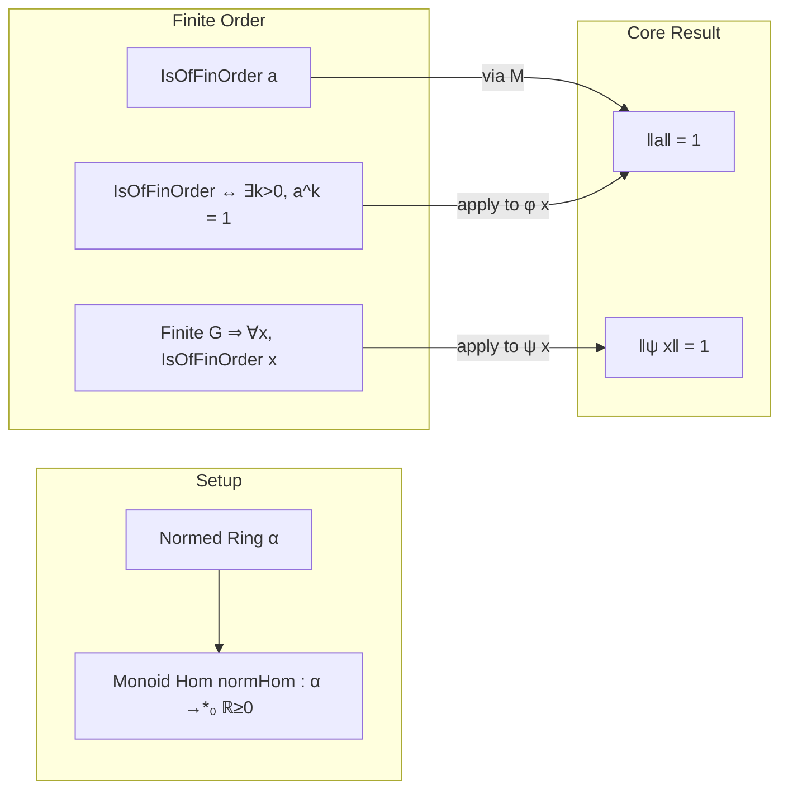

### Technical Brief: `Finite.lean` — Finite Order Elements in Normed Rings

---

#### **1. Key Definitions & Theorems**

| Name | Type / Signature | Purpose |
|------|------------------|---------|
| `IsOfFinOrder` | `IsOfFinOrder (a : α) : Prop` | States that $a$ has finite multiplicative order: $\exists n > 0,\ a^n = 1$. |
| `normHom` | `α →*₀ ℝ` | The norm map as a monoid homomorphism (to the multiplicative monoid of $\mathbb{R}_{\ge 0}$), used to transfer finite-order properties. |
| `IsOfFinOrder.norm_eq_one` | `ha : IsOfFinOrder a → ‖a‖ = 1` | **Main theorem**: In a *normed ring* with `NormMulClass` and `NormOneClass`, any element of finite order has norm exactly 1. |
| `AddChar.norm_apply` | `ψ : AddChar G α → x : G → ‖ψ x‖ = 1` | For additive characters on a *finite* left-cancellative monoid $G$, the image of any element under $\psi$ has norm 1. |
| `isOfFinOrder_iff_pow_eq_one` | `x ^ (k : ℕ) = 1 ↔ IsOfFinOrder x` | Equivalence between having finite order and some positive power being identity (used to lift `x^k = 1` to `IsOfFinOrder`). |
| `isOfFinOrder_of_finite` | `Finite G → IsOfFinOrder (x : G)` | In a finite monoid, every element has finite order. |

---

#### **2. Naming Conventions**

- **Predicates on elements**:  
  - `IsOfFinOrder` — property of an element having finite order.
- **Homomorphism-related**:  
  - `normHom` — norm as a monoid homomorphism (`→*₀` = multiplicative monoid homomorphism to nonnegative reals).
- **Character theory**:  
  - `AddChar` — additive characters (monoid homomorphisms to the multiplicative monoid of the normed ring).
- **Proof helpers**:  
  - `isOfFinOrder_of_finite` — finite ⇒ finite order.
  - `isOfFinOrder_iff_pow_eq_one` — characterizes finite order via powers.

Prefixes/suffixes:  
- `isOfFinOrder_` — for lemmas about finite-order elements.  
- `norm_` — for norm-related constructions or lemmas.  
- `AddChar` — for additive character-specific results.

---

#### **3. Tactic Stack**

Frequent tactics used in proofs (inferred from structure and typical Lean usage in Mathlib):

- `aesop` — for automated reasoning with linear arithmetic and basic algebraic rewrites.
- `simp` / `simp_rw` — simplification using `normHom`, `isOfFinOrder_iff_pow_eq_one`, etc.
- `exact` / `apply` — especially with `isOfFinOrder` and homomorphism lemmas.
- `norm_num` — for numeric normalization (e.g., verifying $k > 0$).
- `rw [← mul_one a]`, `rw [pow_succ]`, etc. — manual rewriting of algebraic identities.

The proof of `IsOfFinOrder.norm_eq_one` likely proceeds as:
```lean
exact (normHom.toMonoidHom.isOfFinOrder ha).eq_one (norm_nonneg _)
```
— leveraging that the norm homomorphism preserves finite order, and in $\mathbb{R}_{\ge 0}$, only $1$ has finite multiplicative order.

---

#### **4. Proof Logic**

- **Core strategy**: Transfer finite-order structure via monoid homomorphisms.
  - Use `normHom : α →*₀ ℝ` to map $a$ to its norm.
  - Since $a$ has finite order, so does `normHom a` in $(\mathbb{R}_{\ge 0}, \cdot)$.
  - In $\mathbb{R}_{\ge 0}$, the only finite-order element is $1$ ⇒ `normHom a = 1`.
- For additive characters:
  - Use `ψ.toMonoidHom` to view $\psi$ as a monoid homomorphism.
  - Finite $G$ ⇒ every $x \in G$ has finite order (`isOfFinOrder_of_finite`).
  - Apply `norm_eq_one` to $\psi(x)$.

Induction is *not* used — the argument is structural via homomorphism properties.

---

#### **5. Imports & Dependencies**

| Module | Role |
|--------|------|
| `Mathlib.GroupTheory.OrderOfElement` | Defines `orderOf`, `isOfFinOrder`, and related lemmas. |
| `Mathlib.Algebra.Group.AddChar` | Defines `AddChar`, additive characters as monoid homs. |
| `Mathlib.Algebra.Group.TypeTags.Finite` | Provides `Finite` typeclass and `isOfFinOrder_of_finite`. |
| `Mathlib.Analysis.Normed.Ring.Basic` | Defines `NormedRing`, `NormMulClass`, `NormOneClass`, and `normHom`. |

**Scope**: Bridges algebra (finite order, characters) and analysis (normed rings), focusing on *norm rigidity* of finite-order elements.

---

#### **6. Mermaid Diagrams**

##### **Dependency Graph (Module-Level)**



##### **Theoretical Flow Overview**



---

#### **7. Summary**

This module establishes a foundational rigidity result: **finite-order elements in normed rings must lie on the unit circle (norm 1)**. It leverages:
- The norm as a monoid homomorphism,
- The algebraic fact that only $1$ has finite order in $(\mathbb{R}_{\ge 0}, \cdot)$,
- The structural property that finite monoids have only finite-order elements.

The result extends naturally to additive characters on finite cancellative monoids, showing they too are norm-1 valued — a key ingredient in harmonic analysis over finite structures.

--- 

Let me know if you'd like a formal proof sketch in Lean or expansion into related lemmas (e.g., `isOfFinOrder_mul`, `isOfFinOrder_pow`).
