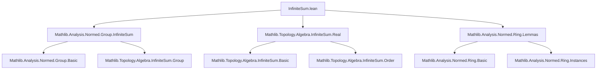
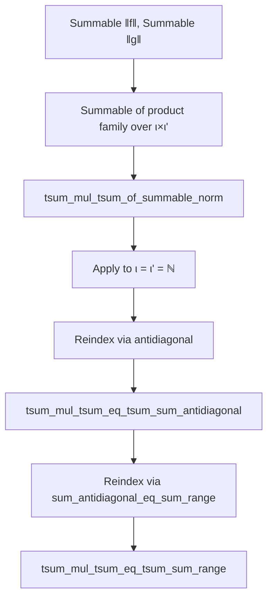

### Technical Brief: `InfiniteSum.lean`

---

#### **1. Key Definitions & Theorems**

| Name | Type / Signature | Purpose |
|------|------------------|---------|
| `Summable.mul_of_nonneg` | `{f : ι → ℝ} {g : ι' → ℝ} → Summable f → Summable g → 0 ≤ f → 0 ≤ g → Summable (fun x ↦ f x.1 * g x.2)` | Product of two nonnegative summable real families over arbitrary index types is summable. |
| `Summable.mul_norm` | `{f : ι → R} {g : ι' → R} → Summable ‖f‖ → Summable ‖g‖ → Summable (fun x ↦ ‖f x.1 * g x.2‖)` | Norm of product of two absolutely summable families is summable. |
| `summable_mul_of_summable_norm` | `{f : ι → R} {g : ι' → R} → Summable ‖f‖ → Summable ‖g‖ → Summable (fun x ↦ f x.1 * g x.2)` | Absolute summability implies summability of the product family (requires `CompleteSpace R`). |
| `tsum_mul_tsum_of_summable_norm` | `{f : ι → R} {g : ι' → R} → Summable ‖f‖ → Summable ‖g‖ → (∑' x, f x) * (∑' y, g y) = ∑' z, f z.1 * g z.2` | Product of two absolutely convergent infinite sums equals the double sum over the product index type. |
| `tsum_mul_tsum_eq_tsum_sum_antidiagonal_of_summable_norm` | `{f g : ℕ → R} → Summable ‖f‖ → Summable ‖g‖ → (∑' n, f n) * (∑' n, g n) = ∑' n, ∑ kl ∈ antidiagonal n, f kl.1 * g kl.2` | **Cauchy product formula** using `Finset.antidiagonal n = {(k,l) | k + l = n}`. |
| `tsum_mul_tsum_eq_tsum_sum_range_of_summable_norm` | `{f g : ℕ → R} → Summable ‖f‖ → Summable ‖g‖ → (∑' n, f n) * (∑' n, g n) = ∑' n, ∑ k ∈ range (n+1), f k * g (n - k)` | Equivalent Cauchy product formula using `Finset.range (n+1)` and subtraction. |
| `hasSum_sum_range_mul_of_summable_norm` | `{f g : ℕ → R} → Summable ‖f‖ → Summable ‖g‖ → HasSum (fun n ↦ ∑ k ∈ range (n+1), f k * g (n - k)) ((∑' n, f n) * (∑' n, g n))` | The partial Cauchy products converge to the product of sums. |
| `summable_of_absolute_convergence_real` | `{f : ℕ → ℝ} → (∃ r, Tendsto (∑ i ∈ range n, |f i|) atTop (𝓝 r)) → Summable f` | In ℝ, absolute convergence (convergence of partial sums of absolute values) implies summability. |

---

#### **2. Naming Conventions**

- **`mul_`**: Indicates multiplication-related operations (e.g., `mul_norm`, `mul_of_nonneg`).
- **`norm_`**: Pertains to norms (e.g., `norm_nonneg`, `norm_mul_le`, `norm_sum_le`).
- **`summable_`**: Properties about summability of families.
- **`tsum_`**: Properties about the total sum (`∑'`) and its algebraic behavior.
- **`antidiagonal`**: Refers to the diagonal pairing `(k, l)` with `k + l = n`.
- **`range`**: Refers to finite initial segments of `ℕ`, i.e., `{0, ..., n}`.
- **`of_` suffix**: Often used to derive a stronger result from a weaker one (e.g., `of_norm`, `of_nonneg_of_le`).
- **`'` suffix (prime)**: Denotes variants without assuming completeness (e.g., `tsum_mul_tsum_of_summable_norm'`).

---

#### **3. Tactic Stack**

Frequently used tactics in proofs:
- `simp_rw`: Rewriting with simplification rules, especially for `antidiagonal` ↔ `range` conversions.
- `gcongr`: For congruence reasoning with inequalities (e.g., bounding norms).
- `convert`: To match goals up to definitional equality or use intermediate lemmas.
- `exact`, `apply`, `refine`: Standard proof construction.
- `have`, `suffices`: Intermediate lemma introduction.
- `calc`: Chain of equalities/inequalities (e.g., in `norm_sum_le`).
- `nonneg`-based reasoning: `norm_nonneg`, `mul_nonneg`, `summable_prod_of_nonneg`.
- `tendsto_*` tactics: For convergence arguments (e.g., `tendsto_finset_prod_atTop`, `prod_atTop_atTop_eq`).
- `continuous_mul`, `continuousAt`, `tendsto.comp`: Topological arguments for limits under multiplication.

---

#### **4. Proof Logic**

The logical flow follows a **two-phase strategy**:

1. **Arbitrary Index Types (`ι`, `ι'`)**:
   - First prove summability of the product family using norm estimates (`mul_norm`, `summable_mul_of_summable_norm`).
   - Then derive equality of the product of sums and the double sum (`tsum_mul_tsum_of_summable_norm`), using:
     - `hasSum_of_subseq_of_summable`
     - Continuity of multiplication
     - Convergence of finite partial products (`Finset.prod` over rectangles)

2. **ℕ-indexed Families (Cauchy Product)**:
   - Show summability of the *antidiagonal* or *range* partial sums using norm bounds.
   - Use equivalence between `antidiagonal n` and `range (n+1)` via `sum_antidiagonal_eq_sum_range_succ`.
   - Apply the arbitrary-index result to the reindexing via `antidiagonal` or `range`.
   - Derive `HasSum` and `tsum` equalities accordingly.

Key proof techniques:
- **Reduction to nonnegative case** via `of_nonneg_of_le` and `norm_nonneg`.
- **Norm estimation** (`norm_mul_le`, `norm_sum_le`) to transfer summability.
- **Topological arguments** (continuity, convergence) in `CompleteSpace R`.
- **Index reorganization** (product ↔ antidiagonal ↔ range) using combinatorial lemmas.

---

#### **5. Imports**

| Import | Purpose |
|--------|---------|
| `Mathlib.Analysis.Normed.Group.InfiniteSum` | General theory of infinite sums in normed abelian groups. |
| `Mathlib.Topology.Algebra.InfiniteSum.Real` | Real-specific infinite sum properties (e.g., absolute convergence ⇒ convergence). |
| `Mathlib.Analysis.Normed.Ring.Lemmas` | Basic lemmas about normed rings (e.g., `norm_mul_le`). |

---

#### **6. Mermaid Diagrams**

##### **Dependency Graph (Module-Level)**

##### **Overview of Theoretical Flow**

##### **Structure of Proof for Cauchy Product**

---

#### **7. Summary**

This module formalizes the **Cauchy product formula** and its generalizations in the setting of **normed rings**, emphasizing **absolute convergence** as the key condition to ensure validity of termwise multiplication of infinite sums. It bridges abstract infinite sum theory (for arbitrary index types) with concrete series over `ℕ`, leveraging:
- Norm estimates,
- Continuity of multiplication,
- Combinatorial index reorganization (`antidiagonal` ↔ `range`),
- Completeness for convergence.

The results are foundational for analysis in normed algebras (e.g., power series multiplication, convolution).
