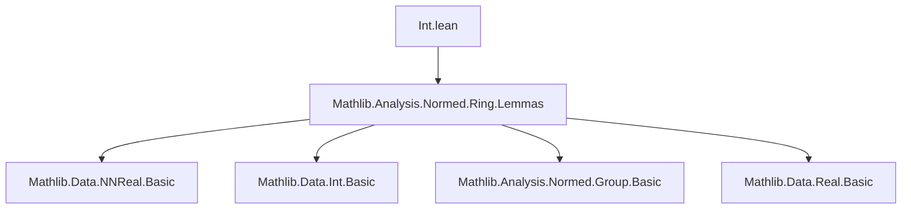

**Technical Brief: `Int.nnorm` in Lean 4 (Mathlib)**  
*Based on `Int.lean` (c) 2021 Johan Commelin, Apache 2.0*

---

### 1. **Key Definitions & Theorems**

| Name | Type | Purpose |
|------|------|---------|
| `nnnorm_coe_units` | `∀ e : ℤˣ, ‖(e : ℤ)‖₊ = 1` | Shows that units in `ℤ` (i.e., `±1`) have norm `1` in `NNReal`. |
| `norm_coe_units` | `∀ e : ℤˣ, ‖(e : ℤ)‖ = 1` | Unbundled version: the real norm of units is `1`. |
| `nnnorm_natCast` | `∀ n : ℕ, ‖(n : ℤ)‖₊ = n` | Natural numbers embed isometrically into `ℤ` under `NNReal`-valued norm. |
| `enorm_natCast` | `∀ n : ℕ, ‖(n : ℤ)‖ₑ = n` | `‖·‖ₑ` is the *extended* norm (into `ENNReal`); matches natural embedding. |
| `toNat_add_toNat_neg_eq_nnnorm` | `∀ n : ℤ, ↑n.toNat + ↑(-n).toNat = ‖n‖₊` | Expresses the `NNReal` norm of an integer as sum of positive and negative parts. |
| `toNat_add_toNat_neg_eq_norm` | `∀ n : ℤ, ↑n.toNat + ↑(-n).toNat = ‖n‖` | Same identity, but for the real-valued norm `‖·‖`. |

> **Notation**:  
> - `‖n‖` = real norm (i.e., absolute value) of `n : ℤ` viewed as `ℝ`.  
> - `‖n‖₊` = bundled nonnegative real norm, i.e., `Real.nnnorm n : NNReal`.  
> - `‖n‖ₑ` = extended nonnegative real norm (`ENNReal`), used for completeness/measure theory.  
> - `n.toNat` = `max n 0` for `n : ℤ`.  

---

### 2. **Naming Conventions**

- **`nnnorm_` prefix**: `NNReal`-valued norm (e.g., `nnnorm_coe_units`, `nnnorm_natCast`).  
- **`norm_` prefix**: real-valued norm (e.g., `norm_coe_units`).  
- **`enorm_` prefix**: `ENNReal`-valued norm (e.g., `enorm_natCast`).  
- **`toNat_add_toNat_neg_` pattern**: expresses norm via decomposition into positive/negative parts.  
- **`coe_` suffix**: coercion (e.g., `coe_units`, `coe_natCast`).  
- **`natCast` suffix**: embedding `ℕ → ℤ`.  

---

### 3. **Tactic Stack**

- `simp only [...]` — heavily used for rewriting with specific lemmas (e.g., `nnnorm_neg`, `nnnorm_one`, `NNReal.coe_one`).  
- `rw [...]` — for rewriting equalities (e.g., `← coe_nnnorm`).  
- `congrArg` — to lift equalities from `NNReal` to `ℝ` via coercion.  
- `obtain rfl | rfl := ...` — case analysis on equality `e = 1` or `e = -1` (via `units_eq_one_or`).  
- `simpa [...] using ...` — simplifies goal using a hypothesis (here, a congruence).  

---

### 4. **Proof Logic**

- **Structure**:  
  1. **Case analysis** on units (`±1`) using `units_eq_one_or`.  
  2. **Simplification** using bundled/unbundled norm lemmas (`nnnorm_one`, `nnnorm_neg`, coercion lemmas).  
  3. **Algebraic decomposition** for integers: use `toNat_add_toNat_neg_eq_natAbs` + `NNReal.natCast_natAbs` to relate to absolute value.  
  4. **Coercion lifting**: use `NNReal.coe_natCast`, `NNReal.coe_add`, and `congrArg NNReal.toReal` to pass from `NNReal` to `ℝ`.  

- **Core idea**: exploit that `‖n‖ = |n| = n.toNat + (-n).toNat`, and that `NNReal` coercion preserves addition and naturals.

---

### 5. **Imports**

- `Mathlib.Analysis.Normed.Ring.Lemmas` — provides foundational lemmas about norms on rings (e.g., `nnnorm_neg`, `nnnorm_one`, `coe_nnnorm`, `NNReal.natCast_natAbs`, `toNat_add_toNat_neg_eq_natAbs`).  
- Implicitly relies on:  
  - `Mathlib.Data.NNReal.Basic` (for `NNReal`, coercion, arithmetic).  
  - `Mathlib.Data.Int.Basic` (for `toNat`, `ℤˣ`, `natAbs`).  
  - `Mathlib.Analysis.Normed.Group.Basic` (for normed group/real structure).  

---

### 6. **Mermaid Diagrams**

#### **Dependency Graph (Module-Level)**



#### **Overview of Theory Flow**

```mermaid
flowchart LR
  subgraph "Normed Ring Setup"
    G[Ring ℤ] --> H[Normed Ring Structure]
    H --> I[‖·‖ : ℤ → ℝ≥0]
    H --> J[‖·‖₊ : ℤ → ℝ≥0]
    H --> K[‖·‖ₑ : ℤ → ℝ≥∞]
  end

  subgraph "Unit Norms"
    L[ℤˣ ≃ {±1}] --> M[nnnorm_coe_units]
    L --> N[norm_coe_units]
  end

  subgraph "Natural Embedding"
    O[ℕ ↪ ℤ] --> P[nnnorm_natCast]
    O --> Q[enorm_natCast]
  end

  subgraph "Integer Decomposition"
    R[ℤ] --> S[n.toNat + (-n).toNat]
    S --> T[toNat_add_toNat_neg_eq_nnnorm]
    S --> U[toNat_add_toNat_neg_eq_norm]
  end

  M --> H
  P --> H
  T --> H
```

---

### 7. **Summary**

This module formalizes the **standard absolute-value norm** on `ℤ`, viewed as a **normed ring**, with careful attention to:
- Bundled (`NNReal`) vs unbundled (`ℝ`) norms,
- Units (`±1`) having norm `1`,
- Compatibility of the norm with the embedding `ℕ ↪ ℤ`,
- Decomposition of integers into positive/negative parts.

It serves as a foundational step toward normed group/ring theory over `ℤ`, especially in contexts like adeles, profinite completions, or $p$-adic analysis where integer norms are used as building blocks.

--- 

Let me know if you'd like the corresponding `docs` entry or a formalized lemma catalog.
