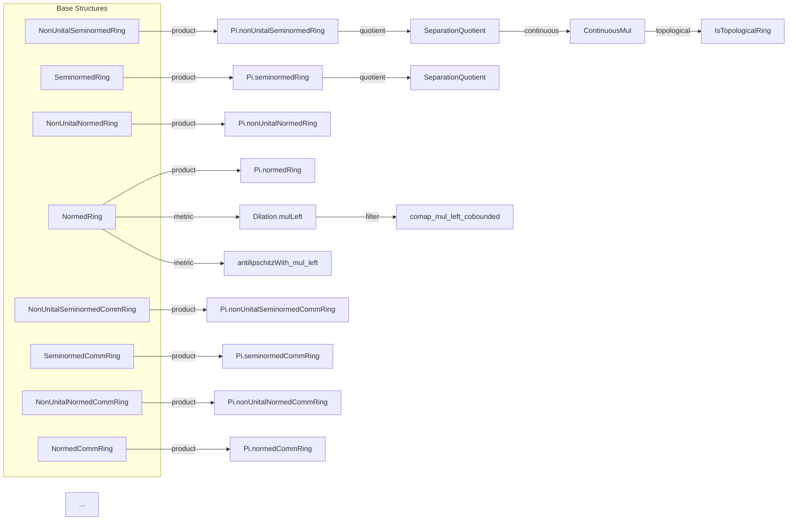

### Technical Brief: `Lemmas.lean` — Normed Rings and Related Structures in Lean 4

---

#### **1. Key Definitions & Theorems**

| Name | Type / Signature | Purpose |
|------|------------------|---------|
| `Filter.Tendsto.zero_mul_isBoundedUnder_le` | `Tendsto f l (𝓝 0) → IsBoundedUnder (· ≤ ·) l (norm ∘ g) → Tendsto (f * g) l (𝓝 0)` | Product of a function tending to 0 and another bounded under norm tends to 0. |
| `Filter.isBoundedUnder_le_mul_tendsto_zero` | `IsBoundedUnder (· ≤ ·) l (norm ∘ f) → Tendsto g l (𝓝 0) → Tendsto (f * g) l (𝓝 0)` | Symmetric variant of above; multiplication with bounded left factor and vanishing right factor. |
| `Pi.nonUnitalSeminormedRing` | `instance` | Product of finitely many non-unital seminormed rings becomes a non-unital seminormed ring under sup norm. |
| `Pi.seminormedRing` | `instance` | Same for seminormed rings (unital multiplication). |
| `Pi.nonUnitalNormedRing`, `Pi.normedRing`, etc. | `instance` | Analogous product constructions for normed (commutative) rings. |
| `RingHom.isometry` | `RingHomIsometric σ → Isometry σ` | A ring homomorphism with norm-preserving property is an isometry. |
| `RingHomIsometric.inv` | `RingHomInvPair σ σ' → RingHomIsometric σ → RingHomIsometric σ'` | Inverse of a norm-preserving ring isomorphism is also norm-preserving. |
| `tendsto_pow_cobounded_cobounded` | `[NormOneClass α] → [NormMulClass α] → m ≠ 0 → Tendsto (· ^ m) (cobounded α) (cobounded α)` | Power maps preserve cobounded sets under norm-one and multiplicative norm assumptions. |
| `NonUnitalSeminormedRing.toContinuousMul` | `instance` | Multiplication is continuous in a non-unital seminormed ring. |
| `NonUnitalSeminormedRing.toIsTopologicalRing` | `instance` | A non-unital seminormed ring is a topological ring (addition & multiplication continuous). |
| `SeparationQuotient` instances | `instance` | Quotient by kernel of seminorm inherits normed ring structures. |
| `Int.instNormedCommRing` | `instance` | ℤ with usual absolute value norm is a normed commutative ring. |
| `Dilation.mulLeft`, `Dilation.mulRight` | `α → a ≠ 0 → α →ᵈ α` | Left/right multiplication by nonzero element is a dilation (edist scaling by `‖a‖₊`). |
| `Filter.comap_mul_left_cobounded`, `Filter.comap_mul_right_cobounded` | `a ≠ 0 → comap (a * ·) (cobounded α) = cobounded α` | Multiplication by nonzero element preserves cobounded sets (via dilation theory). |
| `antilipschitzWith_mul_left/right` | `a ≠ 0 → AntilipschitzWith (‖a‖₊⁻¹) (a * ·)` | Multiplication by nonzero element is antilipschitz (i.e., bi-Lipschitz onto its image). |

---

#### **2. Naming Conventions**

- **Prefixes:**
  - `is_`: e.g., `isometry`, `isBoundedUnder`, `isTopologicalRing` — properties.
  - `norm_`: e.g., `norm_mul_le`, `norm_one`, `normedAddCommGroup` — norm-related axioms.
  - `tendsto_`: e.g., `tendsto_pow_cobounded_cobounded`, `zero_mul_isBoundedUnder_le` — convergence behavior.
  - `antilipschitzWith_`, `lipschitzWith_`: metric properties.
  - `comap_`, `map_`: filter-theoretic operations.

- **Suffixes:**
  - `_le`: inequality direction (e.g., `norm_mul_le`).
  - `_under`: boundedness under a relation (e.g., `isBoundedUnder_le`).
  - `_class`: typeclass-related (e.g., `NormMulClass`, `NormOneClass`).
  - `_instance`: often omitted, but implied in `instance` declarations.

- **Structure naming:**
  - `Pi.*` for product constructions.
  - `SeparationQuotient.*` for quotient constructions.
  - `Dilation.*` for dilation morphisms.

---

#### **3. Tactic Stack**

Frequently used tactics in proofs:

| Tactic | Usage |
|--------|-------|
| `simp` / `simp only` | Simplify goals using definitional equalities and lemmas (e.g., `norm_mul_le`, `mul_comm`). |
| `rw` | Rewrite using equalities (e.g., `← RingHomIsometric.norm_map`). |
| `convert` / `congr'` | Match goal structure to known theorems (e.g., convergence via squeeze theorem). |
| `calc` | Chain inequalities (e.g., `norm_mul_le`, `sup_mono_fun`). |
| `exact` / `assumption` | Immediate proof steps. |
| `have` / `suffices` | Introduce intermediate lemmas. |
| `intro` / `introv` | Introduce variables/hypotheses. |
| `simpa` | Simplify and discharge goal using a lemma. |
| `norm_num` | Normalize numeric expressions (e.g., in `LipschitzWith.sub`). |
| `aesop` / `linarith` | Not heavily used here; mostly manual inequality reasoning. |
| `induction` / `induction’` | Not present in this file (focus on analysis, not induction). |

---

#### **4. Proof Logic**

- **Structure of proofs:**
  - Most proofs are **direct applications of axioms** (`norm_mul_le`, `norm_add_le`, etc.) combined with:
    - `calc` for inequality chains,
    - `simp` for rewriting,
    - `convert` to match known convergence theorems (e.g., `squeeze_zero`, `tendsto_iff_norm_sub_tendsto_zero`).
  - **Product constructions** rely on `sup_mono_fun`, `sup_mul_le_mul_sup_of_nonneg`, and `Quotient.ind₂` for well-definedness.
  - **Continuity proofs** use `tendsto_iff_norm_sub_tendsto_zero`, then decompose `‖e.1 * e.2 - x.1 * x.2‖` via algebraic identity and apply `squeeze_zero`.
  - **Dilation constructions** use `edist_nndist`, `nndist_eq_nnnorm`, and `nnnorm_ne_zero_iff` to verify edist-scaling.

- **Common pattern:**
  ```lean
  have h : ‖a * b - c * d‖ ≤ ...,
  calc
    ‖a * b - c * d‖ ≤ ... := by rw ...; norm_mul_le ...
    _ ≤ ... := by linarith [h₁, h₂]
  ```

---

#### **5. Imports & Dependencies**

| Module | Role |
|--------|------|
| `Mathlib.Algebra.Order.GroupWithZero.Finset` | Ordered additive groups, finset suprema, monotonicity. |
| `Mathlib.Analysis.Normed.Group.*` | Normed additive groups, boundedness, uniform structures, integer norms. |
| `Mathlib.Analysis.Normed.Ring.Basic` | Basic theory of (semi)normed rings. |
| `Mathlib.Topology.MetricSpace.Dilation` | Dilation theory (edist scaling, Lipschitz/antilipschitz maps). |
| `Filter`, `Bornology` | Filter convergence, cobounded sets, uniform structures. |
| `NNReal`, `Pointwise`, `Topology` | Sup norm, product norms, topological ring properties. |

---

#### **6. Theory Overview & Dependency Diagram**

##### **Module Scope**
This file extends the theory of **(semi)normed rings**, focusing on:
- Product constructions (finite products → sup norm),
- Continuity of multiplication,
- Quotient constructions (separation),
- Metric properties of multiplication (Lipschitz, antilipschitz, dilation),
- Special cases: ℤ, NNReal.

##### **Dependency Graph (Mermaid)**

```mermaid
graph TD
  A[NormedRing Theory] --> B[Mathlib.Algebra.Order.GroupWithZero.Finset]
  A --> C[Mathlib.Analysis.Normed.Group.*]
  A --> D[Mathlib.Topology.MetricSpace.Dilation]
  A --> E[Mathlib.Analysis.Normed.Ring.Basic]

  B --> B1[Finset suprema]
  B --> B2[Monotonicity under order]

  C --> C1[SeminormedAddCommGroup]
  C --> C2[BoundedUnder]
  C --> C3[UniformStructure]
  C --> C4[IntNormedGroup]

  D --> D1[Dilation]
  D --> D2[edist_nndist]

  E --> E1[NonUnitalSeminormedRing]
  E --> E2[SeminormedRing]
  E --> E3[NormedRing]

  A --> F[SeparationQuotient]
  A --> G[ContinuousMul]
  A --> H[IsTopologicalRing]

  subgraph "Instances"
    I1[Pi.nonUnitalSeminormedRing]
    I2[Pi.seminormedRing]
    I3[Pi.normedRing]
    I4[Pi.nonUnitalNormedCommRing]
    I5[Pi.seminormedCommRing]
    I6[Pi.normedCommRing]
  end

  subgraph "Metric Properties"
    M1[Dilation.mulLeft]
    M2[Dilation.mulRight]
    M3[antilipschitzWith_mul_left]
    M4[comap_mul_left_cobounded]
  end

  A --> I1 & I2 & I3 & I4 & I5 & I6 & M1 & M2 & M3 & M4
```



##### **Overview Diagram (Mermaid)**



---

#### **7. Notes**

- **`norm_mul_le`** is the central axiom for all normed ring structures.
- **Sup norm** is used universally for finite products (`univ.sup`).
- **`SeparationQuotient`** ensures Hausdorffness by quotienting out null-norm elements.
- **`Dilation`** framework connects multiplicative scaling to metric geometry.
- **`Int`** is a canonical example of a normed commutative ring.

--- 

Let me know if you'd like a **dependency graph of typeclasses**, or a **proof automation summary** (e.g., which lemmas are auto-provable by `simp`).
