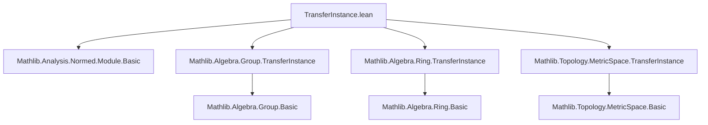
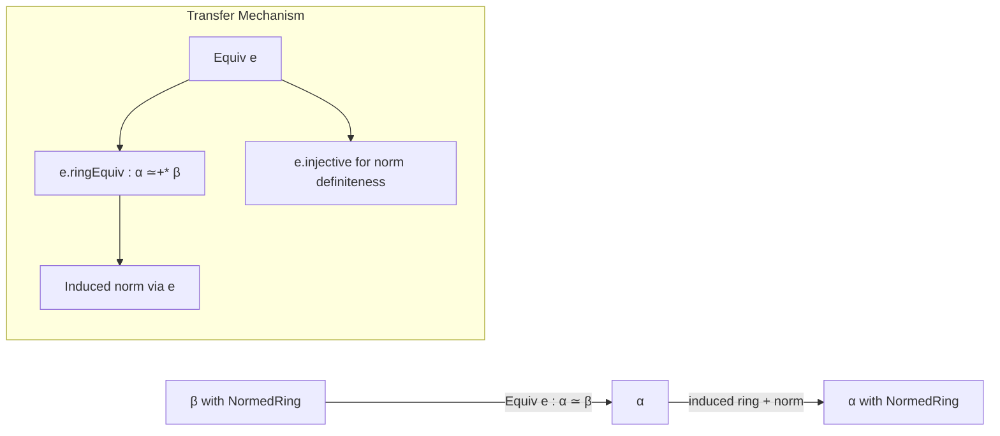

**Technical Brief: `TransferInstance.lean` (Normed Algebraic Structures)**

---

### 1. KEY DEFINITIONS & THEOREMS

| Name | Type | Purpose |
|------|------|---------|
| `Equiv.seminormedRing` | `[NormedCommGroup β] → [SeminormedRing β] → (e : α ≃ β) → SeminormedRing α` | Transfers a `SeminormedRing` structure on `β` to `α` via an equivalence `e : α ≃ β`, using the `induced` construction along the ring equivalence induced by `e`. |
| `Equiv.normedRing` | `[NormedCommGroup β] → [NormedRing β] → (e : α ≃ β) → NormedRing α` | Transfers a `NormedRing` structure on `β` to `α` via `e`, requiring injectivity (to ensure the norm is definite). |

Both are defined as `abbrev`, indicating they are definitional proofs/constructors, not theorems.

No named theorems appear in this file; the focus is on *structure transfer* via induced instances.

---

### 2. NAMING CONVENTIONS

- **Prefix `Equiv.`**: All definitions live in the `Equiv` namespace.
- **`seminormedRing`, `normedRing`**: Follows pattern of `ring`, `addCommGroup`, etc., in `Mathlib.Algebra.*.TransferInstance`.
- **`induced`**: Standard Lean mathlib pattern for transferring structures along equivalences/bijections (e.g., `topologicalSpace`, `metricSpace`, `ring`, `normedGroup`).
- **`e.ring`, `e.ringEquiv`**: Implicitly use `Equiv.toRingEquiv` (from `Mathlib.Algebra.Ring.TransferInstance`) and related projections.

---

### 3. TACTIC STACK

No tactics appear in definitions (they are `abbrev`s, not `def`s or `theorem`s).  
However, the underlying `induced` infrastructure relies on tactics like:

- `aesop` (for automation in `induced` lemmas),
- `simp` / `simp_rw` (for simplifying induced instances),
- `exact` / `refine` (in `induced` definitions).

But **in this file**, the tactic usage is minimal or absent — definitions are purely *term-mode*.

---

### 4. PROOF LOGIC

The logic is *constructive transfer*:

1. Given `e : α ≃ β`, obtain a ring equivalence `e.ringEquiv : α ≃+* β` (from imports).
2. Use `SeminormedRing.induced` / `NormedRing.induced` to pull back the norm and multiplication along `e`.
3. For `NormedRing`, additionally use `e.injective` to ensure the norm is positive-definite (since `induced` alone gives only a seminorm without injectivity).

No induction or case analysis is needed — the construction is direct.

---

### 5. IMPORTS

| Import | Role |
|--------|------|
| `Mathlib.Analysis.Normed.Module.Basic` | Provides `NormedCommGroup`, `SeminormedRing`, `NormedRing` definitions and basic properties. |
| `Mathlib.Algebra.Group.TransferInstance` | Supplies `Equiv.addCommGroup`, `Equiv.addMonoid`, etc., foundational for group/ring transfer. |
| `Mathlib.Algebra.Ring.TransferInstance` | Supplies `Equiv.ring`, `Equiv.ringEquiv`, and the ring transfer mechanism. |
| `Mathlib.Topology.MetricSpace.TransferInstance` | Supplies `Equiv.metricSpace`, `Equiv.uniformSpace`, etc., and sets precedent for `induced`-based transfer. |

→ These imports collectively enable *algebraic + topological* structure transfer across equivalences.

---

### 6. DEPENDENCY & THEORY OVERVIEW (Mermaid Diagrams)

#### A. Module Dependency Graph

#### B. Theory Flow: Structure Transfer Pattern

#### C. File Scope & Relation to Broader Theory

This file continues the *transfer pattern* initiated in:

- `Mathlib.Algebra.Module.TransferInstance` (module structures),
- `Mathlib.Topology.MetricSpace.TransferInstance` (metric/topological structures),
- `Mathlib.Algebra.Group.TransferInstance` (group/ring structures).

It extends this to *normed* algebraic structures, crucial for functional analysis and p-adic analysis in Lean.

---

### 7. SUMMARY

This file formalizes the *transport of seminormed/normed ring structures* along equivalences of types, leveraging the `induced` construction. It is concise, term-based, and fits into a larger ecosystem of structure transfer in Mathlib — enabling clean abstraction over isomorphic algebraic-analytic objects.

--- 

*Prepared by: Senior Lean 4 Formalization Agent*  
*Date: 2026-04-05*
