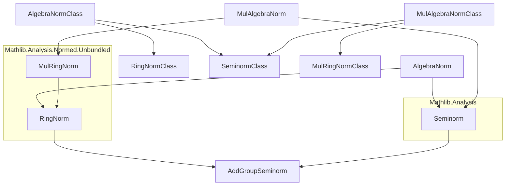
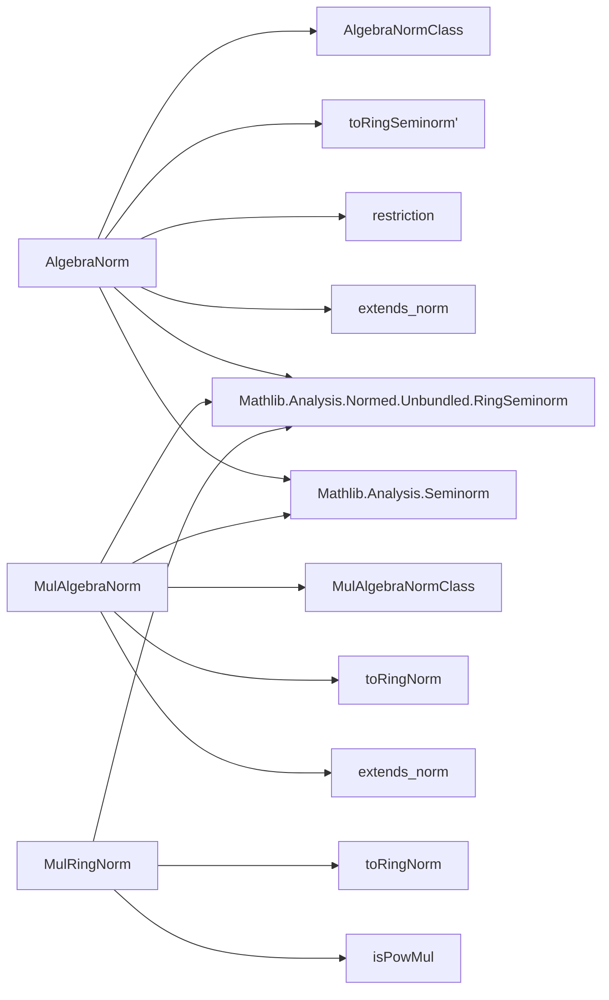

### Technical Brief: `AlgebraNorm.lean`

---

#### **1. Key Definitions & Theorems**

| Name | Type / Structure | Purpose |
|------|------------------|---------|
| `AlgebraNorm R S` | `Structure` | Defines a ring norm on an $R$-algebra $S$ compatible with the $R$-action (i.e., satisfies $\|r \cdot s\| = \|r\| \cdot \|s\|$). Extends both `RingNorm S` and `Seminorm R S`. |
| `MulAlgebraNorm R S` | `Structure` | Defines a *multiplicative* ring norm on an $R$-algebra $S$, i.e., one satisfying $\|x y\| = \|x\| \|y\|$, and compatible with $R$-action. Extends `MulRingNorm S` and `Seminorm R S`. |
| `AlgebraNormClass F R S` | `Class` | Typeclass for families of algebra norms (e.g., for coercion or generalization). Extends `RingNormClass` and `SeminormClass`. |
| `MulAlgebraNormClass F R S` | `Class` | Analogous to `AlgebraNormClass`, but for multiplicative algebra norms. |
| `AlgebraNorm.toRingSeminorm'` | `def` | Forgets the ring-norm structure to a `RingSeminorm`. |
| `AlgebraNorm.restriction` | `def` | Restricts an algebra norm to a subalgebra. |
| `AlgebraNorm.isScalarTower_restriction` | `def` | Restricts an algebra norm along a scalar tower, assuming injectivity of the middle map. |
| `AlgebraNorm.ext` | `theorem` | Extensionality: two algebra norms equal if they agree on all elements. |
| `AlgebraNorm.extends_norm` | `theorem` | If $f(1) = 1$, then $f(a \cdot 1_S) = \|a\|$ for all $a \in R$. |
| `MulAlgebraNorm.extends_norm` | `theorem` | Same as above, but for multiplicative algebra norms (note: $f(1)=1$ is automatic here). |
| `MulRingNorm.toRingNorm` | `def` | Forgets multiplicativity to a plain ring norm (since $\|xy\| = \|x\|\|y\|$ implies $\|xy\| \le \|x\|\|y\|$). |
| `MulRingNorm.isPowMul` | `theorem` | Multiplicative ring norms are power-multiplicative: $\|x^n\| = \|x\|^n$. |

---

#### **2. Naming Conventions**

- **Prefixes**:
  - `AlgebraNorm`, `MulAlgebraNorm`: main structures.
  - `AlgebraNormClass`, `MulAlgebraNormClass`: typeclass interfaces.
  - `to*`: projection functions (e.g., `toRingNorm`, `toRingSeminorm'`).
  - `restriction`, `isScalarTower_restriction`: operations on norms.

- **Suffixes**:
  - `'` (prime): often used for variants (e.g., `extends_norm'` vs `extends_norm`).
  - `Class`: for typeclasses encoding families of norms.

- **Functional style**:
  - `map_*`: properties of the norm as a map (e.g., `map_zero'`, `map_add_le_add`, `map_mul_le_mul`).
  - `eq_zero_of_map_eq_zero'`: characterization of zero via norm.

---

#### **3. Tactic Stack**

Frequent tactics used in proofs and definitions:

| Tactic | Usage |
|--------|-------|
| `simp only [...]` | Simplify using specific lemmas (e.g., `map_zero`, `map_add`, `algebraMap_smul`). |
| `rw [...]` | Rewrite using definitions or theorems (e.g., `Algebra.algebraMap_eq_smul_one`). |
| `congr` | Prove equality of structures by congruence. |
| `ext` / `DFunLike.ext` | Extensionality for functions/structures. |
| `cases` | Destructure inductive types (e.g., `cases f; cases f'`). |
| `erw` | Rewrite with definitional equality (used in `toFun_eq_coe`). |
| `lia` | Linear integer arithmetic (used in `isPowMul` base case). |
| `exact`, `apply`, `intro` | Basic proof scripting. |
| `simp only [map_*]` | Simplify using norm properties. |

---

#### **4. Proof Logic**

- **Structure definitions** are straightforward extensions of existing norm classes.
- **Instances** (e.g., `Inhabited`) are constructed by verifying all required properties using known facts about `norm` on a `NormedField`.
- **Extensionality proofs** (`ext`) rely on `DFunLike.ext`, leveraging the `FunLike` instance.
- **Restriction proofs**:
  - Use `val` for subalgebra elements.
  - Apply properties of the original norm (`map_*`) and verify subalgebra conditions (e.g., `ZeroMemClass.coe_eq_zero`).
- **Scalar tower restriction**:
  - Uses `algebraMap` and `IsScalarTower.algebraMap_apply`.
  - Injectivity assumption (`hinj`) is used to lift zero-characterization via `map_eq_zero_iff`.
- **Multiplicative → ring norm** (`toRingNorm`):
  - Uses `le_of_eq` on `map_mul'` to get the submultiplicative inequality.
- **Power-multiplicativity**:
  - Induction on natural numbers (via `cases n`), using `map_pow` for the successor case.

---

#### **5. Imports**

| Import | Purpose |
|--------|---------|
| `Mathlib.Analysis.Normed.Unbundled.RingSeminorm` | Provides `RingNorm`, `RingSeminorm`, `MulRingNorm`, and their classes. |
| `Mathlib.Analysis.Seminorm` | Provides `Seminorm`, `SeminormClass`. |

These imports define the foundational normed algebraic structures used in `AlgebraNorm`.

---

#### **6. Mermaid Diagrams**

##### **Dependency Graph (Module-Level)**

##### **Overview of File Structure**

---

#### **7. Theory Context**

- **Goal**: Formalize norms on algebras that behave well with respect to scalar multiplication.
- **Motivation**: In functional analysis and non-archimedean geometry, algebra norms (especially multiplicative ones) are central (e.g., Banach algebras, $C^*$-algebras, rigid geometry).
- **Relation to existing mathlib**:
  - Builds on `RingNorm`, `MulRingNorm`, and `Seminorm`.
  - Aligns with `Mathlib.Analysis.Normed` hierarchy, but at the *unbundled* level (i.e., norms as functions, not as bundled maps).
- **Future extensions**:
  - `BanachAlgebraNorm`, `CStarAlgebraNorm`, or `SubmultiplicativeAlgebraNorm`.
  - Relationships with `NormedRing`, `NormedAlgebra`, and `CompleteSpace`.

--- 

Let me know if you'd like a formalization roadmap or a comparison with bundled alternatives (`NormedAlgebra`).
